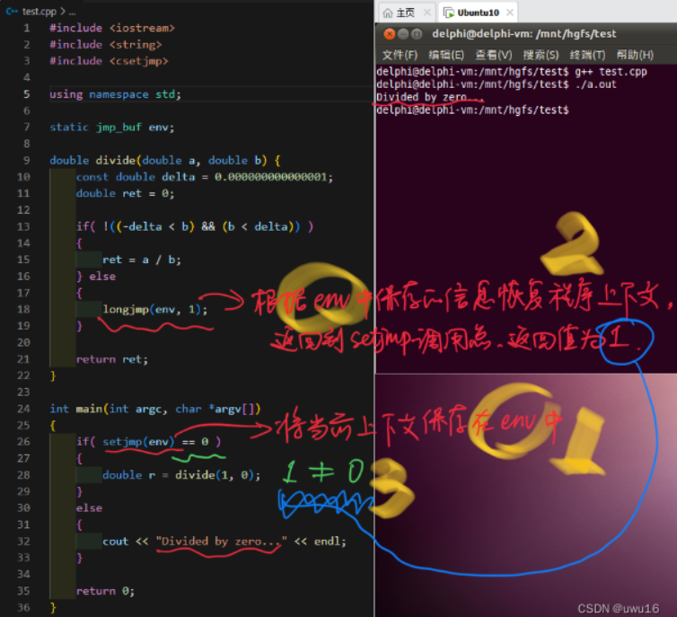

# 自动类型

C++11 时代，auto 关键字可以用于变量类型的推断，可以在声明变量的时候根据变量初始值的类型自动为该变量选择合适的类型，而不需要显式指定类型。auto 自动类型推断发生在编译期，所以使用 auto 关键字不会降低程序的运行效率；

**(1)普通类型的推断**

```c++
auto x = 127;               // auto 被推断为 int 类型
auto y = 3.14;              // auto 被推断为 double 类型
auto z;                         // 错误，必须有初始值才能进行推断
```

**(2)引用类型推断**

```c++
int x = 0, &rx = x; 
auto a1 = rx;               // 使用引用其实是使用引用的对象，此时 auto 以引用对象的类型作为 auto 的类型，
							//所以auto 这里被推断为 int 
auto &a2 = rx;            	// 此时 auto 被推断为 int 类型，a2 对象本身就是 int & 类型
const auto &a3 = rx;  		// auto 被推断为 int 类型，a3 对象本身是 const int & 类型，
							//不能通过 a3 去修改 rx 引用的对象值
```

**(3)const类型的推断**

```c++
const int c = 10;
auto a1 = c;            // auto 此时是 int，顶层 const 属性被丢弃
auto &a2 = c;         // auto 此时是 const int，底层 const 属性保留
```

**(4)针对数组和函数的推断**

```c++
const char arr[] = "I Love China";
auto r1 = arr;						// 如果将数组名赋值给 auto 变量，那么 auto 推断的结果是指针类型，
						//如果有 const 属性会被保留，auto 推断的结果是 const char *，r1 为 const char *
auto &r2 = arr;                     // 如果将数组名赋值给 auto & 变量，auto & 变量的类型是一个数组引用类
									//型，即为const char (&) [14] 
int add(int a,int b);               // 函数声明
auto r3 = add;                      // r3 为 int(*)(int, int)
auto &r4 = add;                     // r4 为 int(&)(int, int)
```

## **推断规则说明**

- 对于普通类型推断（没有 const 也不掺杂引用的），直接根据表达式右边值的类型进行推断，注意必须有初始值

- 使用引用进行推断，实际上就是使用引用对象的类型进行推断，此时引用特性会被丢弃，如果定义的对象需要成为引用，就自己在 auto 后面加上 & 来定义对象

- 使用带有 const 属性的对象进行推断时，如果定义的对象不是指针或者引用，则 const 属性会被丢弃，否则 const 属性会保留，见 (3) const 类型的推断

## **auto关键字使用的场景**

- 适用的场景
  - 一些类型长度书写很长的，可以使用 auto 来简化，如 for(std::vector\<int\>::iterator it = v.begin();it != v.end();++it)，如果使用 auto 可以直接写为 for(auto it = v.begin();it != v.end();++it)
  - 当函数返回的值不确定时，可以使用 auto 做返回值类型，更加方便，编译器会根据返回值的类型推断 auto 的类型，这种语法是在`C++14`才出现的。

- 不适用的场景
  - 函数参数类型不能是 auto 类型，比如 int add(auto a, auto b) { return a + b; } 是不允许的
  - 类的成员变量不可以是 auto 类型。类的静态成员变量可以是 auto 类型的，但是需要使用 const 修饰，而且该变量的值在类内初始化

------

# 布尔类型

bool类型只有true（非0）和false（0）两个值；

C++编译器会将非0值转换为true，0值转换为false；

bool类型是C++基本数据类型，可以定义bool类型的`全局变量、常量、指针、数组`等；

------

# 三目运算符

C语言中的三目运算符返回的是`变量值`，`不能`作为`左值`使用；

C++中的三目运算符可以直接返回`变量本身`，既可以作为`右值`使用，又可以作为`左值`使用；

**注意：**三目运算符可能返回的值中如果有一个常量值，则不能作为左值使用；

- 当三目运算符的可能返回都是变量时，返回的是`变量引用`；

- 当三目运算符的可能返回中有常量时，返回的是`值`；

------

# 引用

引用可以看作一个已定义`变量的别名`，在一些场合可以`代替指针`；

引用在C++中的内部实现是一个指针常量；

引用相对于指针来说具有更好的<u>可读性</u>和<u>实用性</u>，C++为了实用性而隐藏了引用的存储空间这一细节；

```c++
//引用的语法
Type& name = var;

int a = 4;
int& b = a;	//b为a的别名

b = 5;	//操作b就是操作a
```

**注意：**普通引用在定义时`必须用同类型`的变量进行初始化。

C++编译器在编译过程中用`指针常量`作为引用的`内部实现`，因此<u>引用所占用的空间大小与指针相同</u>；

const引用可以使得`变量具有只读属性`；

------

# 内联函数

C++中推荐使用内联函数替代宏代码片段，使用`inline`关键字声明内联函数；

C++编译器直接将函数体插入函数调用的地方；

内联函数`没有`普通函数调用时的`额外开销`（压栈、跳转、返回）；

对于函数体很小，调用频繁的函数可以选择内联函数；

```c++
inline int func(int a, int b)
{
	return a < b ? a : b;
}
```

**注意：**内联函数声明时inline关键字必须和函数定义结合在一起，否则编译器会直接忽略内联请求；

- 内联函数具有普通函数的特征（参数检查，返回类型等）；

- 函数的内联请求可能被编译器拒绝；

- 函数被`内联编译后`，`函数体直接扩展到调用的地方`；

## C++中inline内联编译的限制

- 不能存在任何形式的循环语句（取决于编译器版本）
- 不能存在`过多的条件判断语句`
- 函数体不能`过于庞大`
- 不能对`函数进行取址操作`
- 函数内联声明必须在调用语句之前

------

# 函数默认参数

C++中可以在`函数声明时为参数提供一个默认值`；

当函数调用时<u>没有提供参数的值</u>，则`使用默认值`；

```c++
#include <iostream>
using namespace std;
 
int sum(int a, int b=20)
{
  int result;
 
  result = a + b;
  
  return (result);
}
 
int main ()
{
   // 局部变量声明
   int a = 100;
   int b = 200;
   int result;
 
   // 调用函数来添加值
   result = sum(a, b);
   cout << "Total value is :" << result << endl;
 
   // 再次调用函数
   result = sum(a);
   cout << "Total value is :" << result << endl;
 
   return 0;
}

//Total value is :300
//Total value is :120
```

**函数默认参数的规则：**

- 参数的默认值必须`从右到左提供`
- 函数调用时`使用了默认值`，则后续参数`必须`使用默认值

------

# 重载

同一标识符在`不同的上下文有什么不同的意义`（Overload）

```c++
class printData
{
   public:
      void print(int i) {
        cout << "整数为: " << i << endl;
      }
 
      void print(double  f) {
        cout << "浮点数为: " << f << endl;
      }
 
      void print(char c[]) {
        cout << "字符串为: " << c << endl;
      }
};
 
int main(void)
{
   printData pd;
 
   // 输出整数
   pd.print(5);
   // 输出浮点数
   pd.print(500.263);
   // 输出字符串
   char c[] = "Hello C++";
   pd.print(c);
 
   return 0;
}

//整数为: 5
//浮点数为: 500.263
//字符串为: Hello C++
```

**函数重载`至少`满足下面的一个条件：**

- 参数个数不同
- 参数类型不同
- 参数顺序不同

**编译器调用重载函数的准则：**

尝试寻找可行的候选函数

- 精确匹配实参
- 通过默认参数能够匹配实参
- 通过默认类型转换匹配实参

<u>匹配失败</u>：

- 最终寻找到的候选函数不唯一，则出现二义性，编译失败
- 无法匹配所有候选者，函数未定义，编译失败

## 函数重载的注意事项

重载函数在`本质`上是`相互独立的不同函数`

重载函数的`函数类型不同`

函数`返回值不能`作为函数重载的依据

> 函数重载是由函数名和参数列表决定的；

## 重载与指针

将重载`函数名`赋值给`函数指针`时

1. 根据重载规则挑选与`函数指针参数列表一致`的候选者
2. `严格匹配`候选者的函数类型与函数指针的`函数类型`

**注意：**

函数重载`必然发生在同一个作用域中`

编译器需要用`参数列表`或`函数类型`进行函数选择

`无法`通过`函数名`得到重载函数的`入口地址`

------

# C++和C相互调用

C++编译器能够兼容C语言的编译方式，优化使用C++编译的方式

extern关键字能强制让C++编译器进行C方式的编译

> __cplusplus是C++编译器内置的标准宏定义，确保C代码以统一的C方式被编译成目标文件

```c++
#ifdef __cplusplus
extern "C" {
#endif
    
// do C-style compilation here

#ifdef __cplusplus
}
#endif
```

------

# 动态内存分配

- C++通过`new`关键字进行动态内存申请

- C++中的动态内存申请是基于类型进行的
- `delete`关键字用于内存释放

```c++
//变量申请：
Type* pointer = new Type;
……
delete pointer;

//数组申请：
Type* pointer = new Type[N];
……
delete[] pointer;
```

## new关键字与malloc函数的区别

- new关键字是C++的一部分，malloc是由C库提供的函数
- new以具体类型为单位进行内存分配，malloc以字节为单位进行内存分配
- new在申请单个类型变量时可进行初始化，malloc不具备内存初始化的特征

------

# 命名空间

C语言中只有一个全局作用域，C语言中`所有的全局标识符共享同一个作用域`，标识符之间可能发生冲突

**C++提出命名空间概念：**

- 命名空间将全局作用域分成不同的部分
- 不同命名空间中的标识符可以同名而不会发生冲突
- `命名空间可以相互嵌套`
- 全局作用域也叫`默认命名空间`

命名空间的定义可以不连续，甚至可以写在多个文件中。如果已经定义了该命名空间，那么就相当于添加新成员的声明；

```c++
//命名空间定义
namespace name
{
   namespace internal
   {
       /*……*/
   }
    /*……*/
}

//命名空间使用
using namespace name;	//使用整个命名空间
using name::variable;	//使用命名空间中的变量
::variable	//使用默认命名空间中的变量

//实例
#include <iostream>
using namespace std;
 
// 第一个命名空间
namespace first_space{
   void func(){
      cout << "Inside first_space" << endl;
   }
}
// 第二个命名空间
namespace second_space{
   void func(){
      cout << "Inside second_space" << endl;
   }
}
int main ()
{
 
   // 调用第一个命名空间中的函数
   first_space::func();
   
   // 调用第二个命名空间中的函数
   second_space::func(); 
 
   return 0;
}
```

------

# 类型转换

详细参考链接：[四种类型转换运算符](http://c.biancheng.net/view/2343.html)

C++将强制类型转换分为4种不同类型

- static_cast
- const_cast
- dynamic_cast
- reinterpret_cast

**static_cast强制类型转换**

用于`基本类型`间的转换

`不能`用于`基本类型指针`间的转换

用于`有继承关系类对象`之间的转换和`类指针`之间的转换

**const_cast强制类型转换**

用于`去除`变量的`只读属性`

强制转换的目标类型必须是`指针`或`引用`

**dynamic_cast强制类型转换**

用于`有继承关系的类指针`间的转换

用于`有交叉关系的类指针`间的转换

具有类型检查的功能

**`需要虚函数的支持`**

**reinterpret_cast强制类型转换**

用于`指针类型间`的转换

用于`整数`和`指针类型`间的转换

------

# const

- 只有用`字面量`初始化的const常量才会`进入符号表`

- 使用其他`变量`初始化的const常量仍然是`只读变量`

- 被`volatile修饰`的const常量`不会进入符号表`

在`编译期间不能直接确定初始值`的const标识符，都会被作为`只读变量`处理；

**const引用的类型与初始化变量的类型**

- 相同：初始化变量成为只读变量
- 不同：生成一个新的只读变量

**constexpr关键字**（C++11引入）

常量的概念，在编译时求值；

```c++
constexpr int func()
{
    int a = 6;
    return a;
}

int main()
{
    constexpr int var{ 1 };
    int b = 5;
    constexpr int var2 = func();
    cout << var2 << endl;

    return 0;
}
```

------

# 引用与指针

指针是一个变量

- 值为一个内存地址，不需要初始化，可以保存不同的地址
- 通过指针可以访问对应内存地址中的值
- 指针可以被const修饰成为常量或者只读变量

引用只是一个变量的新名字

- 对引用的操作（赋值，取地址等）都会`传递到代表的变量上`
- const引用使其代表的变量具有只读属性
- 引用必须在定义时初始化，之后无法代表其他变量

------

# C异常处理

C语言经典处理方式if else

```c++
double divide(double a, double b, int* valid)
{
    const double delta = 0.000000000000001;
    double ret = 0;
    
    if( !((-delta < b) && (b < delta)) )
    {
        ret = a / b;
        
        *valid = 1;
    }
    else
    {
        *valid = 0;
    }
    
    return ret;
}

int main(int argc, char *argv[])
{   
    int valid = 0;
    double r = divide(1, 0, &valid);
    
    if( valid )
    {
        cout << "r = " << r << endl;
    }
    else
    {
        cout << "Divided by zero..." << endl;
    }
    
    return 0;
}
```

 通过setjmp()和longjmp()进行优化；

- int setjmp(jmp_buf env)
  - 将当前上下文保存在jmp_buf结构体中
- void longjmp(jmp_buf env, int val)
  - 从jmp_buf结构体中恢复setjmp()保存的上下文
  - 最终从setjmp函数调用点返回，返回值为val

 

**setjmp()和longjmp()引入的缺陷：**

- 必然涉及到使用全局变量
- 暴力跳转导致代码可读性降低
- 本质还是if else异常处理方式

**异常处理代码实例分析**

```c++
#include <iostream>
#include <string>
using namespace std;

#define SUCCESS           0 
#define INVALID_POINTER   -1
#define INVALID_LENGTH    -2
#define INVALID_PARAMETER -3

int MemSet(void* dest, unsigned int length, unsigned char v)
{
    if( dest == NULL ) {
        return INVALID_POINTER;
    }
    
    if( length < 4 ) {
        return INVALID_LENGTH;
    }
    
    if( (v < 0) || (v > 9) ) {
        return INVALID_PARAMETER;
    }
    
    unsigned char* p = (unsigned char*)dest;
    
    for(int i=0; i<length; i++) {
        p[i] = v;
    }
    
    return SUCCESS;
}

int main(int argc, char *argv[])
{
    int ai[5];
    int ret = MemSet(ai, sizeof(ai), 0);
    
    if( ret == SUCCESS )
    {
    }
    else if( ret == INVALID_POINTER )
    {
    }
    else if( ret == INVALID_LENGTH )
    {
    }
    else if( ret == INVALID_PARAMETER )
    {
    }
    
    return ret;
}
```

