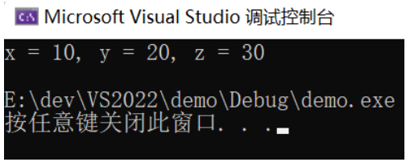
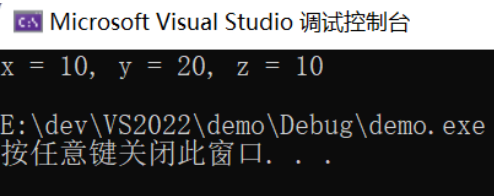
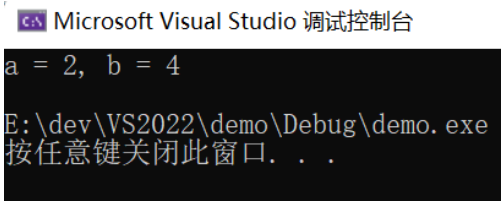
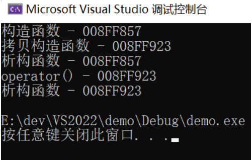
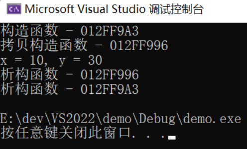
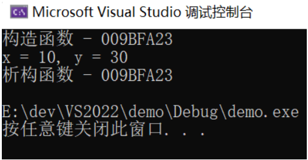
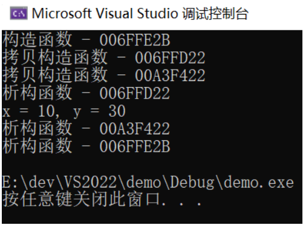

# 类型推断结果

推断有时候叫做推导，在现代c++中，经常涉及到推断，如auto等。这里主要讲解模板类型推断的知识。

通过“查看编译器类型推断的结果”这个手段来学习并掌握c++类型推断的规则。掌握C++类型推断结果，而不是依赖什么手段去查看编译器出来的结果。


**如何查看类型推断结果**

- 模拟编译器来推断一个模板参数和普通参数的类型。

- 使用boost库，把编译器给我们推断出来的类型信息打印出来。

  - 1.访问官网https://www.boost.org/ 下载boost库；

  *		2.点击右侧Version History可以下载到最新版本；
  *		3.将文件解压到一个文件夹中，本例中boost_1_68_0；
  *		4.右键项目--“属性”--“vc++目录”--“包含目录”中将解压的路径添加上（vs环境）；
  *		也可以使用nuget安装，右键项目 --“管理NuGet安装包”，搜索boost安装包；

**理解模板类型推断**

- 指针或者引用类型
  - 如果tem类型是个指针或者引用，但是不是万能引用

*			万能引用--形式参数tem是一个万能引用类型T&&
*			传值方式
*			数组做实参
*			数组名代表数组的首地址
*			函数名做实参，函数名相当于函数首地址，可以赋值给一个函数指针

**总结**

- 推断中，引用类型实参的引用类型等于不存在
- 万能引用中，实参为右值和左值，推断出来的结果不同
- 按值传递的实参，传递给形参时const属性不起作用，则传递过去指针可能起作用。
- 数组或者函数类型在推断中被看作指针，除非函数模板的形参是个引用。

```C++
#include<iostream>
#include<cstdlib>
#include <boost/type_index.hpp>

using namespace std;

//显示参数类型，这里不研究boost库
template<typename T>
//void myFunction01(T&tem)//T是类型模板参数，T是有类型的,tem是形参，tem也是有类型的
void myFunction01(const T &tem)
{
	using boost::typeindex::type_id_with_cvr;
	cout << "T type=" << type_id_with_cvr<T>().pretty_name() << endl;//显示T类型
	cout << "tem type=" << type_id_with_cvr<decltype(tem)>().pretty_name() << endl;//显示T类型

}

//2.1指针或者引用类型
template<typename T>
void myFunction02( T &tem)//tem是引用
{
	using boost::typeindex::type_id_with_cvr;
	cout << "T type=" << type_id_with_cvr<T>().pretty_name() << endl;//显示T类型
	cout << "tem type=" << type_id_with_cvr<decltype(tem)>().pretty_name() << endl;//显示T类型

}

template<typename T>
void myFunction03( const T &tem)//形参是常量引用
{
	using boost::typeindex::type_id_with_cvr;
	cout << "T type=" << type_id_with_cvr<T>().pretty_name() << endl;//显示T类型
	cout << "tem type=" << type_id_with_cvr<decltype(tem)>().pretty_name() << endl;//显示T类型

}

template<typename T>
void myFunction04( T *tem)//形参是指针类型
{
	using boost::typeindex::type_id_with_cvr;
	cout << "T type=" << type_id_with_cvr<T>().pretty_name() << endl;//显示T类型
	cout << "tem type=" << type_id_with_cvr<decltype(tem)>().pretty_name() << endl;//显示T类型

}

template<typename T>
void myFunction05(T &&tem)//形参是万能引用类型
{
	using boost::typeindex::type_id_with_cvr;
	cout << "T type=" << type_id_with_cvr<T>().pretty_name() << endl;//显示T类型
	cout << "tem type=" << type_id_with_cvr<decltype(tem)>().pretty_name() << endl;//显示T类型

}


template<typename T>
void myFunction06(T tem)//形参是万能引用类型
{
	using boost::typeindex::type_id_with_cvr;
	cout << "T type=" << type_id_with_cvr<T>().pretty_name() << endl;//显示T类型
	cout << "tem type=" << type_id_with_cvr<decltype(tem)>().pretty_name() << endl;//显示T类型

}

void tesFunction()
{
	;
}
int main(void)
{
	//(2)void myFunction01(const T&tem)
	myFunction01(100);
	/*
	 * T type=int
	 * tem type=int const &
	 */
	
	//2.1
	int i = 18;	//int
	const int j = i;	//const int
	const int&k = i;	//const int&类型
	cout << "-----" << endl;
	myFunction02(i);
	myFunction02(j);
	myFunction02(k);
	/*
	 *	T type=int
		tem type=int &
		T type=int const
		tem type=int const &
		T type=int const
		tem type=int const &
	1.如果实参是引用类型，则引用类型会被忽略掉，T不会被推到为引用类型。
	2.当我们向引用类型的形参tem传递const类型实参时，形参就会成为const&
		实参的const属性会成为类型模板参数的推导的类型的组成部分，
		也就是说，实参的const属性会传递。在函数中修改不了原来带const属性的实参。
	
	 */

	//形参是常量引用
	cout << "*******" << endl;
	myFunction03(i);
	myFunction03(j);
	myFunction03(k);
	/*
	 *  T type=int
		tem type=int const &
		T type=int
		tem type=int const &
		T type=int
		tem type=int const &

	1.如果实参是引用类型，则引用类型会被忽略掉，T不会被推到为引用类型。
	2.对于有const属性的实参，推导后T中的const属性没有了，因为模板函数myFunction03的形参tem出现了const。实参const替换掉形参const
	
	 */

	//指针类型
	const int*pi = &i;
	cout << "&&&&&&&&&" << endl;
	myFunction04(&i);
	myFunction04(pi);
	/*
	 *  T type=int
		tem type=int *
		T type=int const
		tem type=int const *
	结论：如果tem形参中没有const，则实参中的const就会传递到T类型中去。如果形参中有const，则T类型中不会带const。
	
	 */

	//*	2.2万能引用--形式参数tem是一个万能引用类型T&&
	cout << "2.2------------------------" << endl;
	myFunction05(i);//左值
	myFunction05(j);//左值
	myFunction05(k);
	myFunction05(100);//传递过去右值
	/*
	T type=int &
	tem type=int &	//这里有引用折叠
	T type=int const &
	tem type=int const &
	T type=int const &
	tem type=int const &
	T type=int
	tem type=int &&
	 */


	//2.3传值方式 如果形式参数tem是常规的传值方式传递
	cout << "2.3------------------------" << endl;
	myFunction06(i);
	myFunction06(j);
	myFunction06(k);
	/*
	 *  T type=int
		tem type=int
		T type=int
		tem type=int
		T type=int
		tem type=int
	const属性没有传递进去，因为形式参数是一个新副本。怎么传递进去const属性？？？-->传递指针进去
	 */
	char myStr[] = "jisuanjizuchengyhuanli";
	const char*const point = myStr;//第一个const修饰内存空间，第二个表示指针的指向不能改变
	cout << "jjjjjjjjjjjjjjjj" << endl;
	myFunction06(point);
	/*
	 T type=char const *
	 tem type=char const *
	传递const char*或者const char[]第一个const没有了，第二个const保留。
	 */

	//2.4数组做实参
	const char mystr02[] = "jisuanjizuchegnaun";
	cout << "22222222222222222222222" << endl;

	myFunction06(mystr02);
	myFunction02(mystr02);//调引用--推导成数组
	/*
	T type=char const *
	tem type=char const *
	T type=char const [19]
	tem type=char const (&)[19]//代表数组的引用
	*/

	//	2.5函数名做实参，函数名相当于函数首地址，可以赋值给一个函数指针
	cout << "6666666666666" << endl;
	myFunction06(tesFunction);

	myFunction02(tesFunction);//引用
	/*
	T type=void (__cdecl*)(void)//函数指针类型
	tem type=void (__cdecl*)(void)
	T type=void __cdecl(void)//函数指针引用
	tem type=void (__cdecl&)(void)
	 */

	cout << "helloWorld" << endl;
	system("pause");
	return 0;
}
```

------

# auto应用场合

**auto类型常规推断**

c++11中，auto用于变量的自动类型推断，在声明变量的时候根据变量的初值的类型`自动为此变量选择匹配的类型`，而不需要显示指定类型

- 自动类型推断发生在`编译期间`，不会影响程序执行期间的性能。
- auto定义的变量`必须立即初始化`，这样编译器才能自动推断它的类型。确定auto的类型和它所定义变量的类型。然后在编译期间使用真正的类型替换掉auto这个类型占位符。
- auto使用灵活，可以和指针，引用，const等限定符结合使用。
- auto类型推断和函数模板推断非常类似。auto推导后代表一个具体类型。auto实际上是一个类型，实际上相当于函数模板推导中的类型模板参数T。auto也是类型声明中的一部分，可以把auto当作类型占位符。


**auto类型推断分类**

*		指针或者引用类型，但不是万能引用：不会抛弃const属性，但是会抛弃引用等限定符；
*		万能引用类型
*		传值方式，非指针，非引用：`传值方式会抛弃引用和const属性`

```C++
#include<iostream>
#include<cstdlib>
#include <boost/type_index.hpp>

using namespace std;

//显示参数类型，这里不研究boost库
template<typename T>
void myFunction01(T&tem)//T是类型模板参数，T是有类型的,tem是形参，tem也是有类型的
{
	using boost::typeindex::type_id_with_cvr;
	cout << "T type=" << type_id_with_cvr<T>().pretty_name() << endl;//显示T类型
	cout << "tem type=" << type_id_with_cvr<decltype(tem)>().pretty_name() << endl;//显示T类型
}

int main(void)
{
	int number01 = 18;
	const int number02 = number01;
	const int&number03 = number01;
	myFunction01(number01);//T=int  tem=int&类型
	myFunction01(number02);//T=int const tem=const int&
	myFunction01(number03);//T=int const tem=const int& 引用会被忽略，传递不过去
	/*
	T type=int
	tem type=int &
	T type=int const
	tem type=int const &
	T type=int const
	tem type=int const &
	 */

	// (1)auto类型常规推断
	auto number04 = 23;//number04是int类型，auto是int类型占位符
	
	//1.指针或者引用类型，但不是万能引用
	const auto&number07 = number01;  //auto =int,number07=const int&
	auto number08 = number07;//传值方式，引用和const属性会被抛弃，把对方当作新副本， number08=int ,auto =int
	auto &number09 = number07;//auto =const int		number09=const int&  引用属性被丢弃，const属性被保留
	const auto*p1 = &number01;//auto =int		p1=const int*
	auto*p2 = &number01;//auto=int	p2=int*
	auto p3 = &number01;//auto=int*		p3=int*
	
	//2.万能引用类型  --函数模板万能引用是T&&   auto万能引用是auto&&
	auto&&number11 = number01;//number11是左值，auto =int&,number11=int&,这里产生引用折叠
	const auto number12 = 234;
	auto&&number13 = number12;//autu=int&，number13=const int&
	auto&&number14 = 234;//赋值给处置是右值  --auto=int,number14=int&&

	//3.传值方式，非指针，非引用--
	auto number05 = 234;
	const auto number06 = number05;//auto =int number06=const int

	//auto可以使用new操作符
	auto number10 = new auto(2343);//auto=int
	
	system("pause");
	return 0;
}
```

**auto针对数组和函数的推断**

```C++
#include<iostream>
#include<cstdlib>

#include <boost/type_index.hpp>

using namespace std;

//显示参数类型，这里不研究boost库
template<typename T>
void myFunction01(T&tem)//T是类型模板参数，T是有类型的,tem是形参，tem也是有类型的
{
	using boost::typeindex::type_id_with_cvr;
	cout << "T type=" << type_id_with_cvr<T>().pretty_name() << endl;//显示T类型
	cout << "tem type=" << type_id_with_cvr<decltype(tem)>().pretty_name() << endl;//显示T类型
}

void myFunction(double a,int b){}

int main(void)
{
	const char myStr[] = "jisuanjizuchengyaunli";//mystr=const char[长度]类型
	auto mystr02 = myStr;//const char*
	auto&mystr03 = myStr;//const char(&)[数组长度]类型

	int a[2] = { 1,2 };
	auto myIntarry = a;//auto =int* myIntArray=int*

	//函数类型
	auto myf = myFunction;//
	auto &myf02 = myFunction;//
	using boost::typeindex::type_id_with_cvr;
	cout << "myf type=" << type_id_with_cvr<decltype(myf)>().pretty_name() << endl;//显示类型
	cout << "myf02 type=" << type_id_with_cvr<decltype(myf02)>().pretty_name() << endl;
	/*
	    myf type=void (__cdecl*)(double,int)//函数指针
		myf02 type=void (__cdecl&)(double,int)//函数引用
	 */
	
	system("pause");
	return 0;
}
```

**auto类型std::initializer_list的特殊推断** 

- class std::initializer_list\<int> c++中引入的类模板，表示某种特定的值的数组 

- auto还可以放在函数返回值类型位置。

```C++
#include<iostream>
#include<cstdlib>
#include <boost/type_index.hpp>

using namespace std;

//显示参数类型，这里不研究boost库
template<typename T>
void myFunction01(T&tem)//T是类型模板参数，T是有类型的,tem是形参，tem也是有类型的
{
	using boost::typeindex::type_id_with_cvr;
	cout << "T type=" << type_id_with_cvr<T>().pretty_name() << endl;//显示T类型
	cout << "tem type=" << type_id_with_cvr<decltype(tem)>().pretty_name() << endl;//显示T类型
}

int main(void)
{
	//c++98支持的初始化方式
	int number01 = 10;
	int number02(23);
	//c++11支持的初始化方式
	int number03 = { 23 };
	int number04{ 234 };
	//替换为auto可以吗？？

	auto number05 = 23;//ok
	auto number06(23);
	auto number07 = { 23 };//class std::initializer_list<int>  auto遇见{}推导规则不一样
	auto number08{ 23 };
	using boost::typeindex::type_id_with_cvr;
	cout << "number07 type=" << type_id_with_cvr<decltype(number07)>().pretty_name() << endl;//显示T类型
	cout << "number08 type=" << type_id_with_cvr<decltype(number08)>().pretty_name() << endl;//显示T类型
	/*
	 *  number07 type=class std::initializer_list<int>一个类模板
		number08 type=int
	 */
	auto number09 = { 23,345 };//所有的类型要一致，需要进行二次推导，先推导auto=int,再推导出类模板类型
	
	system("pause");
	return 0;
}
```

**auto不适用场合举例**

- atuo不能使用与函数形参，比如void myfunction(auto x)
- 类中普通成员变量不能使用auto 。static const 允许，但是必须在类内初始化；

```C++
#include<iostream>
#include<cstdlib>
#include <boost/type_index.hpp>

using namespace std;

//显示参数类型，这里不研究boost库
template<typename T>
void myFunction01(T&tem)//T是类型模板参数，T是有类型的,tem是形参，tem也是有类型的
{
	using boost::typeindex::type_id_with_cvr;
	cout << "T type=" << type_id_with_cvr<T>().pretty_name() << endl;//显示T类型
	cout << "tem type=" << type_id_with_cvr<decltype(tem)>().pretty_name() << endl;//显示T类型
}

class TescClass
{
public:
	//auto m;//普通成员变量不可以是auto
	static  const auto m2 = 23;//static const 静态成员可以使用auto，其值必须在类内初始化
};

int main(void)
{
	system("pause");
	return 0;
}
```

**auto适用场合举例**

*	代替很长的类型名字，如迭代器
*	当没有办法确定类型的时候，使用auto

```C++
#include<iostream>
#include<cstdlib>
#include <boost/type_index.hpp>
#include <map>
#include <string>

using namespace std;

//显示参数类型，这里不研究boost库
template<typename T>
void myFunction01(T&tem)//T是类型模板参数，T是有类型的,tem是形参，tem也是有类型的
{
	using boost::typeindex::type_id_with_cvr;
	cout << "T type=" << type_id_with_cvr<T>().pretty_name() << endl;//显示T类型
	cout << "tem type=" << type_id_with_cvr<decltype(tem)>().pretty_name() << endl;//显示T类型
}

class TescClassA
{
public:
	static int test()
	{
		return 0;
	}
};

class TescClassB
{
public:
	static double test()
	{
		return 0.12;
	}
};

//通过类模板调用上面两个类中的函数,返回值不确定
template<typename T>
auto testFunction()
{
	auto value = T::test();//调用哪个函数不确定，返回值也不确定
	return value;
}

int main(void)
{
	std::map<string, int>myMap;
	myMap.insert(make_pair("aaa", 3454));
	myMap.insert({ "bbb",222 });
	myMap.insert({ "ccc",3434 });
	for (map<string,int>::iterator iter=myMap.begin();iter!=myMap.end();iter++)
	{
		cout << iter->first << "=" << iter->second << endl;
	}
	//可以使用auto代替类型
	for (auto iter=myMap.begin();iter!=myMap.end();iter++)
	{
		cout << iter->first << "=" << iter->second << endl;
	}

	//2.当没有办法确定类型的时候，使用auto
	cout << testFunction<TescClassA>() << endl;//0
	cout << testFunction<TescClassB>() << endl;//0.12
	
	system("pause");
	return 0;
}
```

------

# decltype

decltype 是 C++11 新增的一个用来`推导表达式类型的关键字`。

和 auto 的功能一样，用来在编译时期 进行自动类型推导。引入 decltype 是因为 auto 并不适用于所有的自动类型推导场景。也可以将 decltype 看作是 sizeof 运算符的另一种形式，因为两者都`不会真正计算其参数`，只充当一种编译期工具的角色。

```C++
auto varName = value;
decltype(exp) varName = value;
```

- auto 根据 = 右边的初始值推导出变量的类型，decltype 根据 exp 表达式推导出变量的类型，跟 = 右边的 value 没有关系；
- auto 要求变量必须初始化，因为 auto 是根据变量的初始值来推导变量类型的，如果不初始化，变量的类型也就无法推导；
- 而 decltype 不要求，因此可以写成如下形式：

```C++
decltype(exp) varName;
```

原则上讲，exp 只是一个普通的表达式，它可以是任意复杂的形式，但`必须保证exp的结果是有类型的`，不能用void来定义变量，会导致编译错误。


**decltype的几种形式**

```C++
int x = 0;
decltype(x) y = 1;            // y -> int
decltype(x + y) z = 0;        // z -> int
const int& i = x;
decltype(i) j = y;            // j -> const int&
const decltype(z) *p = &z;    // *p -> const int, p -> const int*
decltype(z) *m = &z;          // *m -> int, m -> int*
decltype(m)* n = &m;          // *n -> int*, n -> int**
```

**推导规则**

- 如果 exp 是一个不被括号()包围的表达式，或者是一个类成员访问表达式，或者是一个单独的变量，decltype(exp) 的类型和 exp 一致。

```C++
#include<string> 
#include<iostream>
using namespace std;
 
class A {
public:
    static int total;
    string name;
    int age;
    float scores;
}
 
int A::total = 0;
 
int main()
{
	int n = 0;
	const int &r = n;
	A a;
	decltype(n) x = n;           // n 为 int，x 被推导为 int
	decltype(r) y = n;           // r 为 const int &，y 被推导为 const int &
	decltype(A::total)  z = 0;   // total 是类 A 的一个 int 类型的成员变量，z 被推导为 int
	decltype(A.name) url = "www.baidu.com"; // url 为 string 类型
	
	return 0;
}
```

- 如果 exp 是函数调用，则 decltype(exp) 的类型就和函数返回值的类型一致。
- exp 中调用函数时需要带上括号和参数，但这仅仅是形式，`并不会真的去执行函数代码`。

```C++
int& func1(int, char);   // 函数返回值为 int&
int&& func2(void);       // 函数返回值为 int&&
int func3(double);       // 函数返回值为 int
 
const int& func4(int, int, int);  // 函数返回值为 const int&
const int&& func5(void);          // 函数返回值为 const int&&
 
int n = 50;
decltype(func1(100,'A')) a = n; // a 的类型为 int&
decltype(func2()) b = 0;        // b 的类型为 int&&
decltype(func3(10.5)) c = 0;    // c 的类型为 int
 
decltype(func4(1,2,3)) x = n;    // x 的类型为 const int&
decltype(func5()) y = 0;         // y 的类型为 const int&&
```

- C++中通过函数的返回值和形参列表，定义了一种名为函数类型的东西。它的作用主要是为了定义函数指针。
- 当使用decltype(func_name)的形式时，decltype会返回对应的函数类型，不会自动转换成相应的函数指针。

```C++
// 声明了一个函数类型
using FuncType = int(int &, int);

// 下面的函数就是上面的类型
int add_to(int &des, int ori);

// 声明了一个FuncType类型的指针
// 并使用函数add_to初始化
FuncType *pf = add_to;

int a = 4;
// 通过函数指针调用add_to
pf(a, 2);

//可以使用decltype获得函数add_to的类型：
decltype(add_to) *pf = add_to;
```

- 如果 exp 是一个`左值`，或被括号()包围，decltype(exp) 的类型`就是 exp 的引用`，假设 exp 的类型为 T，则 decltype(exp) 的类型为 T&。

```C++
class A 
{
public:
   int x;
}
 
int main()
{
	const A obj;
	decltype(obj.x) a = 0;   // a 的类型为 int
	decltype((obj.x)) b = a; // b 的类型为 int&
	 
	int n = 0, m = 0;
	decltype(m + n) c = 0;     // n + m 得到一个右值，c 的类型为 int
	decltype(n = n + m) d = c; // n = n + m 得到一个左值，d 的类型为 int &
	return 0;
}
```

```C++
int i = 42, *p = &i, &r = i;

// r + 1是一个表达式
// 算术表达式返回右值
decltype(r + 1) b;	// b是一个int类型

decltype(*p) c = i;	// c是一个int &
//解引用运算符*作用于指针类型，得到了p指向的对象的左值，p是指向int的指针，因此decltype(*p)得到的类型是int &。

decltype((p)) temp = p;	//(p)得到的是p的左值，temp是一个引用；p是指向int类型的指针，因此decltype得到的是指向int类型的指针的引用。
```

- 类的静态成员可以使用 auto， 对于类的非静态成员无法使用 auto，如果想`推导类的非静态成员的类型，只能使用 decltype`。

```C++
template<typename T>
class A
{
private :
   decltype(T.begin()) m_it;
   // typename T::iterator m_it;   // 这种用法会出错
public:
	void func(T& container)
	{
	   m_it = container.begin();
	}
};
 
int main()
{
	const vector<int> v;
	A<const vector<int>> obj;
	obj.func(v);
	return 0;
}
```

- 此外，可以在函数模板、类模板和 lambda 表达式中使用 decltype，从而推断类型或者声明类型。

```C++
#include <iostream>

int main()
{
    int x = 42;
    auto f = [&](decltype(x)& val) { val += 1; };
    f(x);

    std::cout << "x: " << x << std::endl;  // x: 43

    return 0;
}
//在这个例子中，定义了一个 lambda 表达式 f，它的参数使用了 decltype 推断出参数类型为 int&。由于在 lambda 表达式中使用的变量必须是可见的，因此在 lambda 表达式前面的捕获列表中使用了 [&]，以让 lambda 表达式捕获 x。最后，调用 lambda 表达式 f，并将变量 x 作为参数传递给它，从而使 x 的值被加 1。
```

------

# 可调用对象

- 函数指针

```C++
#include <iostream>
using namespace std;

void fun(int v)
{
	cout << "fun()函数执行了，v = " << v << endl;
}

int main()
{
	void(*pfun)(int) = fun;
	pfun(15);

	return 0;
}
```

- 仿函数是一个重载了operator()运算符、能行使函数功能的类，这个类的对象就是函数对象。函数对象本质上是一个对象，但使用形式就像和函数调用一样。

```C++
#include <iostream>
using namespace std;

class TC
{
public:
	void operator()(int tv) // 函数调用运算符
	{
		cout << "TC::operator()执行了，tv = " << tv << endl;
	}
};

int main()
{
	TC tc;
	tc(20); // 等价于tc.operator()(20);

	return 0;
}
```

- 可被转换为函数指针的类对象

```C++
#include <iostream>
using namespace std;

class TC
{
public:
	using pfun = void(*)(int); // 使用using指定别名

	static void fun(int tv) // 静态成员函数
	{
		cout << "TC::fun()静态成员函数执行了，tv = " << tv << endl;
	}

	operator pfun() // 类型转换运算符，能把本类类型对象转换成一个函数指针
	{
		return fun;
	}
};

int main()
{
	TC tc;
	tc(50); // 等价于tc.operator TC::pfun()(50);

	return 0;
}
```

- 类成员函数指针

```C++
#include <iostream>
using namespace std;

class TC
{
public:
	void fun(int tv)
	{
		cout << "TC::fun()非静态成员函数执行了，tv = " << tv << endl;
	}
};

int main()
{
	TC tc;
	void(TC::*pfun)(int) = &TC::fun; // 类成员函数指针变量pfun的定义与初始化
	(tc.*pfun)(50); // 对象tc通过类成员函数指针pfun调用成员函数fun()

	return 0;
}
```

------

# std::function

引入头文件为 `#include <functional>`

可调用对象的定义方法五花八门，保存和传递的过程很繁琐。为此，C++11 提供了解决方案，即可调用对象包装器 std::function。

std::function 是一个类模板，通过给它指定模板参数，它就能够用统一的方式来处理各种可调用对象，方便统一的保存和调用。

std::function 的应用场景：回调函数和作为函数参数。


**包装普通函数**

```C++
#include <iostream>
#include <functional>
using namespace std;

void fun(int v)
{
	cout << "fun()函数执行了，v = " << v << endl;
}

int main()
{
	std::function<void(int)> myf = fun;
	myf(100);

	return 0;
}
```

**包装函数指针**

```C++
#include <iostream>
#include <functional>
using namespace std;

void fun(int v)
{
	cout << "fun()函数执行了，v = " << v << endl;
}

int main()
{
	void(*pfun)(int) = fun;

	std::function<void(int)> myf = pfun;
	myf(15);

	return 0;
}
```

**包装函数对象**

```C++
#include <iostream>
#include <functional>
using namespace std;

class TC
{
public:
	void operator()(int tv) // 函数调用运算符
	{
		cout << "TC::operator()执行了，tv = " << tv << endl;
	}
};

int main()
{
	TC tc;
	std::function<void(int)> myf = tc;
	myf(100);

	return 0;
}
```

**包装可被转换为函数指针的类对象**

```C++
#include <iostream>
#include <functional>
using namespace std;

class TC
{
public:
	using pfun = void(*)(int); // 使用using指定别名

	static void fun(int tv) // 静态成员函数
	{
		cout << "TC::fun()静态成员函数执行了，tv = " << tv << endl;
	}

	operator pfun() // 类型转换运算符，能把本类类型对象转换成一个函数指针
	{
		return fun;
	}
};

int main()
{
	TC tc;
	std::function<void(int)> myf = tc;
	myf(100);

	return 0;
}
```

**包装类的静态成员函数**

```c++
#include <iostream>
#include <functional>
using namespace std;

class TC
{
public:
	static int fun(int tv) // 静态成员函数
	{
		cout << "TC::fun()静态成员函数执行了，tv = " << tv << endl;
		return tv;
	}
};

int main()
{
	// 静态成员函数不包含隐藏的this指针
	std::function<int(int)> myf = TC::fun;
	cout << myf(100) << endl;

	return 0;
}
```

**包装类的非静态成员函数**

```C++
#include <iostream>
#include <functional>
using namespace std;

class TC
{
public:
	int fun(int tv) // 非静态成员函数
	{
		cout << "TC::fun()非静态成员函数执行了，tv = " << tv << endl;
		return tv;
	}
};

int main()
{
	// 非静态成员函数包含一个隐藏的this指针，所以形参需要多定义一个类型
	std::function<int(TC, int)> myf = &TC::fun;
	cout << myf(TC(), 100) << endl;

	return 0;
}
```

------

# std::bind()

引入头文件：#include \<functional>

- std::bind() 是一个函数模板，它接受一个可调用对象，生成一个新的可调用对象来“适应”原对象的参数列表。具体说来，std::bind() 用于将可调用对象及其参数绑定到一起，返回一个仿函数，因此可以直接调用，也可以使用 std::function 进行保存。

- std::bind() 的思想实际上是一种`延迟计算的思想`，将可调用对象保存起来，然后在需要的时候再调用，而且这种绑定是非常灵活的，不论是普通函数、函数对象、还是成员函数都可以绑定，而且其参数可以支持占位符。


**绑定普通函数**

```C++
#include <iostream>
#include <functional>
using namespace std;

void fun(int x, int y, int z)
{
	cout << "x = " << x << ", y = " << y << ", z = " << z << endl;
}

int main()
{
	auto bf = std::bind(fun, 10, 20, 30);
	bf();

	return 0;
}
```

**placeholders占位符**

如果函数有多个参数，可以绑定部分参数，其他的参数在调用的时候指定。

```C++
#include <iostream>
#include <functional>
using namespace std;

void fun(int x, int y, int z)
{
	cout << "x = " << x << ", y = " << y << ", z = " << z << endl;
}

int main()
{
	auto bf = std::bind(fun, placeholders::_1, 20, placeholders::_2);
	bf(10, 30);

	return 0;
}
```

 

```C++
#include <iostream>
#include <functional>
using namespace std;

void fun(int x, int y, int z)
{
	cout << "x = " << x << ", y = " << y << ", z = " << z << endl;
}

int main()
{
	std::bind(fun, placeholders::_1, 20, placeholders::_1)(10, 30);

	return 0;
}
```

 

> 需要注意的是，std::bind() 对于预先绑定的函数参数是通过值传递的，对于通过 placeholders 占位的参数是通过引用传递的。

```C++
#include <iostream>
#include <functional>
using namespace std;

void fun(int& x, int& y)
{
	x++;
	y++;
}

int main()
{
	int a = 2;
	int b = 3;
	
	auto bf = std::bind(fun, a, placeholders::_1);
	bf(b);

	cout << "a = " << a << ", b = " << b << endl;

	return 0;
}
```

 


**绑定函数对象**

```C++
#include <iostream>
#include <functional>
using namespace std;

class CQ
{
public:
	CQ()
	{
		cout << "构造函数 - " << this << endl;
	}
	CQ(const CQ&)
	{
		cout << "拷贝构造函数 - " << this << endl;
	}
	~CQ()
	{
		cout << "析构函数 - " << this << endl;
	}
	void operator()() // 函数调用运算符
	{
		cout << "operator() - " << this << endl;
	}
};

int main()
{
	auto bf = std::bind(CQ());
	bf();

	return 0;
}
```

 


**绑定类的成员函数**

在下面代码中，第二个参数为 cq，这会导致调用 CQ 类的拷贝构造函数生成一个 CQ 类型的临时对象作为 std::bind() 的返回值。

```C++
#include <iostream>
#include <functional>
using namespace std;

class CQ
{
public:
	CQ()
	{
		cout << "构造函数 - " << this << endl;
	}
	CQ(const CQ&)
	{
		cout << "拷贝构造函数 - " << this << endl;
	}
	~CQ()
	{
		cout << "析构函数 - " << this << endl;
	}
	void fun(int x, int y)
	{
		cout << "x = " << x << ", y = " << y << endl;
	}
};

int main()
{
	CQ cq;
	auto bf = std::bind(&CQ::fun, cq, std::placeholders::_1, std::placeholders::_2);
	bf(10, 30);

	return 0;
}
```

 

在下面代码中，第二个参数为 &cq，这样就不生成 CQ 类型的临时对象了，此时 std::bind() 返回的就是 cq 对象本身。

```C++
#include <iostream>
#include <functional>
using namespace std;

class CQ
{
public:
	CQ()
	{
		cout << "构造函数 - " << this << endl;
	}
	CQ(const CQ&)
	{
		cout << "拷贝构造函数 - " << this << endl;
	}
	~CQ()
	{
		cout << "析构函数 - " << this << endl;
	}
	void fun(int x, int y)
	{
		cout << "x = " << x << ", y = " << y << endl;
	}
};

int main()
{
	CQ cq;
	auto bf = std::bind(&CQ::fun, &cq, std::placeholders::_1, std::placeholders::_2);
	bf(10, 30);

	return 0;
}
```

 

------

## std::bind()和std::function配合使用

```C++
#include <iostream>
#include <functional>
using namespace std;

class CQ
{
public:
	CQ()
	{
		cout << "构造函数 - " << this << endl;
	}
	CQ(const CQ&)
	{
		cout << "拷贝构造函数 - " << this << endl;
	}
	~CQ()
	{
		cout << "析构函数 - " << this << endl;
	}
	void fun(int x, int y)
	{
		cout << "x = " << x << ", y = " << y << endl;
	}
};

int main()
{
	CQ cq;
	std::function<void(int, int)> bf = std::bind(&CQ::fun, cq, std::placeholders::_1, std::placeholders::_2);
	bf(10, 30);

	return 0;
}
```

 

------

# lambda表达式

**用法介绍：**

- lambda表达式是一种`可调用对象`。
- 它定义了一个`函数`，并且可以`捕获一定范围内的变量`。

```C++
auto f = [](int a)->int {
    return a+1
};
cout << f(1) << endl; //输出 2
```

- 特点：

  - 是个`匿名函数`，也可以理解为“可调用的代码单元” ，或者理解成`未命名的内联函数`。
  - 它有一个返回类型，一个参数列表，一个函数体。
  - 与函数不同的是，lambda表达式`可以在函数的内部定义`，这是常规函数做不到的。

- 格式：

  > [捕获列表]（参数列表）->返回类型{函数体};

  - 注意`结尾有分号`。

  - 因为很多时候lambda表达式返回值类型特别明显，所以允许lambda表达式返回值类型省略，编译器可以自动推导。

  - 编译器不是总能推断出返回值类型，如果编译器不能推断出类型就会报错，这个时候就需要你显示的给出返回值类型。

  - 没有参数的时候，参数列表可以省略，甚至()也能省略，所以如下写法也是合法的：

    ```C++
    auto f1 = [](){ return 1; };
     
    auto f2= [] { return 2; };
     
    cout << f1() << endl;  //输出1
     
    cout << f2() << endl;  //输出2
    ```

  - `捕获列表和函数体不能省略`，必须时刻包含。

  - lambda调用方法和普通函数相同，都是`使用()`这种函数调用运算符。

  - lambda表达式可以不返回任何类型，`不返回的类型就是 void`。

  - lambda表达式函数体`末尾分号不能省略`。

------

## 捕获列表 [ ]

[捕获列表]：通过捕获列表来捕获一定范围内的变量


- [ ]不捕获任何变量

  ```C++
  int i = 9;
   
  auto f = [] {
      return i;
  };
  ```

  - 编译报错（无法捕获外部变量），不认识i 在哪里定义。

  - 注意：a[] 不捕获任何变量，但不包括`静态局部变量`。lambda表达式可以直接使用局部静态变量（局部静态变量不需要捕获的）

    ```C++
    static int i = 9;
     
    auto f = [] {
        return i;
    };
    ```

- [&] 捕获外部作用域中的所有变量，并作为`引用`在函数体内使用**。**

  ```C++
  int i = 9 ;
   
  auto f = [&] {
      i = 5;
      return i;
  };
   
  cout << f() << endl;  //输出 5
  cout << i << endl;  //输出 5
  ```

  - 因为 & 的存在，那么就允许给 i 赋值，从而就改变了 i 的值。
  - 注意 i 的范围，其他地方调用f()，保证其内部的变量有效。

- [=]：捕获外部作用域中所有变量，并作为`副本`（按值）在函数中使用，也就是`可以用它的值`，但`不允许给它赋值`。

  ```C++
  int  i = 9;
   
  auto f = [=] {
       // i = 5; 非法，不可以给它赋值，因为是以值的方式捕获。
      return i;
  };
   
  cout << f() << endl; 输出9
  ```

- [this] ：一般用于类中，捕获当前类中的this指针，让lambda表达式有和当前类成员函数同样的访问权限。

  - 如果 [] 中已经使用了 & 或者 = ，那么默认就已经使用了 this ，捕获this 的目的是为了在lambda表达式中使用当前类的成员函数和成员变量。

    ```C++
    class Te {
    public:
    	int m__ = 5;
    	void func(int x, int y){
    	auto my_lambda = [this]{   //无论是this，还是 & 或者 = 都可以达到访问类成员的目的
    		
    		return m__;  //因为有了this，这个访问是合法的
    	  };	
    	}
    };
     
    int main(){
        Te t;
        t.func(3, 4);   //输出 5
        return 0;
    }
    ```

- [变量名] ：如果是多个变量名。彼此之间用 逗号分隔。[变量名] 表示按值捕获变量名代表的变量，同时不捕获其他变量。

  ```C++
  class Te {
  public:
  	int m__ = 5;
  	void func(int x, int y){
  	auto my_lambda = [this,x ,y ]{  
  		m__ = x + y;  //捕获x, y，可以使用，不能修改x，y的值
   
  		return m__;  
  	  };	
  	}
  };
  ```

- [&变量名] ：如果是多个变量名。彼此之间用 逗号分隔。[变量名] 表示按引用捕获变量名代表的变量，同时不捕获其他变量。

  ```C++
  class Te {
  public:
  	int m__ = 5;
  	void func(int x, int y){
  	auto my_lambda = [this,x ,y ]{  
  		x = 5;
          y = 5;  
  		return m__;  
  	  };	
  	}
  };
  ```

- [= , &变量名] ：按值捕获所有外部变量，但按引用捕获&中所指的变量，这里这个=必须写在开头位置，开头这个位置表示`默认捕获方式`。

  - 也就是说，这个捕获列表，`第一个位置`表示的是默认捕获方式（`隐式捕获方式`），`后续其他的都是显式捕获方式`。

  ```C++
  class Te {
  public:
  	int m__ = 5;
  	void func(int x, int y){
  	auto my_lambda = [this, &x ]{  
  		x = 5;  //显示指定引用方式捕获，可以修改
          y = 5;  //默认按值捕获，不能修改  
  		return m__;  
  	  };	
  	}
  };
  ```

- [&, 变量名]：按引用来捕获所有外部变量，但按值来捕获变量名所代表的变量，这里这个&必须写在开头位置，开头表示的是默认捕获方式。

  ```C++
  class Te {
  public:
  	int m__ = 5;
  	void func(int x, int y){
  	auto my_lambda = [&, x ]{  
  		x = 5;  //显示指定按值捕获，不能修改 
          y = 5;  //默认指定引用方式捕获，可以修改
  		return m__;  
  	  };	
  	}
  };
  ```

------

## lambda使用注意事项

**lambda表达式延迟调用易出错细节分析**

```C++
intx=5;
auto f = [=]
{
	return x;
};
 
x=10;
cout << f() << endl;
```

- 上面输出为 5 。
- 当遇到auto这一 行，也就是在捕获的这个时刻，x的值就已经被复制到了这个f 中了。
- 凡是按值捕获的外部变量，在lambda表达式定义的这个时刻，所有这些外部变量值就被复制了一份存储在lambda表达式变量中。
- 如果想要使用最新的值，则使用 & 进行捕获。


**lambda表达式中的mutable** (易变的)

```C++
intx=5;
 
auto f = [=]()mutable{
	x=6;  //可以修改
	return x;
}
```

- 注意mutable前面的圆括号不能省略。


**lambda表达式的类型及存储**

- c++11中lambda表达式的类型被称呼为“`闭包类型`（Closure Type）”。
- 闭包：函数内的函数（可调用对象）。本质上就是lambda表达式创建的`运行时期的对象`。
- lambda表达式是一种比较特殊的，匿名的，类类型【闭包类】的对象（也就是定义了一个类类型，又生成一个匿名的类类型的对象（闭包）。
  - 我们可以认为它是一个带有operator()的类类型对象，也就是仿函数（函数对象）。
- 所以，我们也可以用 std::function 和 std::bind 来保存和调用lambda表达式。每个lambda都会触发编译器给咱们生成独一无二的类类型对象。
- lambda表达式这种语法，是我们可以`就地定义匿名函数`（就地封装短小的功能闭包）。

```C++
auto f  = []{};
```

- f 是个`未命名的类类型对象`。
- 捕获到的变量类似于作为这个匿名的类类型对象的`成员变量`。

```C++
std::function<int(int)> fc1 =  [](int v){
	return v;
};
std::cout << fc1(6) <<std::endl; //输出6
 
 
std::function<int(int)> fc2 =  std::bind([](int v){ //bind第一个参数是函数指针(函数对象)，第二个参数开始 就是真正的函数参数。
	return v;
	},
	16
);
std::cout << fc2(1) <<std::endl; //输出16
```

- 不捕获任何变量的lambda表达式，也就是捕获列表为空，可以转换成一个普通的函数指针。

```C++
using functype = int(*)int);//定义一个函数指针类型；
 
functype fp = [](int tv){
		return tv;
		};
cout << fp(17)<< endl;  //输出17
```


**语法糖概念**

- 语法糖：一种便捷写法的意思。

```cpp
int a[5];
a[0]=1; //便捷写法（语法糖）
*(a+1) = 3：//a[1]=3
```

- 语法糖这个词，让我们写的代码更简单，看起来也更容易理解，有效的减少些代码出错的机率。
- 语法糖是指基于语言现有特性，构建出一个东西，程序员用起来会很方便。但它没有增加语言的原有功能。
- 所以，这个lambda表达式，大家也可以看成是定义仿函数闭包（函数中的函数）。

------

## lambda表达式再演示

- **for_each**：是个函数模板

  ```C++
  void myfunc(int i){
  	cout << i << endl;
  }
  ...
  //在main中调用
  vector<int> myvector = { 10, 20, 30, 40, 50 };
   
  for_each(myvector.begin(), myvector.end(), myfunc);
  //输出 10 20 30 40 50 
  ```

- 使用lambda表达式

  ```C++
  vector<int>myvector={10,20,30,40,50};
  int sum = 0;
   
  for_each(
      myvector.begin(), myvector.end(), [&sum](int val){
  	                                    sum += val;
  	                                    cout << val << endl;
                                          }
  );
  cout << sum << endl;  //输出150
  ```


**find_if简介：函数模板find_if**

- 用来查找一个东西，查什么东西呢？取决于它的第三个参数，它的第三个参数也是个函数对象(lambda表达式)。

```cpp
vector<int> myvector={10, 20, 30, 40, 50};

auto result = find_if(myvector.begin(), myvector.end(), [](int val){
    cout << val << endl;
    return false; //只要我返回false,那么find_if就不停的遍历myvecotr。一直到返回true或者遍历完为止。
})
```

- 如果find if第三个参数这个可调用对象(lambda)返回true，find_if就停止遍历。

```cpp
vector<int> myvector={10, 20, 30, 40, 50};

auto result = find_if(myvector.begin(), myvector.end(), [](int val){

    cout << val << endl;

    if(val > 15)
        return true; //返回true，停止遍历
    return false; 
})
```

------

## lambda表达式捕获模式的陷阱分析

**常见陷阱_捕获列表中的引用，局部变量超出作用域**

* 捕获外部区域中的所有变量，并作为引用在lambda表达式中使用。
* 按照引用这种捕获方式，会导致lambda包含绑定到局部变量中的引用。

```C++
#include<iostream>
#include<cstdlib>
#include<functional>
#include <vector>
#include <algorithm>
#include <ctime>
using namespace std;

//全局变量，每个元素都是function，每个元素都是参数是int，返回值是bool类型
std::vector<std::function<bool(int)>> gv;

void myFunction()
{
	srand((unsigned)time(nullptr));
	int temValue = rand() % 6;//产生一个0-5之间的种子
	gv.push_back(
		[&](int tv)//这里改为按值捕获可以解决=
	{
		if (tv%temValue == 0)//如果tv是temValue的倍数
		{
			return true;
		}
		return false;
	}
	);//把lambda表达式插入vector容器中
}

int main(void)
{
	myFunction();
	cout << gv[0](10) << endl;
	/*
	 * gv[0](10)调用的时候，temValue是个局部变量已经超出作用域了，这里调用有问题
	 * temValue的内存空间已经释放了。解决办法，改为按值捕获。
	 */
	system("pause");
	return 0;
}
```


**常见陷阱_类中成员变量捕获问题，实际上是捕获的this指针**

- 形参列表可以使用auto
  - c++14中允许在lambda表达式形参列表中使用auto。//18行

* 类中成员变量捕获问题，实际上是捕获的this指针

  - 明确一点：捕获这个概念，只针对在创建lambda表达式的作用域内可见的，非静态局部变量（包括形参）

  - m_temvalue不是非静态局部变量，m_temvalue是AT类的成员变量，成员变量不能被捕获到的。

  - 那么为什么可以在lambda中使用m_temvalue?

  - this指针指向对象本身，这里使用的[=]捕获的是this指针值。

  - \[=](auto tv) 等价于 \[this](auto tv)

  - 解决办法：将成员变量赋值到一个局部变量中，捕获局部变量的值。

```cpp
#include<iostream>
#include<cstdlib>
#include<functional>
#include <vector>
#include <algorithm>
#include <ctime>
using namespace std;

//全局变量，每个元素都是function，每个元素都是参数是int，返回值是bool类型
std::vector<std::function<bool(int)>> gv02;

class AT
{
public:
	int m_temvalue = 7;
	void addItem()
	{
		auto temvalue02 = this->m_temvalue;//成员变量转局部变量，lambda表达式捕获
		gv02.push_back(// c++4中允许在lambda表达式形参列表中使用auto
			//[=](auto tv)//按值捕获，解决引用捕获超出范围的问题（引用悬空）=按值，相当于有this
			//等价于
			[this](auto tv)
		{
			cout << "m_temvalue=" << m_temvalue << endl;//7
			if (tv % m_temvalue == 0)//如果tv是temValue的倍数
			{
				return true;
			}
			return false;
		}
		);
		/*
		 * 我们会认为=是按值捕获，使我们能够访问成员变量m_temvalue,lambda表达式中使用的是m_temvalue的副本。
		 *但是如果我们在调用lambda之前删除对象的指针，//46行，结果是：
		 *m_temvalue=-572662307
		 *0
		 *也就是lambda执行的正确与否却决于pat对象是否存在，这个lambda表达式在对象存在的时候才能正确执行。
		 */
	}
};

int main(void)
{

	AT *pat = new AT();
	pat->addItem();
	//delete pat;
	cout << gv02[0](10) << endl;//0
	delete pat;
	
	system("pause");
	return 0;
}
```


**广义lambda捕获**

- 广义lambda捕获generalized lambda capture

* c++14中引入，解决lambda表达式成员属性依赖this指针问题。

```CPP
#include<iostream>
#include<cstdlib>
#include<functional>
#include <vector>
#include <algorithm>
using namespace std;

//全局变量，每个元素都是function，每个元素都是参数是int，返回值是bool类型
std::vector<std::function<bool(int)>> gv02;

class AT
{
public:
	int m_temvalue = 7;
	void addItem()
	{
		gv02.push_back(// c++4中允许在lambda表达式形参列表中使用auto
				[abc=m_temvalue](auto tv)//将m_temvalue复制到闭包中来，lambda中使用的都是副本
					   //等价于
					//[this](auto tv)
		{
			cout << "m_temvalue=" << abc << endl;//7
			if (tv%abc == 0)//如果tv是temValue的倍数
			{
				return true;
			}
			return false;
		}
		);
		/*
		* 我们会认为=是按值捕获，使我们能够访问成员变量m_temvalue,lambda表达式中使用的是m_temvalue的副本。
		*但是如果我们在调用lambda之前删除对象的指针，//46行，结果是：
		*m_temvalue=-572662307
		*0
		*也就是lambda执行的正确与否却决于pat对象是否存在，这个lambda表达式在对象存在的时候才能正确执行。
		*/
	}
};

int main(void)
{
	AT *pat = new AT();
	pat->addItem();
	delete pat;//ok,可以提前删除
	cout << gv02[0](10) << endl;//0
	//delete pat;
	system("pause");
	return 0;
}
```


**lambda中不捕获静态局部变量**

- 捕获时间是不包括静态局部变量，也就是说静态局部变量是不能被捕获的。

*	但是可以在lambda表达式中使用静态局部变量，静态局部变量是保存在静态存储区，它的有效期是程序的运行期间。
*	静态变量不需要捕获，也捕获不到。但是这种对静态变量与按引用捕获效果类似。
*	将lambda匿名表达式存放在vector容器中，可以使用下表调用

```CPP
#include<iostream>
#include<cstdlib>
#include<functional>
#include <vector>
#include <algorithm>
using namespace std;
std::vector<void(*)(int)>gv2;//用于存放一个int类型参数，返回值是void类型的lambda表达式

int main(void)
{
	static int temvalue = 4;
	gv2.push_back([](int value)//静态局部变量可以直接使用
	{
		cout << temvalue << endl;
		temvalue++;
	});
	
	gv2[0](12);//4
	gv2[0](123);//5
	gv2[0](123);//6
	
	system("pause");
	return 0;
}
```

------

# 萃取(traits)技术

参考网页:https://en.cppreference.com/w/cpp/types


**类型萃取案例**

- C++11提供很多类型萃取接口，这些接口其实是一些类模板。
- 通过萃取接口中的value值为true，false获取信息。

```cpp
#include "pch.h"
#include <iostream>
#include <vector>
#include <algorithm>
#include <map>
#include <list>
#include <unordered_set>
#include <functional>
#include <queue>

using namespace std;

namespace _nmsp1
{	
	template <typename T>
	void printTraitsInfo(const T& t)
	{
		cout << "--------------begin-----------" << endl;

		cout << "我们要萃取的类型名字是：" << typeid(T).name() << endl;

		cout << "is_void = " << is_void<T>::value << endl;                                    //类型是否是void
		cout << "is_class = " << is_class<T>::value << endl;                                  //类型是否是一个class
		cout << "is_object = " << is_object<T>::value << endl;                                //类型是否是 一个对象类型
		cout << "is_pod = " << is_pod<T>::value << endl;                                      //是否普通类（只包含成员变量，不包含成员函数）；   POD(plain old data)
		cout << "is_default_constructible = " << is_default_constructible<T>::value << endl;  //是否有缺省构造函数
		cout << "is_copy_constructible = " << is_copy_constructible<T>::value << endl;        //是否有拷贝构造函数
		cout << "is_move_constructible = " << is_move_constructible<T>::value << endl;        //是否有移动构造函数
		cout << "is_destructible = " << is_destructible<T>::value << endl;                    //是否有析构函数
		cout << "is_polymorphic = " << is_polymorphic<T>::value << endl;                      //是否含有虚函数
		cout << "is_trivially_default_constructible = " << is_trivially_default_constructible<T>::value << endl;      //缺省拷贝构造函数是否是可有可无的(没有也行的),返回1表示确实可有可无

		cout << "has_virtual_destructor = " << has_virtual_destructor<T>::value << endl;      //是否有虚析构函数

		cout << "--------------end-------------" << endl;

	}

	class A
	{
	public:
		A() = default;
		A(A&& ta) = delete;           //移动构造：你要不写delete，系统一般就会认为你有这个成员函数；
		A(const A& ta) = delete;      //拷贝构造 
		virtual ~A() {}
	};
	class B
	{
	public:
		int m_i;
		int m_j;
	};
	class C
	{
	public:
		C(int t) {} //有自己的构造函数，编译器不会给你提供缺省构造函数
	};

	void func()
	{
		printTraitsInfo(int());     //扔一个临时对象进去
		printTraitsInfo(string());
		printTraitsInfo(A());
		printTraitsInfo(B());
		printTraitsInfo(C(1));
		printTraitsInfo(list<int>());
	}
}

int main()
{		
	_nmsp1::func();	
	
	return 1;
}
```

