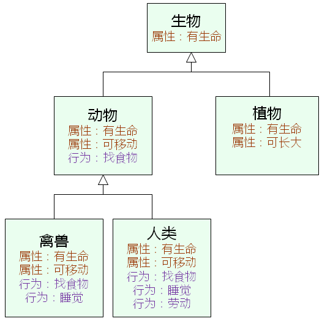
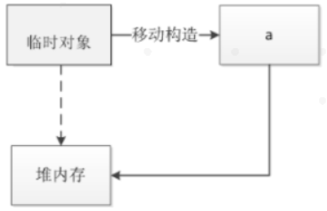
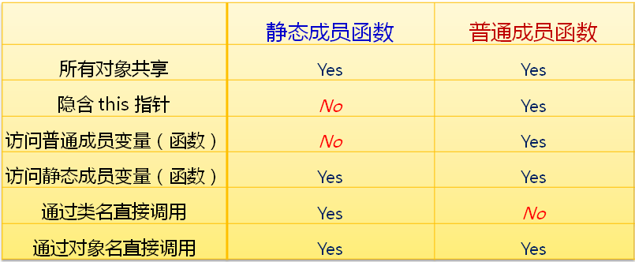
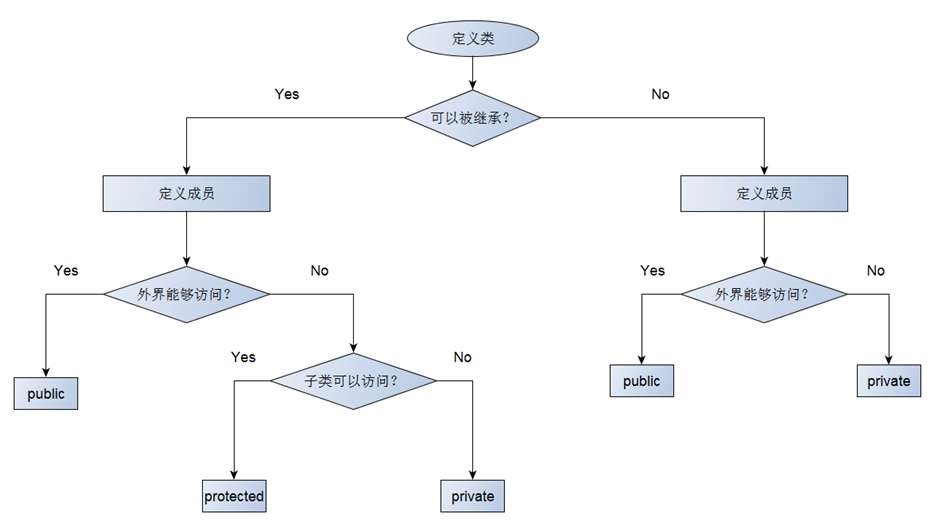
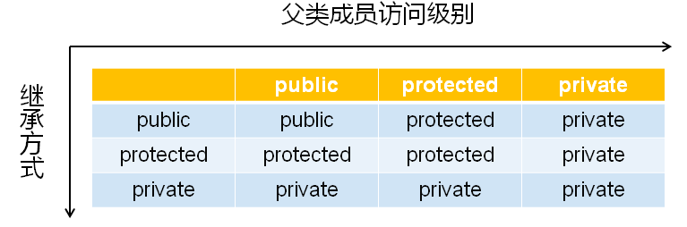
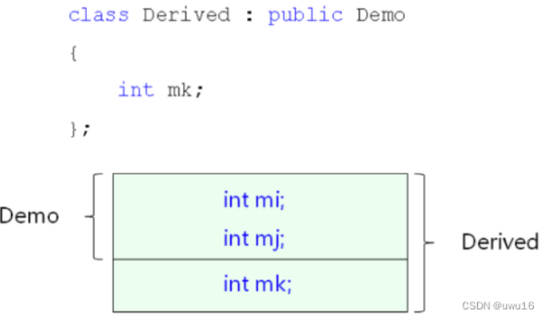
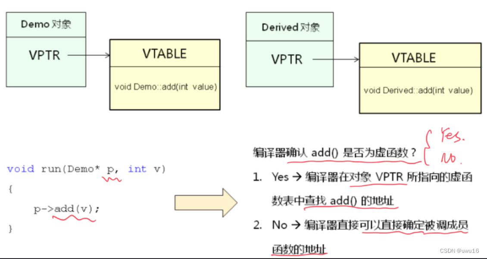
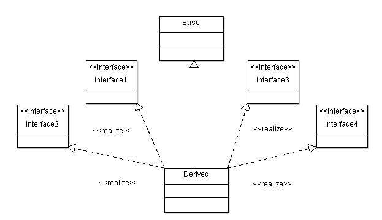

面向对象思想：以模块为中心构建可复用的软件系统，提高软件产品的可维护性和可扩展性；


# 类和对象

**类和对象是面向对象中的两个概念**

- 类：指的是一类事物，是一个抽象的概念
- 对象：指的是属于某个类的`具体实体`
- 类是一种`模型`，这种模型可以`创建出不同的对象实体`
- 对象实体是类模型的一个`具体实例`

**类和对象的意义**

- 类用于抽象的`描述`一类事物所特有的属性和行为
- 对象是具体的事物，`拥有所属类中描述的一切属性和行为`

<u>每个类可以有多个对象，每个对象必然属于某个类；</u>

**类的表示法**

 

------

## 类成员

- 每一个`对象拥有自己独立的属性`（成员变量）

- 所有的`对象共享类的方法`（成员函数）
- 方法能直接访问对象的属性
- 方法中的隐藏参数 `this`用于`指代当前对象`

------

## 类的封装

并不是类的每个属性都是对外公开的；

必须在类的表示法中`定义属性和行为的公开级别`；

- 成员变量：C++中用于表示类属性的变量
- 成员函数：C++中用于表示类行为的函数

C++中可以给成员变量和成员函数定义`访问级别`

- public：成员变量和成员函数可以在类的内部和外界访问和调用
- private：成员变量和成员函数只能在类的内部被访问和调用

类的`封装机制`使得使用方式和内部细节相分离；

通过定义类成员的`访问级别实现封装机制`；

**类成员的作用域**

类成员的作用域都`只在类的内部`，`外部无法直接访问`；

`成员函数`可以直接`访问成员变量`和`调用成员函数`；

类的外部可以通过类变量访问public成员；

类成员的`作用域与访问级别没有关系`；

<u>C++中用struct定义的类中所有成员默认为public</u>

------

## 类的关键字

用`struct`定义类时，所有成员的默认访问级别为`public`；

用`class`定义类时，所有成员的默认访问级别为`private`；

C++中的类支持声明和实现分离

- 在头文件中声明类
- 在源文件中实现类

------

## 对象的初始化

从程序设计的角度，`对象只是变量`

- 在`栈`上创建对象时，成员变量初始为`随机值`

- 在`堆`上创建对象时，成员变量初始值为`随机值`

- 在`静态存储区`创建对象时，成员变量初始值为`0`

一般而言，对象都需要一个确定的初始状态

C++可以定义与类名相同的构造函数用于对象初始化

- 构造函数没有任何返回类型的声明
- 构造函数在对象定义时自动被调用

```c++
class Test
{
private:
    int i;
    int j;
public:
    int getI() { return i; }
    int getJ() { return j; }
    Test()
    {
        printf("Test() Begin\n");
        
        i = 1;
        j = 2;
        
        printf("Test() End\n");
    }
};

```

**带参数的构造函数**

构造函数可以`根据需要定义参数`

一个类中可以存在`多个重载的构造函数`

构造函数的重载遵循C++重载的规则

**构造函数调用**

一般情况下，构造函数在对象定义时被自动调用

一些特殊情况下，需要手工调用构造函数

```c++
class Test
{
private:
    int m_value;
public:
    Test() 
    { 
        printf("Test()\n");
        
        m_value = 0;
    }
    Test(int v) 
    { 
        printf("Test(int v), v = %d\n", v);
        
        m_value = v;
    }
    int getValue()
    {
        return m_value;
    }
};

int main()
{
    Test ta[3] = {Test(), Test(1), Test(2)};      
    
    for(int i=0; i<3; i++)
    {
        printf("ta[%d].getValue() = %d\n", i , ta[i].getValue());
    }
    
    Test t = Test(100);
    
    printf("t.getValue() = %d\n", t.getValue());
    
    return 0;
}
```

开发一个数组类解决原生数组的安全性问题

```c++
//IntArray.h
#ifndef _INTARRAY_H_
#define _INTARRAY_H_

class IntArray
{
private:
    int m_length;
    int* m_pointer;
public:
    IntArray(int len);
    int length();
    bool get(int index, int& value);
    bool set(int index ,int value);
    void free();
};
#endif

//IntArray.cpp
#include "IntArray.h"

IntArray::IntArray(int len)
{
    m_pointer = new int[len];

    for (int i = 0; i < len; i++)
    {
        m_pointer[i] = 0;
    }

    m_length = len;
}

int IntArray::length()
{
    return m_length;
}

bool IntArray::get(int index, int &value)
{
    bool ret = (0 <= index) && (index < length());

    if (ret)
    {
        value = m_pointer[index];
    }

    return ret;
}

bool IntArray::set(int index, int value)
{
    bool ret = (0 <= index) && (index < length());

    if (ret)
    {
        m_pointer[index] = value;
    }

    return ret;
}

void IntArray::free()
{
    delete[] m_pointer;
}

//main.cpp
#include "IntArray.h"
#include <stdio.h>

int main()
{
    IntArray a(5);    
    
    for(int i=0; i<a.length(); i++)
    {
        a.set(i, i + 1);
    }
    
    for(int i=0; i<a.length(); i++)
    {
        int value = 0;
        
        if( a.get(i, value) )
        {
            printf("a[%d] = %d\n", i, value);
        }
    }
    
    a.free();

    return 0;
}
```

### 特殊构造函数

- 无参构造函数

当类中没有定义构造函数时，`编译器默认提供一个无参的构造函数`，并且其函数体为空；

- 拷贝构造函数

参数为const class_name&，当类中没有定义拷贝构造函数时，编译器默认提供一个拷贝构造函数，`简单的进行成员变量的值复制`；

**拷贝构造函数的意义**

浅拷贝

- 拷贝后对象的物理状态相同

深拷贝

- 拷贝后对象的逻辑状态相同

编译器提供的拷贝构造函数只进行浅拷贝

对象中有成员指代了系统中的资源时需要深拷贝

- 成员指向了动态内存空间
- 成员打开了外存中的文件
- 成员使用了系统中的网络端口
- ……

```C++
//深拷贝
IntArray::IntArray(const IntArray& obj)
{
    m_length = obj.m_length;
    
    m_pointer = new int[obj.m_length];
    
    for(int i=0; i<obj.m_length; i++)
    {
        m_pointer[i] = obj.m_pointer[i];
    }
}
```

**移动构造函数**

移动构造是C++11标准中提供的一种新的构造方法；C++11引入移动语义：源对象资源的控制权全部交给目标对象。

 

移动构造函数的参数和拷贝构造函数不同，拷贝构造函数的参数是一个左值引用，但是移动构造函数的初值是一个右值引用。这意味着，移动构造函数的参数是一个右值或者将亡值的引用。也就是说，只有当用一个右值，或者将亡值初始化另一个对象的时候，才会调用移动构造函数。移动构造函数的例子如下：

```c++
#include <iostream>
#include <string>

using namespace std;

class Integer 
{
    int* m_ptr;

public:
    Integer(int value) : m_ptr(new int(value)) 
    {
        cout << "Call Integer(int value)" << endl;
    }

    Integer(const Integer& source) : m_ptr(new int(*source.m_ptr)) 
    {
        cout << "Call Integer(const Integer& source)拷贝" << endl;
    }

    Integer(Integer&& source) noexcept : m_ptr(source.m_ptr)
    {
        source.m_ptr = nullptr;
        cout << "Call Integer(Integer&& source)移动" << endl;
    }

    virtual ~Integer() 
    {
        cout << "Call ~Integer()" << endl;
        delete m_ptr;
    }

    int GetValue(void) 
    { 
        return *m_ptr; 
    }
};
Integer getNum()
{
    Integer a(100);
    return a;
}
int main(int argc, char const* argv[]) 
{
    Integer a(getNum());
    cout << "a=" << a.GetValue() << endl;
    cout << "-----------------" << endl;
    Integer temp(10000);
    Integer b(temp);
    cout << "b=" << b.GetValue() << endl;
    cout << "-----------------" << endl;

    return 0;
}
```

移动构造函数首先将传递参数的内存地址空间接管，然后将内部所有指针设置为nullptr，并且在原地址上进行新对象的构造，最后调用原对象的的析构函数，这样做既不会产生额外的拷贝开销，也不会给新对象分配内存空间。即提高程序的执行效率，节省内存消耗。

**移动赋值运算符**

```c++
//拷贝赋值运算符
Integer& operator= (const Integer& src)
{
    if (this == &src) return *this;
     delete m_ptr;
    m_ptr = new int(*(src.m_ptr));
    return *this;
}
//移动赋值运算符
Integer& operator= (Integer&& src) noexcept
{
    if (this == &src) return *this;
    delete m_ptr;
    m_ptr = src.m_ptr;
    src.m_ptr = nullptr;
    return *this;
}
```

### 初始化列表

C++提供了初始化列表对成员进行初始化

**注意事项：**

- 成员的`初始化顺序`与成员的声明顺序相同
- 成员的初始化列表顺序`与初始化列表中的位置无关`
- 初始化列表`先于构造函数的函数体执行`

```c++
class Value
{
private:
    int mi;
public:
    Value(int i)
    {
        printf("i = %d\n", i);
        mi = i;
    }
    int getI()
    {
        return mi;
    }
};

class Test
{
private:
    Value m2;
    Value m3;
    Value m1;
public:
    Test() : m1(1), m2(2), m3(3)
    {
        printf("Test::Test()\n");
    }
};
```

**类中的const成员**

- 类中的const成员会被分配空间的
- 类中的const成员的本质是只读变量
- 类中的const成员只能在初始化列表中指定初始值

编译器无法直接得到const成员的初始值，因此无法进入符号表成为真正意义的常量

**初始化与赋值不同**

- 初始化：对`正在创建的对象`进行初值设置
- 赋值：对`已经存在的对象`进行值设置

### 对象的构造顺序

`局部对象`的构造顺序`依赖于程序的执行流`

`堆对象`的构造顺序`依赖于new的使用顺序`

`全局对象`的构造顺序是`不确定`的

**单个对象创建时构造函数的调用顺序**

1. 调用父类的构造过程
2. 调用成员变量的虚构函数（调用顺序与声明顺序相同）
3. 调用类自身的构造函数

<u>析构函数与对应构造函数的调用顺序相反</u>；

------

## 析构函数

C++的类中可以定义一个清理函数叫析构函数，功能与构造函数相反

定义：~ClassName()

- 析构函数`没有参数`也没有返回值类型声明
- 析构函数在对象销毁时`自动被调用`

析构函数是`对象释放系统资源`的保障

```c++
class Test
{
private:
    /* data */
public:
    Test(/* args */);
    ~Test();
};

Test::Test(/* args */)
{
    printf("Test()\n");
}

Test::~Test()
{
    printf("~Test()\n");
}
```

------

## const成员函数

**定义：**

Type ClassNmae::function(Type p) const

类中的函数`声明`与实际函数`定义`中都必须带`const`关键字；

**const成员函数**

- const对象只能调用const的成员函数
- const成员函数中只能调用const成员函数
- const成员函数中不能直接改写成员变量的值

------

## 静态成员变量

- 静态成员变量`属于整个类所有`
- 静态成员变量的生命周期不依赖于任何对象
- 可以`通过类名直接访问`公有静态成员变量
- 所有对象共享类的静态成员变量
- 可以`通过对象名访问`公有静态成员变量

**静态成员变量的特性**

- 在定义时直接通过`static`关键字修饰
- 静态成员变量`需要在类外单独分配空间`
- 静态成员变量在程序内部`位于全局数据区`
- 静态成员变量的`生命周期为程序运行期`

**语法规则：**

Type ClassName::VarName = value;

```c++
class Test
{
private:
    static int count;

public:
    Test(/* args */);
    ~Test();
    int getCount();
};

Test::Test(/* args */)
{
    count++;
}

Test::~Test()
{
    count--;
}

int Test::getCount()
{
    return count;
}

int Test::count = 0;

Test gTest;
int main()
{
    Test t1;
    Test t2;

    printf("count = %d\n", gTest.getCount());
    printf("count = %d\n", t1.getCount());
    printf("count = %d\n", t2.getCount());

    return 0;
}
```

------

## 静态成员函数

- 静态成员函数是类中特殊的成员函数
- 静态成员函数`属于整个类所有`
- 可以`通过类名直接访问`公有静态成员函数
- 可以`通过对象名访问`公有静态成员函数

 

**静态成员函数的定义**

- 直接通过static关键字修饰成员函数

```c++
class Test
{
public:
    static void Func1(){ }
    static int Func2();
};

int Test::Func2(){
    return 0;
}
```

------

## 二阶构造模式

工程开发中的`构造过程`可分为两个阶段

- 资源无关的初始化操作（不可能出现异常情况的操作）
- 需要使用系统资源的操作（可能出现异常情况，如内存申请、访问文件等）

```C++
class TwoPhaseCons 
{
private:
    TwoPhaseCons() // 第一阶段构造函数
    {   
    }
    bool construct() // 第二阶段构造函数
    { 
        return true; 
    }
public:
    static TwoPhaseCons* NewInstance(); // 对象创建函数
};

TwoPhaseCons* TwoPhaseCons::NewInstance() 
{
    TwoPhaseCons* ret = new TwoPhaseCons();

    // 若第二阶段构造失败，返回 NULL    
    if( !(ret && ret->construct()) ) 
    {
        delete ret;
        ret = NULL;
    }
        
    return ret;
}


int main()
{
    TwoPhaseCons* obj = TwoPhaseCons::NewInstance();
    
    printf("obj = %p\n", obj);

    delete obj;
    
    return 0;
}
```

构造函数`只能决定对象的初始化状态`，初始化`失败不影响对象的诞生`；

二阶构造人为的`将初始化过程分为两部分`，能够确保创建的`对象都是完整初始化`的；

------

## 友元

友元是C++中的一种关系

友元关系发生在`函数与类之间`或者`类与类之间`

友元关系是`单项的`，`不能传递`

**友元的用法**

- 在类中以`friend`关键字声明友元

- 类的友元可以是其他类或者具体函数

- 友元`不是`类的一部分
- 友元`不受`类中访问级别的限制
- `友元可以直接访问具体类的所有成员`

在类中用`friend`关键字对`函数`或`类`进行声明：

```c++
class Point
{
    double x;
    double y;
    
    friend void func(Point& p);
};

void func(Point& p)
{
    
}

//示例
class Point
{
    double x;
    double y;

public:
    Point(double x, double y)
    {
        this->x = x;
        this->y = y;
    }
    double getX()
    {
        return x;
    }
    double getY()
    {
        return y;
    }
    friend double func(Point &p1, Point &p2);
};

double func(Point &p1, Point &p2)
{
    double ret = 0;

    ret = (p2.y - p1.y) * (p2.y - p1.y) +
          (p2.x - p1.x) * (p2.x - p1.x);

    ret = sqrt(ret);
    return ret;
}

int main()
{
    Point p1(1, 2);
    Point p2(10, 20);

    printf("p1(%f,%f)\n", p1.getX(), p1.getY());
    printf("p2(%f,%f)\n", p2.getX(), p2.getY());
    printf("|(p1,p2)| = %f\n", func(p1, p2));

    return 0;
}
```

友元为了兼顾C语言的高效而诞生，但是破坏了面向对象的封装性，在现代实际产品中已经逐渐被遗弃；

**注意事项：**

- 友元不具备传递性
- 类的友元可以是其他类的成员函数
- 类的友元可以是某个完整的类（所有的成员函数都是友元）

------

## 函数重载

类中的`成员函数`可以进行`重载`

- 构造函数的重载
- 普通成员函数的重载
- 静态成员函数的重载

重载必须发生在`同一作用域中`，`全局函数`和`成员函数不能`构成重载关系

```c++
class Test
{
    int i;
public:
    Test()
    {
        printf("Test::Test()\n");
        this->i = 0;
    }
    
    Test(int i)
    {
        printf("Test::Test(int i)\n");
        this->i = i;
    }
    
    Test(const Test& obj)
    {
        printf("Test(const Test& obj)\n");
        this->i = obj.i;
    }
    
    static void func()
    {
        printf("void Test::func()\n");
    }
    
    void func(int i)
    {
        printf("void Test::func(int i), i = %d\n", i);
    }
    
    int getI()
    {
        return i;
    }
};

void func()
{
    printf("void func()\n");
}

void func(int i)
{
    printf("void func(int i), i = %d\n", i);
}

int main()
{
    func();
    func(1);
    
    Test t;        // Test::Test()
    Test t1(1);    // Test::Test(int i)
    Test t2(t1);   // Test(const Test& obj)
    
    func();        // void func()
    Test::func();  // void Test::func()
    
    func(2);       // void func(int i), i = 2;
    t1.func(2);    // void Test::func(int i), i = 2
    t1.func();     // void Test::func()
    
    return 0;
}
```

**重载的意义：**

通过函数名和参数列表对函数用法进行提示，`扩展`系统中`已经存在`的函数功能

```c++
char* strcpy(char* buf, const char* s, unsigned int n)
{
    return strncpy(buf, s, n);
}

int main()
{
    const char* s = "Wong Software";
    char buf[16] = {0};

    //strcpy(buf, s);
    //strncpy(buf, s, sizeof(buf)-1);
    strcpy(buf, s, sizeof(buf)-1);

    printf("%s\n",buf);

    return 0;
}
```

------

## 操作符重载

C++中的重载能够扩展操作符的功能；

操作符的重载以函数的方式进行，本质是用`特殊形式的函数`扩展操作符的功能；

通过`operator`关键字可以定义特殊的函数，`通过函数重载操作符`

```c++
class Type
{
public:
	Type operator Sign(const Type& p)
	{
		Type ret;
    
    	return ret;
	}
}
//Sign为系统中预先定义的操作符，如：+,-,*,/,等
```

可以将操作符重载函数定义为`类的成员函数`

- 比全局操作符重载函数少一个参数（左操作数）
- 不需要依赖友元
- 编译器优先在成员函数中寻找操作符重载函数

```c++
class Complex
{
    int a;
    int b;
public:
	………………//省略
        
    Complex operator + (const Complex& p)
    {
        Complex ret;

        ret.a = this->a + p.a;
        ret.b = this->b + p.b;

        return ret;
    }
};

int main()
{

    Complex c1(1, 2);
    Complex c2(3, 4);
    Complex c3 = c1 + c2;   //c1.operator + (c2)
    
    printf("c3.a = %d, c3.b = %d\n", c3.getA(), c3.getB());
    return 0;
}
```

**注意事项：**

- c++规定赋值操作符（=）只能重载为成员函数

- 操作符重载`不能改变`原操作符的`优先级`，`不能改变`操作数的`个数`，`不应改变`操作符的`原有语义`

------

# 继承

面向对象中的继承指类之间的父子关系

- 子类拥有父类的`所有属性和行为`
- 子类就是一种`特殊的父类`
- 子类对象可以当作父类对象使用
- 子类中可以`添加父类没有的`方法和属性

```c++
class Parent
{
    int mv;
public:
    void method(){};
};

class Child : public Parent	//描述继承关系
{
    
};
```

**重要规则：**

- 子类就是一个特殊的父类
- 子类对象可以直接初始化父类对象
- 子类对象可以直接赋值给父类对象

**继承的意义：**

通过继承，可以获得`父类的所有功能`，并且可以在子类中`重写已有功能`或者`添加新功能`，继承是面向对象中代码代码复用的重要手段；

------

## 继承中访问级别

面向对象中的访问级别不只是public和private；

可以定义`protected`访问级别；

protected关键字是为了继承而专门设计的；

关键字protected的意义：

- 修饰的成员`不能被外界直接访问`
- 修饰的成员`可以被子类直接访问`

```c++
class Parent
{
protected:
    int mv;

public:
    Parent()
    {
        mv = 100;
    }
    int value()
    {
        return mv;
    }
};

class Child : public Parent
{
public:
    int addValue(int v)
    {
        mv += v;
        return mv;
    }
};

int main()
{
    Parent p;
    cout << "p.mv = " << p.value() << endl;
    // p.mv = 1000;    // error

    Child c;
    cout << "c.mv = " << c.value() << endl;

    c.addValue(50);
    cout << "c.mv = " << c.value() << endl;
    // c.mv = 10000;  // error

    return 0;
}
```

**定义类时访问级别的选择**：

 

组合与继承综合实例:
需要一个父类Object, 为子类Point和子类Line 提供name名字和info信息；
由于线Line至少需要两个点Point才能组成,所以Line子类内部需要通过Point子类来组合；

```c++
class Object
{
protected:
    string mName;
    string mInfo;

public:
    Object()
    {
        mName = "Object";
        mInfo = "";
    }
    string name()
    {
        return mName;
    }
    string info()
    {
        return mInfo;
    }
};

class Point : public Object
{
private:
    int mX;
    int mY;

public:
    Point(int x = 0, int y = 0)
    {
        ostringstream s;
        this->mX = x;
        this->mY = y;
        s << "P(" << mX << "," << mY << ")"; // 坐标信息
        mName = "Point";
        mInfo = s.str();
    }
};

class Line : public Object
{
private:
    Point mP1;
    Point mP2;

public:
    Line(Point p1, Point p2)
    {
        ostringstream s;
        mP1 = p1;
        mP2 = p2;
        s << "Line from " << p1.info() << " to " << p2.info(); // 线的信息
        mName = "Line";
        mInfo = s.str();
    }
};

int main()
{
    Point p1(2, 3);
    Point p2(6, 3);
    Line L(p1, p2);

    /*打印点的信息*/
    cout << p1.name() << ":" << endl;
    cout << p1.info() << endl;

    /*打印线的信息*/
    cout << L.name() << ":" << endl;
    cout << L.info() << endl;
    return 0;

    return 0;
}
```

------

## 继承方式

C++中支持三种不同的继承方式

- public

父类成员在子类中`保持原有访问级别`

- private

父类成员在子类中`变为私有成员`

- protected

父类中的`公有成员变为保护成员`，其他成员保持不变

 

继承成员的访问属性 = Max{继承方式，父类成员访问属性}

C++中的默认继承方式为private；


**继承与访问级别深度实践**

```c++
#include <iostream>
#include <string>
using namespace std;

class Parent {
protected:
    int m_a;
    int m_b;
public:
    int m_c;
    
    void set(int a, int b, int c) {
        m_a = a;
        m_b = b;
        m_c = c;
    }
};

class Child_A : public Parent {
public:
    void print() {
        cout << "m_a " << m_a << endl;
        cout << "m_b " << m_b << endl;
        cout << "m_c " << m_c << endl;
    }
};

class Child_B : protected Parent {
public:
    void print() {
        cout << "m_a " << m_a << endl;
        cout << "m_b " << m_b << endl;
        cout << "m_c " << m_c << endl;
    }
};

class Child_C : private Parent {
public:
    void print() {
        cout << "m_a " << m_a << endl;
        cout << "m_b " << m_b << endl;
        cout << "m_c " << m_c << endl;
    }
};

int main() {
    Child_A a;
    Child_B b;
    Child_C c;
    
    a.m_c = 100;
    // b.m_c = 100;    // Child_B 保护继承自 Parent， 所以所有的 public 成员全部变成了 protected 成员， 因此外界无法访问
    // c.m_c = 100;    // Child_C 私有继承自 Parent， 所以所有的成员全部变成了 private 成员， 因此外界无法访问
    
    a.set(1, 1, 1);
    // b.set(2, 2, 2);
    // c.set(3, 3, 3);
    
    a.print();
    b.print();
    c.print();
    
    return 0;
}
```

一般而言，C++工程项目中`只使用public继承；`

C++派生语言只支持public一种继承方式；

protected和private继承带来的复杂性远大于实用性；

------

## 继承的构造和析构

**子类对象的构造函数**

- 必须对继承而来的成员进行初始化
- 直接通过`初始化列表`或者`赋值的方式`进行初始化
- `调用父类构造函数`进行初始化

**父类构造函数在子类中的调用方式**

- 默认调用：适用于无参构造函数和使用默认参数的构造函数
- 显式调用：通过初始化列表进行调用，适用于所有父类构造函数

```c++
class Child : public Parent
{
public:
    Child()	//隐式调用
    {
        
    }
    Child(String s) : Parent("Paremeter to Parent")	//显式调用
    {
        
    }
};
```

**构造规则**

- 子类对象在创建时会首先调用父类的构造函数
- `先执行父类构造函数`再执行子类的构造函数
- 父类构造函数可以被`隐式调用`或者`显式调用`

**对象创建时构造函数的调用顺序**

- 调用`父类`的构造函数
- 调用`成员变量`的构造函数
- 调用类`自身`的构造函数

```c++
class Object
{
public:
    Object(string s)
    {
        cout << "Object(string s) : " << s << endl;
    }
};

class Parent : public Object
{
public:
    Parent() : Object("Default")
    {
        cout << "Parent()" << endl;
    }
    Parent(string s) : Object(s)
    {
        cout << "Parent(string s) : " << s << endl;
    }
};

class Child : public Parent
{
    Object mO1;
    Object mO2;
public:
    Child() : mO1("Default 1"), mO2("Default 2")
    {
        cout << "Child()" << endl;
    }
    Child(string s) : Parent(s), mO1(s + " 1"), mO2(s + " 2")
    {
        cout << "Child(string s) : " << s << endl;
    }
};

int main()
{       
    Child cc("cc");
    
    return 0;
}
```

子类对象在销毁时需要调用父类析构函数进行清理；

析构函数的调用顺序与构造函数相反

- 执行`自身`的析构函数
- 执行`成员变量`的析构函数
- 执行`父类`的析构函数

------

## 父子类间的冲突

子类可以定义父类中的同名成员；

子类中的成员将`隐藏父类中的同名成员`；

父类中的同名成员`依然存在于子类中`；

通过`作用域分辨符`（::）访问父类中的同名成员；

```c++
class Parent
{
public:
    int mi;
    
    void add(int v)
    {
        mi += v;
    }
    
    void add(int a, int b)
    {
        mi += (a + b);
    }
};

class Child : public Parent
{
public:
    int mi;
    
    void add(int v)
    {
        mi += v;
    }
    
    void add(int a, int b)
    {
        mi += (a + b);
    }
    
    void add(int x, int y, int z)
    {
        mi += (x + y + z);
    }
};

int main()
{
    Child c;
    
    c.mi = 100;    
    c.Parent::mi = 1000;
    
    cout << "c.mi = " << c.mi << endl;
    cout << "c.Parent::mi = " << c.Parent::mi << endl;
    
    c.add(1);
    c.add(2, 3);
    c.add(4, 5, 6);
    
    cout << "c.mi = " << c.mi << endl;
    cout << "c.Parent::mi = " << c.Parent::mi << endl;
    
    return 0;
}
```

子类可以`定义`父类中的`同名成员`；

子类中的成员将`隐藏父类中的同名成员`；

子类和父类中的函数`不能构成重载`关系；

子类可以定义父类中`完全相同`的成员函数；

使用`作用域分辨符`访问父类中的同名成员；

------

## 同名覆盖引发的问题

子类对象可以当作父类对象使用（兼容性）

- 子类对象可以`直接赋值`给父类对象
- 子类对象可以`直接初始化`父类对象
- 父类指针可以`直接指向子类对象`
- 父类引用可以`直接引用子类对象`

子类对象的兼容性实验：

```c++
class Parent
{
public:
    int mi;

    void add(int v)
    {
        mi += v;
    }

    void add(int a, int b)
    {
        mi += (a + b);
    }
};

class Child : public Parent
{
public:
    int mv;
    
    void add(int x, int y, int z)
    {
        mv += (x + y + z);
    }
};

int main()
{
    Parent p;
    Child c;

    p = c;

    Parent p1(c);
    Parent& rp = c;
    Parent* pp = &c;

    rp.mi = 100;
    rp.add(5);
    rp.add(10, 10);

    // pp已退化为父类对象，只能访问父类成员
    // pp->mv = 1000;
    // pp->add(1, 2, 3);

    return 0;
}
```

当使用父类指针（引用）指向子类对象时

- 子类对象退化为父类对象
- `只能访问`父类中定义的成员
- 可以`直接访问`被子类`覆盖`的同名成员


子类中可以重定义父类中已经存在的成员函数，这种重定义`发生在继承中`，叫做函数`重写`；

函数重写是同名覆盖的一种特殊情况

```c++
class Parent
{
public:
    int mi;
    
    void add(int i)
    {
        mi += i;
    }
    
    void add(int a, int b)
    {
        mi += (a + b);
    }

    void print()
    {
        cout << "Parent print" << endl;
    }
};

class Child : public Parent
{
public:
    int mv;
    
    void add(int x, int y, int z)
    {
        mv += (x + y + z);
    }

    void print ()
    {
        cout << "Child print" << endl;
    }
};

/**在编译这个函数时，编译器不可能知道指针p究竟指向了什么。但是编译器没有理由报错。
  *于是，编译器认为 最安全的做法是调用父类的print函数，
  *因为，父类和子类肯定都有相同的print函数。*/
void how_to_print(Parent* p)
{
    p->print();
}

int main()
{
    Parent p;
    Child c;

    how_to_print(&p);   // Expected to print: Parent print.
    how_to_print(&c);   // Expected to print: Parent print.
    
    return 0;
}
```

------

# 多态

面向对象中的多态概念：

根据实际的`对象类型决定函数调用`的具体目标；

同样的`调用语句`在实际运行时有`多种不同的表现形态`；


**C++语言直接支持多态的概念**

- 通过使用`virtual`关键字对多态进行支持
- 被virtual声明的函数`被重写后具有多态特征`
- 被virtual声明的函数叫做`虚函数`

```c++
class Parent
{
public:
    virtual void print()
    {
        cout << "I'm Parent." << endl;
    }
};

class Child : public Parent
{
public:
    void print()
    {
        cout << "I'm Child." << endl;
    }
};

void how_to_print(Parent* p)
{
    p->print();     // 展现多态的行为
}

int main()
{
    Parent p;
    Child c;
    
    how_to_print(&p);    // Expected to print: I'm Parent.
    how_to_print(&c);    // Expected to print: I'm Child.
    
    return 0;
}
```


**多态的意义**

- 在程序`运行过程中`展现出`动态的特征`
- `函数重写必须多态实现`，否则没有意义
- 多态是面向对象组件化程序设计的基础

**理论中的概念**

- 静态联编：在程序的`编译期间`就能确定具体的函数调用，如：函数重载
- 动态联编：在`程序实际运行后`才能确定具体的函数调用， 如：函数重写

```c++
class Parent
{
public:
    virtual void func()
    {
        cout << "void func()" << endl;
    }
    
    virtual void func(int i)
    {
        cout << "void func(int i) : " << i << endl;
    }
    
    virtual void func(int i, int j)
    {
        cout << "void func(int i, int j) : " << "(" << i << ", " << j << ")" << endl;
    }
};

class Child : public Parent
{
public:
    void func(int i, int j)
    {
        cout << "void func(int i, int j) : " << i + j << endl;
    }
    
    void func(int i, int j, int k)
    {
        cout << "void func(int i, int j, int k) : " << i + j + k << endl;
    }
};

void run(Parent* p)
{
    p->func(1, 2);     // 展现多态的特性
                       // 动态联编
}


int main()
{
    Parent p;
    
    p.func();         // 静态联编
    p.func(1);        // 静态联编
    p.func(1, 2);     // 静态联编
    
    cout << endl;
    
    Child c;
    
    c.func(1, 2);     // 静态联编
    
    cout << endl;
    
    run(&p);
    run(&c);
    
    return 0;
}
```

**编程实例**

```c++
class Boss
{
public:
    int fight()
    {
        int ret = 10;
        
        cout << "Boss::fight() : " << ret << endl;
        
        return ret;
    }
};

class Master
{
public:
    virtual int eightSwordKill()
    {
        int ret = 8;
        
        cout << "Master::eightSwordKill() : " << ret << endl;
        
        return ret;
    }
};

class New_Master : public Master
{
public:
    int eightSwordKill()
    {
        int ret = Master::eightSwordKill() * 2;
        cout << "New_Master::eightSwordKill() : " << ret << endl;
        return ret; 
    }
};

void field_pk(Master* master, Boss* boss)
{
    int k = master->eightSwordKill();
    int b = boss->fight();
    
    if( k < b )
    {
        cout << "Master is killed..." << endl;
    }
    else
    {
        cout << "Boss is killed..." << endl;
    }
}

int main()
{
    Master master;
    Boss boss;

    cout << "Master vs Boss" << endl;
    field_pk(&master, &boss);

    cout << "New_Master vs Boss" << endl;
    New_Master newMaster;
    field_pk(&newMaster, &boss);

    return 0;
}
```

函数重写只可能发生在父类和子类之间；

`virtual`关键字是c++中支持多态的`唯一`方式；

`被重写的虚函数可表现为多态的特征；`

------

## 对象模型分析

本质class是一种特殊的struct

- 在内存中class依旧可以看作变量的集合
- class和struct遵循相同的内存对齐规则
- class中的成员函数与成员变量是`分开存放`的，每个对象有`独立的`成员变量，所有对象`共享`类中的成员函数

**对象本质分析**

成员变量：

- 运行时的对象`退化为结构体`的形式
- 所有`成员变量`在内存中依次排布
- 成员变量间可能存在内存空隙
- 可以`通过内存地址`直接访问成员变量
- <u>访问权限关键字在运行时失效</u>

成员函数：

- 类中的`成员函数`位于`代码段`中
- 调用成员函数时`对象地址作为参数隐式传递`
- 成员函数`通过对象地址`访问成员变量
- C++语法规则隐藏了对象地址的传递过程


下面用 C 语言模拟过程，显示的传递对象地址，以明白对象调用成员函数的过程。

```c
// ClassDemo.h
#ifndef _CLASSDEMO_H_
#define _CLASSDEMO_H_
typedef void Demo;
Demo* Demo_Create(int i, int j);
int Demo_GetI(Demo* pThis);
int Demo_GetJ(Demo* pThis);
int Demo_Add(Demo* pThis, int value);
void Demo_Free(Demo* pThis);
#endif

// ClassDemo.c
#include<malloc.h>
#include"ClassDemo.h"
struct ClassDemo
{
    int mi;
    int mj;
};
Demo* Demo_Create(int i, int j)
{
    struct ClassDemo* ret = (struct ClassDemo*)malloc(sizeof(struct ClassDemo));
    if (ret != NULL)
    {
        ret->mi = i;
        ret->mj = j;
    }
    return ret;
}
int Demo_GetI(Demo* pThis)
{
    struct ClassDemo* obj = (struct ClassDemo*)pThis;
    return obj->mi;
}
int Demo_GetJ(Demo* pThis)
{
    struct ClassDemo* obj = (struct ClassDemo*)pThis;
    return obj->mj;
}
int Demo_Add(Demo* pThis, int value)
{
    struct ClassDemo* obj = (struct ClassDemo*)pThis;
    return obj->mi + obj->mj + value;
}
void Demo_Free(Demo* pThis)
{
    free(pThis);
}

// main.c
#include<stdio.h>
#include"ClassDemo.h"
int main()
{
    Demo* d = Demo_Create(1, 2);
    printf("d.mi = %d\n", Demo_GetI(d));
    printf("d.mj = %d\n", Demo_GetJ(d));
    printf("Add(3) = %d\n", Demo_Add(d, 3));
    Demo_Free(d);
    return 0;
}
```

<u>在C++编译器的内部，类可以理解为结构体</u>；

子类是由父类成员叠加子类新成员得到的（ 父类在前，子类在后 ）

 

**C++多态的实现原理**

- 当类中`声明虚函数`时，编译器会在类中`生成一个虚函数表`
- 虚函数表是一个`存储成员函数地址的数据结构`
- 虚函数表是由编译器自动生成与维护的
- `virtual`成员函数会被编译器`放入虚函数表中`
- 存在虚函数时，每个对象中都有`一个指向虚函数表的指针`

 


> 注意：指向虚函数表的指针放在**最开始的4个字节处**

```c
/*51-2.c*/
#include "51-2.h"
#include "malloc.h"

static int Demo_Virtual_Add(Demo* pThis, int value);
static int Derived_Virtual_Add(Demo* pThis, int value);

struct VTable   // 2、定义虚函数表数据结构
{
    int (*pAdd) (void*, int);   // 3、虚函数表里面存储什么
};

struct ClassDemo
{
    struct VTable* vptr;    // 1、定义虚函数表的指针==>虚函数表指针类型？？
    int mi;
    int mj;
};

struct ClassDerived
{
    struct ClassDemo d;
    int mk;
};

static struct VTable g_Demo_vtbl = 
{
    Demo_Virtual_Add
};

static struct VTable g_Derived_vtbl = 
{
    Derived_Virtual_Add
};


Demo* Demo_Create(int i, int j)
{
    struct ClassDemo* ret = (struct ClassDemo*)malloc(sizeof(struct ClassDemo));
    
    if( ret != NULL )
    {
        ret->vptr = &g_Demo_vtbl;   // 4、关联对象和指向的具体的虚函数表
        ret->mi = i;
        ret->mj = j;
    }
    
    return ret;
}

int Demo_GetI(Demo* pThis)
{
     struct ClassDemo* obj = (struct ClassDemo*)pThis;
     
     return obj->mi;
}

int Demo_GetJ(Demo* pThis)
{
    struct ClassDemo* obj = (struct ClassDemo*)pThis;
     
    return obj->mj;
}

// 6、定义虚函数表中指针所指向的具体函数
static int Demo_Virtual_Add(Demo* pThis, int value)
{
    struct ClassDemo* obj = (struct ClassDemo*)pThis;
     
    return obj->mi + obj->mj + value;
}

// 5、分析具体的虚函数
int Demo_Add(Demo* pThis, int value)
{
    struct ClassDemo* obj = (struct ClassDemo*)pThis;
     
    return obj->vptr->pAdd(pThis, value);   // 通过对象，找到指向虚函数表的指针，然后在虚函数表中找到具体要调用的函数地址
}

void Demo_Free(Demo* pThis)
{
    free(pThis);
}

Derived* Derived_Create(int i, int j, int k)
{
    struct ClassDerived* ret = (struct ClassDerived*)malloc(sizeof(struct ClassDerived));
    
    if( ret != NULL )
    {
        ret->d.vptr = &g_Derived_vtbl;
        ret->d.mi = i;
        ret->d.mj = j;
        ret->mk = k;
    }
    
    return ret;
}

int Derived_GetK(Derived* pThis)
{
    struct ClassDerived* obj = (struct ClassDerived*)pThis;
     
    return obj->mk;
}

static int Derived_Virtual_Add(Demo* pThis, int value)
{
    struct ClassDerived* obj = (struct ClassDerived*)pThis;
     
    return obj->mk + value;
}

int Derived_Add(Derived* pThis, int value)
{
    struct ClassDerived* obj = (struct ClassDerived*)pThis;
     
    return obj->d.vptr->pAdd(pThis, value);
}

/*51-2.h*/
#ifndef _51_2_H_
#define _51_2_H_

typedef void Demo;
typedef void Derived;

Demo* Demo_Create(int i, int j);
int Demo_GetI(Demo* pThis);
int Demo_GetJ(Demo* pThis);
int Demo_Add(Demo* pThis, int value);
void Demo_Free(Demo* pThis);

Derived* Derived_Create(int i, int j, int k);
int Derived_GetK(Derived* pThis);
int Derived_Add(Derived* pThis, int value);

#endif

/*main.c*/
#include "51-2.h"
#include "stdio.h"

void run(Demo* p, int v)
{
    int r = Demo_Add(p, v);
    printf("r = %d\n", r);
}

int main()
{
    Demo* pb = Demo_Create(1, 2);
    Derived* pd = Derived_Create(1, 22, 333);
    
    printf("pb->add(3) = %d\n", Demo_Add(pb, 3));
    printf("pd->add(3) = %d\n", Derived_Add(pd, 3));
    
    run(pb, 3);
    run(pd, 3);
    
    Demo_Free(pb);
    Demo_Free(pd);
    
    return 0;
}
```

继承的本质就是父子间`成员变量的叠加`；

C++中的多态是通过虚函数表实现的；

虚函数表是由编译器自动生成与维护；

虚函数的`调用效率低于`普通函数；

------

## 抽象类和接口

面向对象中的抽象类

- 一种`只能定义`类型，而`不能产生`对象的类
- `只能被继承并重写相关函数`
- 直接特征是相关函数`没有完整的实现`

**抽象类与纯虚函数**

- C++语言中没有抽象类的概念

- C++中通过纯虚函数实现抽象类
- 纯虚函数是指`只定义原型`的成员函数
- 一个C++类中`存在纯虚函数`就成为了抽象类

**纯虚函数的语法规则**

```c++
class Shape
{
public:
    virtual double area() = 0;
};
```

"= 0" 用于告诉编译器当前是`声明纯虚函数`，因此不需要定义函数体；

```c++
class Shape
{
public:
    virtual double area() = 0;
};

class Rect : public Shape
{
    int ma;
    int mb;
public:
    Rect(int a, int b)
    {
        ma = a;
        mb = b;
    }
    double area()
    {
        return ma * mb;
    }
};

class Circle : public Shape
{
    int mr;
public:
    Circle(int r)
    {
        mr = r;
    }
    double area()
    {
        return 3.14 * mr * mr;
    }
};

void area(Shape* p)
{
    double r = p->area();
    
    cout << "r = " << r << endl;
}

int main()
{
    Rect rect(1, 2);
    Circle circle(10);
    
    area(&rect);
    area(&circle);
    
    return 0;
}
```

- 抽象类`只能`用作父类`被继承`
- 子类必须实现纯虚函数的`具体功能`
- 纯虚函数被实现后`成为虚函数`
- 如果子类没有实现纯虚函数，则子类成为抽象类

**满足下面条件的C++类则称为接口**

- 类中`没有`定义任何的`成员变量`
- 所有的成员函数`都是公有的`
- 所有的成员函数`都是纯虚函数`
- 接口是一种`特殊的抽象类`

**接口初探：**

```c++
class Channel
{
public:
    virtual bool open() = 0;
    virtual bool close() = 0;
    virtual bool send(char* buf, int len) = 0;
    virtual bool receive(char* buf, int len) = 0;
};
```

------

## 多重继承

C++支持编写多重继承的代码

- 一个子类可以拥有多个父类
- 子类拥有`所有父类的`成员变量
- 子类继承`所有父类的`成员函数
- 子类对象可以`当作任意父类对象`使用

**多继承问题一：**

 


通过多重继承得到的对象可能拥有“`不同地址`”；

 

**多重继承问题二：**

```c++
class People
{
    string m_name;
    int m_age;

public:
    People(string name, int age)
    {
        m_name = name;
        m_age = age;
    }
    void print()
    {
        cout << "Name = " << m_name << ", "
             << "Age = " << m_age << endl;
    }
};

class Teacher : public People
{
public:
    Teacher(string name, int age) : People(name, age){}
};

class Student : public People
{
public:
    Student(string name, int age) : People(name, age){}
};

class Doctor : public Teacher, public Student
{
public:
    Doctor(string name, int age) : Teacher(name, age),Student(name, age){}
};

int main()
{
    Doctor d("Delphi", 33);
    
    d.Teacher::print();
    d.Student::print();

    return 0;
}
```

当多重继承关系出现闭合时将产生数据冗余的问题，多重继承可能产生冗余的成员；


**解决方案：`虚继承`**

```c++
class People {};
class Teacher : virtual public People {};
class Student : virtual public People {};
class Doctor : public Teacher, public Student {};
```

- 虚继承能够`解决数据冗余`问题
- 中间层父类不调用顶层父类构造函数
- 最终子类必须调用顶层父类的构造函数

> 当架构设计中需要继承时，无法确定使用直接继承还是虚继承，虚继承使得架构设计可能出现问题


**多重继承问题三：**

多重继承可能会产生多个虚函数表

 


需要进行强制类型转换时，C++中推荐使用新式类型转换关键字
解决方案：dynamic_cast

 


**正确使用多重继承：**

工程中开发中的“多重继承”方式——单继承某个类+实现（多个）接口

 

```c++
class Base
{
protected:
    int mi;
public:
    Base(int i)
    {
        mi = i;
    }
    int getI()
    {
        return mi;
    }
    bool equal(Base* obj)
    {
        return(this == obj);
    }
};

class Interface1
{
public:
    virtual void add(int i) = 0;
    virtual void minus(int i) = 0;
};

class Interface2
{
public:
    virtual void multiply(int i) = 0;
    virtual void divide(int i) = 0;
};

class Derived : public Base, public Interface1, public Interface2
{
public:
    Derived(int i) : Base(i) {}

    void add(int i)
    {
        mi += i;
    }
    void minus(int i)
    {
        mi -= i;
    }
    void multiply(int i)
    {
        mi *= i;
    }
    void divide(int i)
    {
        if( i != 0 )
        {
            mi /= i;
        }
    }
};

int main()
{
    Derived d(100);
    Derived* p = &d;
    Interface1* pInt1 = &d;
    Interface2* pInt2 = &d;
    
    cout << "p->getI() = " << p->getI() << endl;    // 100
    
    pInt1->add(10);
    pInt2->divide(11);
    pInt1->minus(5);
    pInt2->multiply(8);
    
    cout << "p->getI() = " << p->getI() << endl;    // 40
    cout << endl;

    cout << "pInt1 == p : " << p->equal(dynamic_cast<Base*>(pInt1)) << endl;
    cout << "pInt2 == p : " << p->equal(dynamic_cast<Base*>(pInt2)) << endl;

    return 0;
}
```

p->equal(dynamic_cast<Base*>(pInt1))为例，编译时，编译器就会去检查pInt1所在的地址，然后找到是d对象，通过d对象找到Base父类，从而去修正pInt1指针的地址；


**一些工程建议：**

- 先继承自`一个父类`，然后实现`多个接口`
- 父类中提供equal()成员函数，用于`判断指针是否指向当前对象`
- 与`多重继承`相关的强制类型转换用`dynamic_cast`完成

------

## 类型识别

在面向对象中可能出现下面的情况：

- 基类指针指向子类对象
- 基类引用成为子类对象的别名

 

这个时候就会出现问题：（由于**赋值兼容性原则**）没法通过一个父类指针判断指向的是父类对象还是子类对象

- 静态类型：变量（对象）自身的类型
- 动态类型：指针（引用）所指向对象的实际类型

 

基类指针是否可以强制类型转换为子类指针取决于动态类型；


**解决方案——利用多态**

- 在基类中`定义虚函数`返回具体的类型信息
- 所有的派生类都`必须实现`类型相关的虚函数
- 每个类中的类型虚函数`都需要不同的实现`

 


**多态解决方案的缺陷**

- 必须从基类开始提供类型虚函数
- 所有的派生类都必须重写类型虚函数
- 每个派生类的类型名必须唯一

**类型识别关键字**

- C++提供了`typeid关键字`用于获取类型信息
  - typeid关键字返回对应参数的`类型信息`
  - typeid返回一个`type_info类对象`
  - 当typeid的参数为`NULL`时将`抛出异常`

**typeid关键字的使用**

```c++
int i = 0;
const type_info& tiv = typeid(i);
const type_info& tii = typeid(int);
cout << (tiv == tii) << endl;
```

 **typeid的注意事项**

- 当参数为`类型`时：返回静态类型信息
- 当参数为`变量`时：
  - 不存在虚函数表 – 返回静态类型信息
  - 存在虚函数表 – 返回动态类型信息

```c++
class Base
{
public:
    virtual ~Base() = default;
};

class Derived : public Base
{

};

class Child : public Base
{
  
};

void get_TypeInfo(Base* b)
{
    const type_info& ti = typeid(*b);
    cout << ti.name() << endl;
}

int main(int argc, char *argv[])
{
    int i = 0;
    
    const type_info& tiv = typeid(i);
    const type_info& tii = typeid(int);
    
    cout << (tiv == tii) << endl;
    
    Base b;
    Derived d;
    
    get_TypeInfo(&b);
    get_TypeInfo(&d);
    return 0;
}
```
