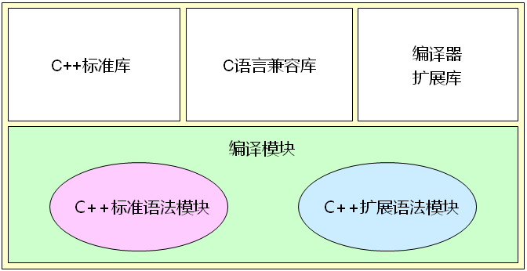
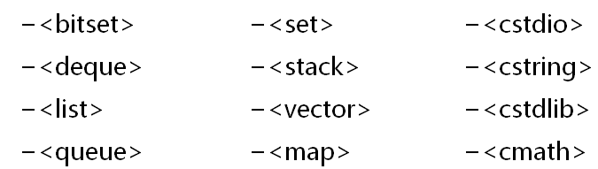
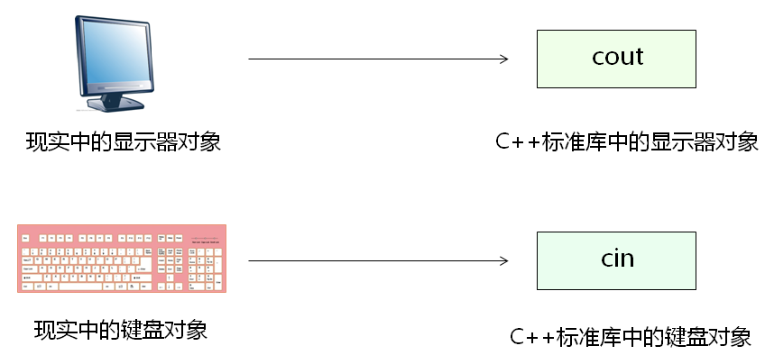
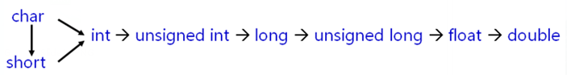

- C++标准库并`不是`C++语言的一部分，是由`类库`和`函数库`组成的集合；
- C++标准库中定义的类和对象都位于`std`命名空间中；
- C++标准库的头文件都`不带.h`后缀；
- C++标准库涵盖了C库的功能；
- C++标准库包含经典`算法`和`数据结构`的体现；

**C++编译环境的组成：**

 


**C++标准库预定了多种常用的数据结构**

 


**面向对象思想的标准库**

 

------

# 字符串类

c++支持C语言的所有概念，`没有原生的字符串类型`；

C++标准库提供了`string`类型

- 支持字`符串连接`
- 支持字符串的`大小比较`
- 支持`子串查找和提取`
- 支持`字符串的插入和替换`

**字符串与数字的转换**

- 标准库中提供了相关的类对字符串和数字进行转换

- 字符串流类（sstream）用于string的转换

`<sstream>`--相关头文件

`<istringstrream>`--字符串输入流

`<ostringstream>`--字符串输出流

```c++
#include <iostream>
#include <sstream>
#include <string>

using namespace std;

#define TO_NUMBER(s, n) (istringstream(s) >> n)
#define TO_STRING(n) (((ostringstream&)(ostringstream() << n)).str())

int main()
{
    double n = 0;
    if(TO_NUMBER("234.567",n))
    {
        cout << n << endl;
    }

    string s = TO_STRING(12345);
    cout << s << endl;

    return 0;
}
```

**字符串循环右移实例：**

```c++
string operator >> (const string& s, unsigned int n)
{
    string ret = "";
    unsigned int pos = 0;
    
    n = n % s.length();
    pos = s.length() - n;
    ret = s.substr(pos);
    ret += s.substr(0, pos);
    
    return ret;
}

int main()
{
    string s = "abcdefg";
    string r = (s >> 3);
    
    cout << r << endl;	//"efgabcd"
    
    return 0;
}
```

**string类实现字符串反转实例：**

```c++
string reverse(const string &str, const char c)
{
    int end;
    int start = 0;
    int len;
    string ret = "";
    string tmp;

    while (1)
    {
        end = str.find(c, start);

        if (end == -1) // 沒找到;
        {
            len = str.length() - start;
            tmp = str.substr(start, len);

            reverse(tmp.begin(), tmp.end()); // 反轉字符串

            ret += tmp;

            return ret;
        }
        else // 找到;
        {
            len = end - start;
            tmp = str.substr(start, len);

            reverse(tmp.begin(), tmp.end()); // 反轉字符串

            ret += tmp + ';';
            start = end + 1;
        }
    }
}

int main()
{
    cout << reverse("", ';') << endl;               // 输出：空字符串
    cout << reverse(";", ';') << endl;              // 输出：;
    cout << reverse("abcde;", ';') << endl;         // 输出：edcba;
    cout << reverse("we;tonight;you", ';') << endl; // 输出：ew;thginot;uoy

    return 0;
}
```

------


# 数组访问操作符重载

数组访问符的原生意义是`数组访问`和`指针运算`；

数组访问操作符（[]）

- 只能通过类的`成员函数重载`
- 重载函数`能且仅能`使用一个参数
- 可以定义不同参数的`多个重载函数`

```c++
class Test
{
    int a[5];
public:
    int& operator [] (int i)
    {
        return a[i];
    }
    
    int& operator [] (const string& s)
    {
        if( s == "1st" )
        {
            return a[0];
        }
        else if( s == "2nd" )
        {
            return a[1];
        }
        else if( s == "3rd" )
        {
            return a[2];
        }
        else if( s == "4th" )
        {
            return a[3];
        }
        else if( s == "5th" )
        {
            return a[4];
        }
        
        return a[0];
    }
    
    int length()
    {
        return 5;
    }
};

int main()
{
    Test t;
    
    for(int i=0; i<t.length(); i++)
    {
        t[i] = i;
    }
    
    for(int i=0; i<t.length(); i++)
    {
        cout << t[i] << endl;
    }
    
    cout << t["5th"] << endl;
    cout << t["4th"] << endl;
    cout << t["3rd"] << endl;
    cout << t["2nd"] << endl;
    cout << t["1st"] << endl;
    
    return 0;
}
```

------

# 函数对象

- 使用具体的类对象取代函数
- 该类的对象`具备函数调用行为`
- 多个对象相互独立 

函数调用操作符（`（）`）

- 只能通过类的成员函数重载
- 可以定义不同参数的多个重载函数

```c++
class Fib
{
    int a0;
    int a1;
public:
    Fib()
    {
        a0 = 0;
        a1 = 1;
    }

    Fib(int n)
    {
        a0 = 0;
        a1 = 1;

        for(int i = 2; i <= n; i++)
        {
            int t = a1;
            a1 = a0 + a1;
            a0 = t;
        }
    }

    int operator ()()
    {
        int ret = a1;
        a1 = a0 + a1;
        a0 = ret;

        return ret;
    }
};

int main ()
{
    Fib fib;

    for(int i = 0; i < 10; i++)
    {
        cout << fib() << endl;
    }

    cout << endl;

    for(int i = 0; i < 5; i++)
    {
        cout << fib() << endl;
    }

    cout << endl;

    Fib fib2(10);

    for(int i = 0; i < 5; i++)
    {
        cout << fib2() << endl;
    }
}
```

------

# 赋值操作符疑问

- 编译器为每个类默认重载了赋值操作符
- 默认的赋值操作符仅完成浅拷贝
- 当需要进行深拷贝时必须重载赋值操作符
- 赋值操作符与拷贝构造函数有相同的存在意义

```c++
//深拷贝
Test(const Test& obj)
{
	m_pointer = new int(*obj.m_pointer);
}
//重载赋值操作符
Test& operator = (const Test& obj)
{
	if(this != &obj)
	{
		delete m_pointer;
		m_pointer = new int(*obj.m_pointer);
	}
	return *this;
}
```

------

# 智能指针

使用对象代替指针解决方案分析：

- 重载指针特征操作符（-> 和 *）
- 只能通过类的`成员函数重载`
- 重载函数`不能`使用参数
- 只能定义`一个`重载函数

智能指针在指针生命周期结束时`主动释放堆空间`；

智能指针的意义在于最大程度的避免内存问题；

> **注意事项：**
>
> 只能用来指向堆空间中的对象或者变量

```c++
class Test
{
    int i;

public:
    Test(int i)
    {
        this->i = i;
    }
    int value()
    {
        return i;
    }
    ~Test()
    {
    }
};

class Pointer
{
    Test *mp;

public:
    Pointer(Test *p = NULL)
    {
        mp = p;
    }
    Pointer(const Pointer &obj)
    {
        mp = obj.mp;
        const_cast<Pointer &>(obj).mp = NULL;
    }
    Pointer &operator=(const Pointer &obj)
    {
        if (this != &obj)
        {
            delete mp;
            mp = obj.mp;
            const_cast<Pointer &>(obj).mp = NULL;
        }
        return *this;
    }
    Test *operator->()
    {
        return mp;
    }

    Test &operator*()
    {
        return *mp;
    }
    bool isNull()
    {
        return (mp == NULL);
    }
    ~Pointer()
    {
        delete mp;
    }
};

int main()
{
    Pointer p1 = new Test(0);
    cout << p1->value() << endl;

    Pointer p2 = p1;
    cout << p1.isNull() << endl;
    cout << p2->value() << endl;

    return 0;
}
```

# 现代智能指针

**C++ 标准库有四种智能指针：**

auto_ptr (C++ 98);  unique_ptr (C++ 11);  shared_ptr (C++ 11); weak_ptr(C++ 11); 

- **shared_ptr** : 共享式指针。多个指针指向同一个对象，最后一个指针被销毁时，这个对象会被释放。
- **weak_ptr** 是辅助shared_ptr工作的；
- **unique_ptr** : 独占式指针；同一个时间内，只有一个指针能够指向该对象。当然，该对象的所有权还是可以移交出去的；

**智能指针作用意义：**

- 忘记delete 的时候，智能指针帮组你delete,或者说，你压根就不再需要自己delete；智能指针的本分（帮助你delete）
- 帮助我们`进行动态分配对象（new出来的对象）的生命周期的管理`。能够有效防止内存泄漏；
- C++ 11标准中反对使用auto_ptr（弃用），目前auto_ptr已经完全被unique_ptr取代
- 这三种智能指针都是`类模板`，我们可以将new获得地址赋给他们；

## shared_ptr

- 共享所有权，不是被一个shared_ptr拥有，而是被多个shared_ptr之间互相协作；shared_ptr有额外开销；
- 工作原理：引用计数，`每个shared_ptr的拷贝都指向相同的内存`。
- 所以，只有最后一个指向该内存（对象）的shared_ptr指针不需要再指向该对象时，那么这个shared_ptr才会去析构所指向的对象
- 垃圾回收机制；我们从此不用担心对象何时被delete;
- 类模板，用到<>, <>里就是指针可以指向的类型，后边再跟智能指针名；

**最后一个指向该内存对象的shared_ptr在什么情况下会释放**

- 这个shared_ptr`被析构`的时候；
- 这个shared_ptr`指向其他的对象时`；

**常规初始化**

```c++
//格式： shared_ptr<指向的类型> 智能指针名：
shared_ptr<int> pi11(new int(100)); // pi指向一个值为100 的int型数据

//要注意智能指针是explicit, 不可以进行隐式类型转换。必须用直接初始化形式；（“=” 一般都是隐式转换）
shared_ptr<int> pi211 = new int(200); //报错
```

<u>裸指针可以初始化shared_ptr, 但不推荐。智能指针和裸指针不要穿插用</u>


**make_shared函数**

- 标准库里的函数模板，安全、高效的分配和使用shared_ptr；
- 它能够在动态内存（堆）中分配并初始化一个对象，然后`返回指向此对象的shared_ptr`;

```c++
shared_ptr<int> p7 = make_shared<int>(100); //这个shared_ptr指向一个值为100的整形内存，
											//有点类似int *pi = new int(100)
 
shared_ptr<string> p8 = make_shared<string>(5, 'a'); // 5个字符a生成的字符串。
													//类似于 string mystr(5, 'a');
 
shared_ptr<int> p9 = make_shared<int>(); // p4指向一个int, int里保存的值是0 （值初始化）
p9 = make_shared<int>(400); //p4 指向一个新int, int 里保存的是400； 
							//p4 首先释放刚才指向的值为0的内存，然后指向这个值为400的内存
 
auto p10 = make_shared<string>(5, 'a'); // 用auto比较简单
```

`共享式`，引用计数，每一个shared_ptr的拷贝`都指向相同的内存`（对象），只有最后一个指向该对象的shared_ptr指针不需要再指向该对象的时候，这个shared_ptr才会去析构所指向的对象。

**引用计数的增加**

- 每个shared_ptr 都会记录有多少个其他的shared_ptr指向相同的对象；

- 在如下情况下，所有指向这个对象的shared_ptr引用计数都会增加1
  - 像下面这样，我们用p6来初始化p7这个智能指针；
  - `把智能指针当做实参往函数里传递；`
  - `作为函数的返回值`

```c++
auto p6 = make_shared<int>(100); // 目前p6所指向的对象只有p6一个引用者；
auto p7(p6); //智能指针定义时的初始化，p7和p6指向了相同的对象，此对象目前有两个引用者；

void myfunc(shared_ptr<int> ptmp){
	return;
}
myfunc(p7);
    
shared_ptr<int> myfunc1(shared_ptr<int>& ptmp){ // 如果参数为引用，则智能指针的引用计数不会增加
	return ptmp;
}

auto p8 = myfunc1(p7); // 引用计数会变成3，这是因为有p8来接这个临时的智能指针。
myfunc(p7); 			// 没有变量来接这个临时的智能指针，则临时智能指针生命周期到了，引用计数从3恢复到2；
```

**引用计数的减少**

- 给shared_ptr赋予新值，让该shared_ptr指向一个新对象；
- 局部的shared_ptr离开其作用域；
- 当一个shared_ptr引用计数从1变成0，则它会自动释放自己所管理

```c++
auto p6 = make_shared<int>(100);  
auto p7(p6); 
auto p8 = myfunc1(p7);
p8 = make_shared<int>(200); // p8 指向新对象，计数为1， p6, p7 指向的对象计数恢复为2；
p7 = make_shared<int>(300); // p7 指向新对象，计数为1， p6 指向的对象计数恢复为1；
p6 = make_shared<int>(400); // p6 指向新对象，计数为1， p6指向的原内存被释放；

auto p9 = make_shared<int>(100); // 目前p9所指向的对象只有p9一个引用者；
auto p10(p9); // p9 和 p10 指向相同的对象，引用计数为2；
myfunc(p10);// 进入函数体myfunc中是3个引用计数，从myfunc中退出时引用计数恢复为2个；

auto p11 = make_shared<int>(110); // 只有p11指向该对象
auto p12 = make_shared<int>(120); 
p11  = p12;
// 给p11赋值会让p11指向p12所指向的对象，该对象引用计数变成2，
//而原来p11所指向的对象引用计数会从1变成0，从而导致被释放。
```

**shared_ptr指针常用操作**

use_cout()：返回多少个智能指针指向某个对象，主要用于调试目的；

```c++
shared_ptr<int> myp(new int(100));
int icout = myp.use_count(); // 1
shared_ptr<int> myp2(myp);
icout = myp.use_count(); // 2
 
shared_ptr<int> myp3;
myp3 = myp2;
icout = myp3.use_count(); // 3
icout = myp.use_count(); // 3
```

unique()：是否该智能指针独占某个指向的对象，也就是若只有一个智能指针指向某个对象，则unique()返回true,否则返回false；

```c++
shared_ptr<int> myp4(new int(100));
shared_ptr<int> myp5(myp4);
if (myp4.unique()) {  
	cout << "unique OK" << endl;
}
else{
	cout << "unique NO" << endl;//输出NO
}
 
shared_ptr<int> myp6;
if (myp6.unique()) { //成立
	cout << "unique OK " << endl;
}
```

reset()：恢复/复位

- reset()不带参数时
  - 若pi 是`唯一`指向该对象的指针，那么`释放`pi所指向的对象，并将pi`置空`
  - 若pi`不是唯一`指向该对象的指针，那么`不释放`pi所指向的对象，但指向该对象的引用`计数会减少1`，同时`将pi置空`

```c++
shared_ptr<int> pi(new int(100));
pi.reset();
if (pi == nullptr)
{
	cout << "pi 被置空" << endl;
}

shared_ptr<int> pi1(new int(100));
auto pi2(pi1);
pi1.reset();
```

- reset()带参数（一般是一个new出来的指针）时
  - 若pi1是`唯一`指向该对象的指针，则`释放`pi1指向的对象，让pi1`指向新对象`。
  - 若pi1`不是唯一`指向该对象的指针，则`不释放`pi1指向的对象，但指向该对象的引用`计数会减少1`，同时让pi1`指向新对象`；

```c++
shared_ptr<int> pi3(new int(100));
auto pi4(pi3); // pi4引用计数会变成2
pi3.reset(new int(1)); //释放原内存，指向新内存；
if (pi3.unique()){
	cout << "pi3 unique OK" << endl;
}
 
if (pi4.unique()) {
	cout << "pi4 unique OK" << endl;
}
```

- <u>空指针也可以通过reset来重新初始化</u>

```c++
shared_ptr<int> p;
p.reset(new int(1)); //释放p所指向的对象，让p指向新对象，因为原来p为空的，所以就等于啥也没释放直接指向新对象；
```

*解引用：获得p指向的对象

```c++
shared_ptr<int> p;
p.reset(new int(1)); 
```

get()：返回p中保存的指针（裸指针），小心使用，如果智能指针释放了所指向的对象，那么这个返回的裸指针也就变得无效了；

```c++
shared_ptr<int> myp7(new int(100));
int *p111 = myp7.get();
*p111 = 45;
 
delete p111; //千万不要这么干，不然系统会报告异常，产生不可预料的结果；
```

swap()：交换两个智能指针所指向的对象

```c++
shared_ptr<string> ps1(new string("I Love China1!"));
shared_ptr<string> ps2(new string("I Love China2!"));
std::swap(ps1, ps2);
ps1.swap(ps2);
```

= nullptr：将智能指针置空，所指向的对象引用计数减1，若引用计数变为0， 则释放智能指针所指向的对象。

```c++
shared_ptr<string> ps3(new string("I Love China!"));
shared_ptr<string> ps4(ps3); 
ps3 = nullptr;
```

**指定删除器以及数组问题**

- **指定删除器；**
  - 一定时机帮我们删除所指向的对象；delete ： 将delete运算符号作为默认的资源析构方式。
  - 我们可以指定自己的删除器`取代`系统提供的默认删除器，当智能指针需要删除所指向的对象时，编译器就会调用我们自己提供的删除器来删除。
  - shared_ptr指定删除器方法比较简单，一般只需要`在参数中添加具体的删除器函数名`即可；

```c++
void myDelete(int* p){ //自定义的删除器，当智能指针引用计数为0， 就会自动调用该删除器
    
	//写一些日志
	delete p; //既然提供了删除器来取代智能指针的缺省删除器，就需要自己来删除所指向的对象。
}

shared_ptr<int> p13(new int(123456), myDelete);
shared_ptr<int> p14(p13); // 两个引用计数
p14.reset(); // 剩1个引用计数，p14为 nullptr
p13.reset(); // 要释放指向的对象，调用我们的删除器myDelete，同时p置空；
```

- 删除器可以是一个lambda表达式

```c++
shared_ptr<int> ps(new int(123456), [](int *p){
	delete p;
});
```

- 有些情况，默认删除器处理不了，（用shared_ptr管理动态数组），需要我们提供自己指定的删除器；

```c++
shared_ptr<int> p22(new int[10], [](int *p){
	delete[]p;
});

class A{
public:
	A(){};
	~A(){};
};

shared_ptr<A> pA33(new A[10]);
 // 异常因为系统释放pA是delete pA所指向的裸指针，而不delete []pA
 //这种情况下我们需要写自己的删除器。
shared_ptr<A> pA44(new A[10], [](A *p){
	delete[] p;
});
```

- 可用`default_delete`来做删除器，default_delete是标准库里的模板类。

```c++
shared_ptr<A> pA(new A[10], std::default_delete<A[]>());
```

- 定义数组的时候我们在尖括号中加[]（C++17）

```c++
shared_ptr<A[]> pA55(new A[10]); // 在<>中加个[]就行了；
shared_ptr<int[]> p77(new int[10]);
//p77[0] = 12;
//p77[1] = 15;
```

- 或者自行封装

```C++
// 写个函数模板来封装shared_ptr数组
template<typename T>
shared_ptr<T> make_shared_array(size_t size){
	return shared_ptr<T>(new T[size], default_delete<T[]>());
}

shared_ptr<int> pintArr = make_shared_array<int>(5);
shared_ptr<A> pAArr = make_shared_array<A>(15);
```

- **指定删除器额外说明**

- 就算是两个shared_ptr指定了不同的删除器，只要他们所指向的对象类型相同，那么这两个shared_ptr也属于同一类型；

```C++
auto lambda1 = [](int *p){
	//日志。。
	delete p;
};
 
auto lambda2 = [](int *p){
	//日志。。。
	delete p;
};
shared_ptr<int> p99(new int(100), lambda1);
shared_ptr<int> p100(new int(200), lambda2);
p100 = p99; // p100 会先调用lambda2 把自己所指向的对象释放，然后指向p99所指向的对象。p99指向的对象引用计数为2；
	
//整个main执行完毕后，还会调用lambda1来释放p99、p100共同指向的对象；
p99.reset();
```

- 类型相同，就代表可以放到元素类型为该对象类型的容器里来；

```C++
vector<shared_ptr<int>> pvec{ p99, p100 };
```

> make_shared是提倡的生成shared_ptr的方法。但是make_shared这种方法，让我们没有办法指定自己的删除器；

### shared_ptr使用建议

std::shared_ptr 使用场景

```C++
shared_ptr<int> create0(int value){
	return make_shared<int>(value); //返回一个shared_ptr
}
 
void myfunc(int value){
	shared_ptr<int> ptmp = create0(10);
	return; // 离开作用域后， ptemp会被自动释放，它所指向的内存也会被自动释放
}
 
shared_ptr<int> myfunc1(int value){
	shared_ptr<int> ptmp = create0(10);
	return ptmp; // 系统是根据ptmp这个局部变量来产生一个临时的shared_ptr对象往回返
}

myfunc(12); // 如果这块不用shared_ptr变量来接收myfunc返回的结果，那么从myfunc返回的shared_ptr就会被销毁，所指向的对象也会被销毁。 
 
auto p11 = myfunc1(12); // 用一个变量来接myfunc的返回值，那么myfunc1返回的shared_ptr就不会被销毁，它所指向的对象也不会被销毁。
```

std::shared_ptr 使用陷阱分析

- 慎用裸指针

```c++
void proc(shared_ptr<int> ptr){
	return;
}

int *p = new int(100); //裸指针
//proc(p); //语法错， int* p 不能转换成shared_ptr<int>
 
proc(shared_ptr<int>(p)); // 参数是个临时的shared_ptr, 用一个裸指针显式的构造；
*p = 45; // 潜在的不可预料的问题； 因为p指向的内存已经被释放了；

//解决方案：
shared_ptr<int> myp(new int(100));
proc(myp);
*myp = 45;
//把一个普通裸指针绑定到了一个shared_ptr上之后，那内存管理的责任就交给了shared_ptr了，这个时候你就不应该再用裸指针（内置指针）来访问shared_ptr 所指向的内存了；
```

- `绝对要记住，不要用裸指针初始化多个shared_ptr`

```c++
int *p1 = new int(100); // 裸指针
shared_ptr<int> p3(p1);
shared_ptr<int> p4(p1); // p1 和 p4 无关联了（p3和p4每个强引用计数都为1了），会导致p3和p4所指向的内存被释放两次，产生异常

//解决方案：
shared_ptr<int> p5(new int);
shared_ptr<int> p6(p5); 
// 这种写法就是ok的，p5和p6 指向同一个内存地址并且两者是互通（用的是同一个控制块）
```

- 慎用get()返回的指针
  - get返回的指针`不能delete`，否则会异常
  - 不能将其他智能指针绑定到get返回的指针上

```C++
shared_ptr<int> myp1(new int(100));
int *p00 = myp1.get();
//delete p00; // 不可以删除，会导致异常

shared_ptr<int> myp2(new int(100));
int *p22 = myp2.get(); //这个指针千万不能随意释放，否则myp2就没办法正常管理该指针了
{
	shared_ptr<int> myp3(p22); // 现在myp2和myp3引用计数都为1，但一旦跳出这个程序块
                              //离开上边这个myp3的范围，导致myp2指向的内存被释放了
}
myp2 = 65; // 该内存已经被释放，这样赋值会导致不可预料的后果；
```

>永远不要用get得到的指针来初始化另外一个智能指针或者给另外一个智能指针赋值。

- enable_shared_from_this
  - 不要把`类对象指针`（this） 作为shared_ptr返回，`改用enable_shared_from_this`
  - 这个enable_shared_from_this中有一个弱指针weak_ptr，这个弱指针能够监视this,在我们调用shared_from_this()这个方法时，这个方法内部实际上是调用了这个weak_ptr的lock()方法；
  - 大家都知道lock方法会让shared_ptr指针计数+1， 同时返回这个shared_ptr , 这个就是工作原理；

```C++
class CT {
public:
	shared_ptr<CT> getself(){
		return shared_ptr<CT>(this); //用裸指针初始化了多个shared_ptr的感觉；
	}
};

shared_ptr<CT> pct1(new CT);
shared_ptr<CT> pct2 = pct1->getself(); //问题出现

//解决方案
class CT : enable_shared_from_this<CT>  {
public:
	shared_ptr<CT> getself(){
		return shared_from_this(); // 这个就是enable_shared_from_this 类模板
	}
};
```

- 避免循环引用

```C++
class CB1; //声明一下CB
 
class CA1{
public:
	shared_ptr<CB1> m_pbs;
	~CA1(){
		int test;
		test = 1;
	}
};
 
class CB1{
public:
	//shared_ptr<CA> m_pas;	//同时两个强引用会导致无法正常释放内存。
	
	weak_ptr<CA1> m_pas;  //把其中一个变成弱引用
	~CB1(){
		int test;
		test = 1;
	}
};

shared_ptr<CA1> pca1(new CA1);
shared_ptr<CB1> pcb1(new CB1);
 
pca1->m_pbs = pcb1; // 等价于指向CB1对象的有两个强引用
pcb1->m_pas = pca1; // 因为m_pas 是弱引用，所以这里指向CA1的对象只有一个强引用；
```

- - 上面代码运行，CA1先析构，CB1后析构；
  - 离开作用域之后，pca引用计数从1就变成0会释放CA1 对象（CA1的析构函数被执行）；
  - CA1 的析构函数被执行了，（表示对象即将被释放），导致CA1内的m_pbs引用计数会减1， 也就是指向CB1对象的引用计数-1；
  - 超出pcb作用域时指向CB1 的计数也会-1；最终会有一个时刻，指向CB1对象的强引用计数会从1减少到0，导致CB1对象被释放；


- 移动语义
  - 移动肯定比复制快，复制你要增加引用计数，移动不需要；
  - 移动构造函数快过复制构造函数，移动赋值运算符快过拷贝赋值运算符；

```C++
shared_ptr<int> p1(new int(100));
shared_ptr<int> p2(std::move(p1)); //移动语义， 移动构造一个新的智能指针对象p2,
										// p1 就不再指向该对象（变成空），引用计数依旧是1；
 
shared_ptr<int> p3; 
p3 = std::move(p2); // 移动赋值， p2指向空，p3指向该对象，整个对象引用计数仍旧为1；
```

## weak_ptr

- weak_ptr辅助shared_ptr进行工作。
- weak "弱"，反义词 "强"。强指的就是shared_ptr, 弱指的就是weak_ptr;
- weak_ptr： 也是个类模板，也是个智能指针。
  - 这个智能指针`指向一个由shared_ptr管理的对象`。
  - 但是weak_ptr指针`不控制所指向的对象的生存期`；
- 将weak_ptr绑定到shared_ptr上并`不会改变shared_ptr的引用计数`
- 当shared_ptr需要释放所指向对象的时候照常释放，不管是否有weak_ptr指向该对象。
- 可以理解成 监视 shared_ptr（强引用）的生命周期用的，是一种对shared_ptr的扩充。
- weak_ptr不是一种独立的智能指针，`不能用来操作所指向的资源`，所以它看起来像一个shared_ptr的助手
- weak_ptr能够监视到它所指向的对象释放存在；

**weak_ptr的创建**

创建weak_ptr的时候，一般是用一个shared_ptr来初始化：

- piw弱共享pi, pi引用计数（强引用计数）不改变，但是弱引用计数会改变（弱引用计数会从0变成1）
- 强引用计数才能决定对象的生存期，弱引用计数对对象生存期没有影响

```c++
auto pi = make_shared<int>(100); //shared_ptr
weak_ptr<int> piw(pi);

auto pi = make_shared<int>(100);
weak_ptr<int> piw1;
piw1 = pi; // pi是一个shared_ptr,赋值给一个weak_ptr,两者指向同一个内存对象；
weak_ptr<int> piw2;
piw2 = piw; // 把weak_ptr赋给另外一个weak_ptr，现在pi是一个强引用。piw和piw2 是两个弱引用；
```

- lock()：检查`weak_ptr所指向的对象是否存在`，如果存在，那么这个lock他就能`返回一个指向该对象的shared_ptr`(指向对象的`强引用计数就会+1`)；如果他所指向的对象不存在，lock会返回一个空的shared_ptr；

```c++
auto pi2 = piw2.lock(); //pi2 是一个shared_ptr
if (pi2 != nullptr) {
	//所指向的对象存在
	*pi2 = 12;
}
else{
	cout << "很遗憾， lock()失败" << endl;
}

auto pi = make_shared<int>(100);
pi.reset();	// 因为pi是唯一指向该对象的强引用智能指针，所以 reset()会释放pi所指向的对象，同时将pi置空。
```

> weak_ptr 能够判断所指向的对象是否存在

- use_count()：获取与该弱指针共享对象的其他shared_ptr的数量，或者说获得当前`所观测资源的强引用计数`；

```C++
auto pi3 = make_shared<int>(100);
auto pi4(pi3);  //是一个shared_ptr
 
weak_ptr<int> piw3(pi3);
int isc = piw3.use_count();
cout << isc << endl; // 输出2
```

- expired()：这个函数用来`判断所观测的资源是否已经被释放`；若该指针的use_count()为0 （表示该弱指针所指向的对象已经不存在了），则返回true；否则返回false；

```C++
auto pi3 = make_shared<int>(100);
auto pi4(pi3);  //是一个shared_ptr
 
weak_ptr<int> piw3(pi3);
 
pi3.reset();
pi4.reset();
if (piw3.expired())
{
	cout << "对象已经过期" << endl;
}
```

- 将该弱引用指针设置为空，`不影响指向该对象的强引用数量`，但指向该对象的弱引用数量会减少1；

```c++
piw3.reset();
```

**例子：**

```c++
auto p1 = make_shared<int>(42);
weak_ptr<int> pw;
pw = p1; // 可以用shared_ptr给weak_ptr赋值；
if (!pw.expired())
{
	auto p2 = pw.lock(); //返回一个shared_ptr,并且 此时强引用计数为2；
	if (p2 != nullptr)
	{
		//做一些操作
		int test;
		test = 1;
		
	}
}// 离开这个范围，强引用计数 会恢复为1 
else{
	//已经过期
	int test;
	test = 1;
}
//走到这里，则强引用计数变回了1；
```

- weak_ptr的尺寸：weak_ptr的尺寸和shared_ptr尺寸一样大，是裸指针的2倍

```C++
weak_ptr<int> pw2;
int *p;
int ilen1 = sizeof(p); // 4个字节，是个裸指针
int ilen2 = sizeof(pw2); // 8个字节，两个裸指针
```

- 第一个裸指针  指向的是这个智能指针所指向的对象；
- 第二个裸指针  指向一个很大的数据结构（控制块），这个控制块里有：
  - 1. 所指对象的强引用计数
  - 2. 所指对象的弱引用计数
  - 3. 其他数据，比如自定义的删除器的指针、内存分配器等等；
- 示意图：

 


## unique_ptr

- 独占式的概念（专属所有权）：同一个时刻，只能有一个unique_ptr指针指向这个对象（这块内存）；
- 当这个`unique_ptr被销毁`的时候，它`所指向的对象也被销毁`；

**初始化**

```C++
unique_ptr<int> pi; //可以指向int对象的一个空智能指针
unique_ptr<int> pi2(new int(105)); // 此时pi2指向一个值为105的int对象；

unique_ptr<int> p1 = make_unique<int>(100);
auto p2 = make_unique<int>(200);
unique_ptr<int> pi22(new int(105)); //前边不能简写为auto;
```

>C++ 14才有的make_unique：不支持指定的删除器语法，如果不用删除器，建议优先选择使用，性能更高。


**unique_ptr常用操作**

- unique_ptr不支持的操作

```C++
unique_ptr<string> ps1(new string("I Love China!"));
unique_ptr<string> ps2(ps1); //该智能指针不支持拷贝动作（定义时初始化）
unique_ptr<string> ps3 = ps1;  //该智能指针不支持拷贝动作（定义时初始化）
unique_ptr<string> ps4;
ps4 = ps1; //ps1是独占式智能指针，独占式智能指针不支持赋值操作
```

- 移动语义

```C++
unique_ptr<string> ps21(new string("I Love China!"));
unique_ptr<string> ps22 = std::move(ps21); // 移动完后，ps21 位空， ps22指向原来ps21所指
```

- release()：
  - 放弃对指针的控制权（切断了智能指针和其所指向的对象之间的联系）。
  - `返回裸指针，将该智能指针置空。`
  - 返回的这个裸指针我们可以手工delete来释放，也可以用来初始化另外一个智能指针，或者给另外一个智能指针赋值。

```C++
unique_ptr<string> ps31(new string("I Love China!"));
unique_ptr<string> ps32(ps31.release());
if (ps31 == nullptr){
	cout << "ps31 被置空" << endl;
}
 
//ps32.release(); // 导致内存泄漏
string * tempp = ps32.release(); // auto tempp = 也可以
delete tempp; //人工（手工）delete释放
```

- reset()：
  - 不带参数情况： 释放智能指针所指向的对象，并将智能指针置空。
  - 带参数的情况：释放 智能指针所指向的对象，并让该智能指针指向新对象。

```C++
unique_ptr<string> ps41(new string("I Love China!"));
ps41.reset();

unique_ptr<string> ps42(new string("I Love China!"));
ps41.reset(ps42.release()); // reset释放ps41指向的对象内存，让ps41指向ps42所指向的内存，同时ps42被置空

ps41.reset(new string("I Love China!"));
```

- = nullptr：释放智能指针所指向的对象，并将智能指针置空。

```C++
unique_ptr<string> ps51(new string("I Love China!"));
ps51 = nullptr; // 释放ps51所指向的对象，并将ps51置空
```

- 指向一个数组

```c++
unique_ptr<int[]> ptrarray(new int[10]); // 注意，数组这里要跟上[]
ptrarray[0] = 12;
ptrarray[1] = 24;
 
//这里不要忘记A[] ,否则如果有自己的析构函数，则会报异常
unique_ptr<A[]> ptrarray1(new A[100]);
```

- get()：返回智能指针中保存的裸指针。

```C++
unique_ptr<string> ps71(new string("I Love China!"));
string* ps7 = ps71.get();
*ps7 = "This is a test!";
//delete ps7; // 不要这么干，否则产生不可预料的后果；
```

- *解引用：获取该智能指针指向的对象，可以直接操作

```C++
unique_ptr<int> pt1(new int(100));
*pt1 = 200;
 
unique_ptr<int[]> pt2(new int[10]); //对于定义的内容是数组，是没有*解引用运算符的；
```

- swap()：交换两个智能指针所指向的对象

```C++
unique_ptr<string> ps91(new string("I Love China1!"));
unique_ptr<string> ps92(new string("I Love China2!"));
std::swap(ps91, ps92);
ps91.swap(ps92);
```

- 转换成shared_ptr类型
  - 如果unique_ptr为右值，就可以将它赋值给shared_ptr。
  - 因为shared_ptr包含一个显示构造函数，可用于将右值unique_ptr转换为shared_ptr， shared_ptr将接管原来归unique_ptr所拥有的对象。

```C++
auto myfunc(){
	return 	unique_ptr<string>(new string("I Love China!")); 
   // 这是个右值； （临时对象都是右值）
}

shared_ptr<string> pss1 = myfunc(); //这里会创建控制块

//第二种方式
unique_ptr<string> pss1(new string("I Love China!"));
shared_ptr<string> pss2 = std::move(pss1); // 左值转右值，执行后pss1为空， pss2就是shared_ptr
```

- 返回unique_ptr：虽然unique_ptr智能指针不能拷贝，但是，`当这个unique_ptr将要被销毁，是可以拷贝的`。最常见用法就是从函数返回一个unique_ptr。

```C++
unique_ptr<string> tuniqp(){
	//unique_ptr<string> pr(new string("I Love China!"));
	//return pr; //从函数返回一个局部的unique_ptr对象。
				//返回这种局部对象，导致系统给我们生成一个临时unique_ptr对象，调用unique_ptr的移动构造函数。
	return unique_ptr<string>(new string("I Love China!"));
}

unique_ptr<string> ps;
ps = tuniqp(); 
//可以用ps来接，则临时对象直接构造在ps里，
//如果不接，则临时对象会被释放，同时会释放掉所指向的对象的内存；
```

- 指定删除器
  - 格式： unique_ptr<指向的对象类型， 删除器> 智能指针变量名；
  - unique_ptr删除器相对复杂一点，`先要在类型模板参数中传递进去类型名，然后在参数中再给具体的删除其函数名`

```C++
void mydelete(string* pdel)
{
	delete pdel;
	pdel = nullptr;
}

typedef void(*fp)(string *); 	// （第一种）定义一个函数指针类型，类型名为fp
using fp2 = void(*)(string*);	// （第二种）用using定义一个函数指针类型，类型名为fp2
typedef decltype(mydeleter)* fp3; 	//（有可能会遇到第三种）
//这里多了一个*， 因为decltype返回的是函数类型void(string*)，加*表示函数指针类型，fp3应该void *(string *);

unique_ptr<string, fp2> ps1(new string("asd"), mydelete);


//用lambda 表达式看看写法，lambda 表达式可以理解成带有operator()类类型对象。
auto mydella = [](string* pdel) {
		delete pdel;
		pdel = nullptr;
};
unique_ptr<string, decltype(mydella)> ps5(new string("asd"), mydella);
```

- 指定删除器额外说明
  - shared_ptr ： 就算两个shared_ptr指定的删除器不相同，只要他们`所指向的对象相同`，那么这两个`shared_ptr也属于同一个类型`。
  - 但是unique_ptr不一样，指定unique_ptr中的删除器会影响unique_ptr的类型，所以从灵活性来讲，shared_ptr设计的更灵活；
  - 当shared_ptr的删除器不同，但指向类型一样的shared_ptr，可以放到统一个容器里，vector<shared_ptr ...>
  - unique_ptr如果删除器不同，那么就等于整个unique_ptr类型不同，这种类型不同的unique_ptr智能指针是没有办法放到同一个容器里的；

**尺寸问题**

- 通常情况下，unique_ptr 尺寸跟裸指针一样；
- 如果你增加了自己的删除器，则unique_ptr的尺寸可能增加，也可能不增加。
  - 如果lambda表达式这种删除器，尺寸就没变化
  - 定义一个函数作为删除器，尺寸发生变化，已经是8字节了。

```C++
string *p;
int ilenp = sizeof(p); //4字节
 
unique_ptr<string> ps31(new string("I Love China!"));
int ilen = sizeof(ps31); //4字节
```

- 增加字节对效率有影响，所以自定义删除器要慎用；
- shared_ptr, 不管你指定什么删除器， shared_ptr的尺寸（大小）都是裸指针的2倍；

## **智能指针总结**

智能指针主要目的：帮助我们释放内存，以防止我们忘记释放内存时造成的内存泄漏。

```C++
auto_ptr<string> ps4(new string("I Love China"));
auto_ptr<string> ps5 = ps4;// ps5指向字符串，ps4变成空了，这可以防止ps4和ps5析构一个string两次；
//用ps4（你没有意识到ps4已经空了），代码就会崩溃；
//这个也是auto_ptr用法上的一个陷阱。

shared_ptr<string> ps6(new string("I Love China"));
shared_ptr<string> ps7 = ps6; //ps7 和ps6都有效，强引用计数为2；
unique_ptr<string> ps8(new string("I Love China"));
unique_ptr<string> ps9 = ps8; //编译出错
//虽然auto_ptr 和unique_ptr都是独占式的，但unique_ptr 这种情况，编译的时候就会报错；
//而不会默默的把ps7的所有权转移到ps8上，避免后续如果使用ps7导致程序崩溃的问题；


//当然如果用移动语义，也能达到auto_ptr的效果：
shared_ptr<string> ps10(new string("I Love China"));
shared_ptr<string> ps11 = std::move(ps10); //运用了移动语义
```

- auto_ptr为什么被废弃
  - auto_ptr : C++ 98时代的智能指针，具有 unique_ptr一部分特性； unique_ptr， shared_ptr，weak_ptr;
  - 不能在容器中保存，也不能从函数中返回auto_ptr;
- auto_ptr被废弃的主要原因：设计的不太好，容易被误用引起潜在的程序崩溃等问题，所以C++ 11启用了unique_ptr来取代auto_ptr
- C++ 11表示不建议再使用auto_ptr ,强烈建议大家，用unique_ptr取代；unique_ptr比auto_ptr更安全；


**智能指针的选择**

- 如果程序要使用多个指向同一个对象的指针，应该选择shared_ptr；
- 如果程序不需要多个指向同一个对象的指针，应该`首选unique_ptr`；

------

# 逻辑操作符陷阱 

逻辑运算符的原生语义

- 操作数只有两种值（true和false）
- 逻辑表达式`不用完全计算就能确定最终值`
- 最终结果只能是true或者false

<u>不推荐重载逻辑与和逻辑或，没办法通过函数调用的方式满足逻辑操作符的原生语义；</u>

```c++
class Test
{
    int mValue;
public:
    Test(int v)
    {
        mValue = v;
    }
    int value() const
    {
        return mValue;
    }
};

bool operator && (const Test& l, const Test& r)
{
    return l.value() && r.value();
}

bool operator || (const Test& l, const Test& r)
{
    return l.value() || r.value();
}

Test func(Test i)
{
    cout << "Test func(Test i) : i.value() = " << i.value() << endl;
    
    return i;
}

int main()
{
    Test t0(0);
    Test t1(1);
    
    if( func(t0) && func(t1) )
    {
        cout << "Result is true!" << endl;
    }
    else
    {
        cout << "Result is false!" << endl;
    }
    
    cout << endl;
    
    if( func(1) || func(0) )
    {
        cout << "Result is true!" << endl;
    }
    else
    {
        cout << "Result is false!" << endl;
    }
    
    return 0;
}
```

**建议：**

- `实际工程开发中避免重载逻辑操作符`
- 通过`重载比较操作符代替`逻辑操作符重载
- 直接`使用成员函数代替`逻辑操作符重载
- 使用`全局函数`对逻辑操作符进行重载

------

# 逗号操作符

逗号操作符（,）可以构成逗号表达式

- 逗号表达式用于`将多个子表达式连接为一个表达式`
- 逗号表达式的值为`最后一个子表达式的值`
- 逗号表达式中的前`N-1个子表达式可以没有返回值`
- 逗号表达式按照`从左向右的顺序`计算每个子表达式的值

**重载逗号操作符**

- 在C++中重载逗号操作符是合法的；

- 使用`全局函数`对逗号操作符进行重载
- 重载函数的`参数`必须有一个是`类类型`
- 重载函数的`返回值`类型必须是`引用`

```c++
Class& operator , (const Class& a, const Class& b)
{
    return const_cast<CLass&>(b);
}
```

```C++
class Test
{
    int mValue;
public:
    Test(int i)
    {
        mValue = i;
    }
    int value()
    {
        return mValue;
    }
};

Test& operator , (const Test& a, const Test& b)
{
    return const_cast<Test&>(b);
}

Test func(Test& i)
{
    cout << "func() : i = " << i.value() << endl;
    
    return i;
}

int main()
{   
    Test t0(0);
    Test t1(1);
    Test tt = (func(t0), func(t1));         // Test tt = func(t1);
    
    cout << tt.value() << endl; // 1
    
    return 0;
}
```

> 工程中不要重载逗号表达式！

------

# 前置操作符和后置操作符

**++操作符可以被重载**

- `全局函数`和`成员函数`均可进行重载
- 重载前置++操作符`不需要额外的参数`
- 重载后置++操作符`需要一个int类型的占位参数`

**对于基础类型的变量**

- 前置++的效率和后置++的效率基本相同
- 根据项目组编码规范进行选择

**对于类类型的对象**

- 前置++的效率高于后置++

- 尽量使用`前置++操作符提高程序效率`

```C++
class Test
{
    int mValue;
public:
    Test(int i)
    {
        mValue = i;
    }
    int value()
    {
        return mValue;
    }

    Test& operator ++()             //前置++
    {
        ++mValue;
　　　　　return *this; 
    }

    Test operator ++(int)    　　　　 //后置++
   {
　　　　　　Test ret(mValue);

　　　　　　++mValue;  　　//改变实际对象的内容

　　　　　　return ret;　　//返回临时对象
  }
};
```

------

# 类型转换函数

标准数据类型之间会进行隐式的类型安全转换，规则如下：

 

 

构造函数可以定义不同类型的参数；

参数满足下列条件时称为`转换构造函数`

- 有且仅有一个参数
- 参数是基本类型
- 参数是其他类类型

编译器的行为是进行`隐式类型转换`；


工程中通过`explicit`关键字杜绝编译器的转换尝试；

一般`单参数的构造函数`都声明为explicit；

转换构造函数被`explicit`修饰时只能进行`显式转换`；

```c++
//转换方式
static_cast<ClassName>(value);
ClassName(value);
(ClassName)value;	//不推荐
```

```c++
class Test
{
    int mValue;
public:
    Test()
    {
        mValue = 0;
    }
    
    explicit Test(int i)
    {
        mValue = i;
    }
    
    Test operator + (const Test& p)
    {
        Test ret(mValue + p.mValue);
        
        return ret;
    }
    
    int value()
    {
        return mValue;
    }
};

int main()
{   
    Test t;
    
    
    t = static_cast<Test>(5);    // t = Test(5);
    
    
    
    Test r;
    
    r = t + static_cast<Test>(10);   // r = t + Test(10);
    
    cout << r.value() << endl;
    
    return 0;
}
```

C++类中可以定义类型转换函数

类型转换函数用于`将类对象转换为其他类型`

```c++
operator Type()
{
	Type ret;
	……
	return ret;
}
```

**类型转换函数**

- 与转换构造函数具有同等的地位
- 使得编译器有能力`将对象转化为其他类型`
- 编译器能够`隐式的使用`类型转换函数

```c++
class Test;

class Value
{
public:
    Value()
    {
    }
    explicit Value(Test& t)
    {
    }
};

class Test
{
    int mValue;
public:
    Test(int i = 0)
    {
        mValue = i;
    }
    int value()
    {
        return mValue;
    }
    operator Value()
    {
        Value ret;
        cout << "operator Value()" << endl;
        return ret;
    }
};

int main()
{   
    Test t(100);
    Value v = t;
    
    return 0;
}
```

**注意：**

- `无法抑制`隐式的类型转换函数调用
- 类型转换函数可能与转换构造函数`冲突`
- 工程中以Type `toType()`的公有成员代替类型转换函数