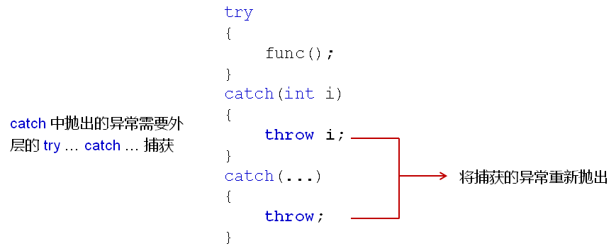

# 异常处理

C++内置了异常处理的语法元素 try……catch……

- try语句用于处理正常代码逻辑
- catch语句用于处理异常情况
  - try语句中的异常由对应的catch语句处理

```c++
try
{
    double r = divide(1, 0);
}
catch(……)
{
    cout << "Divided by zero……" << endl;
}
```

**C++通过throw语句抛出异常信息**

```c++
double divide(double a, double b)
{
    const double delta = 0.000000000000001;
    double ret = 0;
    
	if( !((-delta < b) && (b < delta)) ) {
        ret = a / b;
    }
	else {
        throw 0;// 产生除 0 异常
    }
	return ret;
}
```

**C++异常处理分析：**

throw抛出的异常必须被catch处理；

- 当前函数`能够处理异常`，程序继续往下执行
- 当前函数`无法处理异常`，则函数停止运行，并返回
- `未被处理的异常`会顺着`函数调用栈`向上传播，直到被处理为止，否则程序将停止执行

 

 


`同一个try`语句可以跟上`多个catch`语句

- catch语句可以定义具体处理的异常类型
- 不同类型的异常由`不同的catch语句`负责处理
- try语句中可以抛出任何类型的异常
- `catch(…)` 用于处理`所有类型的异常`（只能放在最后）
- 任何异常都只能被捕获`(catch)一次`


**异常处理的匹配规则**

 

>异常处理匹配时，**不进行任何的类型转换**


**catch语句块中可以抛出异常**

 


catch中捕获的异常可以被重新解释后抛出；

工程开发中使用这样的方式统一异常类型，如下：

 

```C++
/*
    假设： 当前的函数式第三方库中的函数，因此，我们无法修改源代码
    函数名： void func(int i)
    抛出异常的类型： int    -1 ==》 参数异常    -2 ==》 运行异常    -3 ==》 超时异常
*/
void func(int i)
{
    if( i < 0 )
    {
        throw -1;
    }
    
    if( i > 100 )
    {
        throw -2;
    }
    
    if( i == 11 )
    {
        throw -3;
    }
    
    cout << "Run func..." << endl;
}

void MyFunc(int i)
{
    try
    {
        func(i);
    }
    catch(int i)
    {
        switch (i)
        {
        case -1:
            throw "Invalid Parameter";
            break;
        case -2:
            throw "Runtime Exception";
            break;
        case -3:
            throw "Timeout Exception";
            break;
        }
    }
}

int main(int argc, char const *argv[])
{
    try
    {
        MyFunc(11);
    }
    catch(const char* s)
    {
        cout << "Exception Info: " << s << endl;
    }
    
    return 0;
}
```

- 异常的类型可以是`自定义类类型`

- 对于类类型异常的匹配依旧是`至上而下严格匹配`
- `赋值兼容性原则`在异常匹配中依然适用
  - 匹配子类异常的catch放在上部
  - 匹配父类异常的catch放在下部

- 在工程开发中会定义一系列的异常类
- 每个类代表工程中可能出现的一种异常类型
- `代码复用`时可能需要`重新解释不同的异常类`
- 在定义catch语句块时`推荐使用引用作为参数`

```c++
class Base {};

class Exception : public Base
{
    int m_id;
    string m_desc;
public:
    Exception(int id, string desc)
    {
        m_id = id;
        m_desc = desc;
    }
    int id() const
    {
        return m_id;
    }
    string description() const
    {
        return m_desc;
    }
};

/*
    假设： 当前的函数是第三方库中的函数，因此，我们无法修改源代码
    函数名： void func(int i)
    抛出异常的类型： int    -1 ==》 参数异常    -2 ==》 运行异常    -3 ==》 超时异常
*/
void func(int i)
{
    if( i < 0 )
    {
        throw -1;
    }
    
    if( i > 100 )
    {
        throw -2;
    }
    
    if( i == 11 )
    {
        throw -3;
    }
    
    cout << "Run func..." << endl;
}

void MyFunc(int i)
{
    try
    {
        func(i);
    }
    catch(int i)
    {
        switch(i)
        {
            case -1:
                throw Exception(-1,"Invalid Parameter");
                break;
            case -2:
                throw Exception(-2,"Runtime Exception");
                break;
            case -3:
                throw Exception(-3,"Timeout Exception");
                break;
        }
    }
}

int main(int argc, char const *argv[])
{
    try
    {
        MyFunc(11);
    }
    catch(const Exception& e)
    {
        cout << "Exception Info: " << e.description() << endl;
    }
    catch(const Base& e)
    {
        cout << "catch(const Base& e)" << endl;
    }
    
    return 0;
}
```

**C++标准库中提供了实用异常类**

- 标准库中的异常都是从`exception类`派生的
- exception类有两个主要的分支：
  - logic_error：常用语程序中的`可避免`逻辑错误
    - domain_error(const string& )    ：   专业领域内的范畴
    - invalid_argument(const string& )   ：  无效参数,比如对unsigned型进行负数操作
    - length_error(const string& )  ：    长度异常,比如字符串附加太多字符
    - out_of_range(const string&)     :    超出范围,比如数组下标越界
    - 它们都有一个what()成员函数,用来返回一个字符串异常信息
  - runtime_error：常用语程序中`无法避免`的恶性错误
    - range_error(const string& )  ：内部计算时发生区间错误
    - overflow_error(const string& )  ：算数运算时发生上溢
    - underflow_error(const string& )  ：算数运算时发生下溢
    - 它们都有一个what()成员函数,用来返回一个字符串异常信息

 

```c++
#include <iostream> 
#include <stdexcept>
 
using namespace std;
 
template <typename T, int N >
class Array
{
       T ma[N];
public:
       Array()
       { 
              for(int i=0;i<N;i++)
              ma[N]=0;
       }
 
       T& operator [] (int index)
       {  
              if((index>=0)&&(index<N))
              {
                     return ma[index];
              }
 
              else	//数组下标越界
              {
                  throw out_of_range("T& operator [] (int index)"); //抛出一个 out_of_range类
              }  
       }
};
 
int main()
{
       try
       {
              Array<int,5> arr;
              arr[10]=100;
       }
       catch(out_of_range& exc)
       {
              cout<< exc.what()<<endl;	//打印捕获到out_of_range类的异常信息
              cout<< " Line: " << __LINE__ <<", Function: "<< __FUNCTION__ << endl;  //打印当前行
       }
       return 0;
}
```

------

# 异常处理深度解析

 

 

- 如果异常无法被处理，`terminate()结束函数会被自动调用`
- 默认情况下，terminate()调用库函数abort()终止程序
- abort()函数使得程序执行异常而`立即退出`
- C++支持`自定义的结束函数`来替换默认的terminate()函数实现

**terminate()函数的替换：**

- `自定义一个无返回值无参数的函数`
  - 不能抛出任何异常
  - 必须以某种方式结束当前程序
- 调用set_terminate()设置自定义的结束函数
  - 参数类型为void(*)()
  - 返回值为默认的terminate()函数入口地址

 

**编程实验：析构函数抛出异常**

 

- 如果异常没有被处理，`最后terminate()结束整个程序`
- terminate()是整个程序`释放资源的最后机会`
- 结束函数可以自定义，但不能继续抛出异常
- `析构函数不能抛出异常`，可能导致terminate()多次调用

------

# 函数异常规格

- C++提供语法用于声明函数所抛出的异常
- 异常声明作为函数声明的修饰符，写在参数列表后面

 


 **异常规格说明的意义：**

- 提示函数调用者必须`做好异常处理的准备`
- 提示函数的维护者`不要抛出其它异常`
- 异常规格说明是`函数接口的一部分`

------

# 异常规格之外的异常

- 函数抛出的`异常不在规格说明中`，全局`unexpected()`被调用
- 默认的unexpected()函数会调用全局的terminate()函数
- 可以自定义函数替换默认的unexpected()函数实现
- 注意：`不是所有的C++编译器`都支持这个标准行为

 


**unexpected()函数的替换**

- `自定义一个无返回值无参数的函数`
  - 能够再次抛出异常
    - 当异常符合触发函数的异常规格说明时，恢复程序执行
    - 否则，调用全局terminate()函数结束程序
  - `调用set_unexpected()设置自定义的异常函数`
    - 参数类型为void(*)()
    - 返回值为默认的unexpected()函数入口地址

 

 

- C++中的函数可以声明异常规格说明
- 异常规格说明可以看作`接口的一部分`
- 函数抛出的`异常不在规格说明中`，unexpected()被调用
- unexpected()中能够再次抛出异常
  - `异常能够匹配，恢复程序的执行`
  - `否则，调用terminate()结束程序`