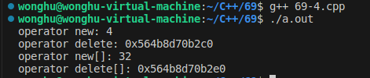
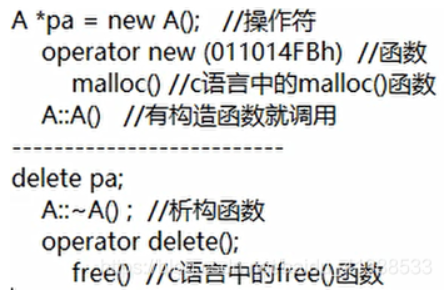
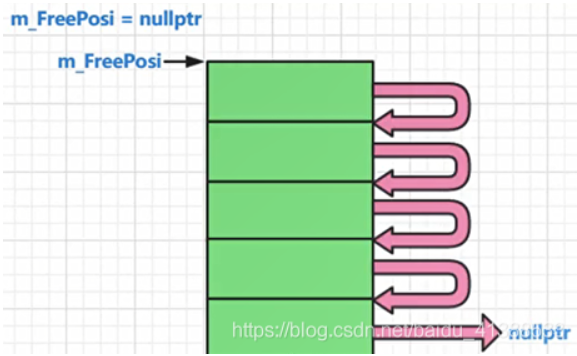
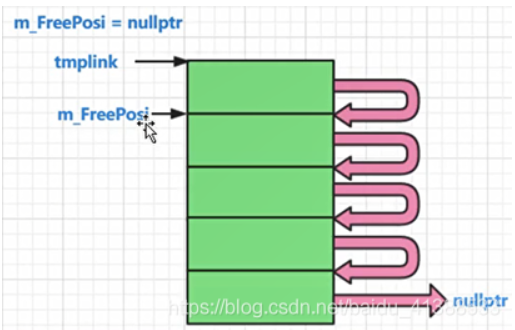
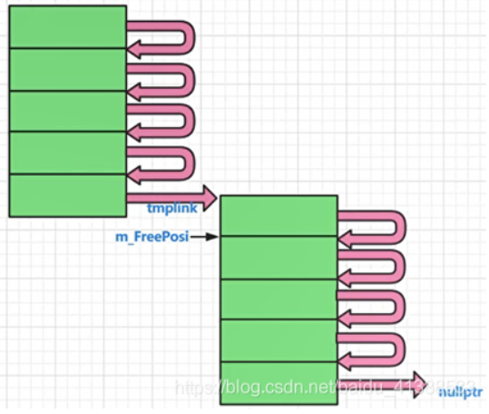
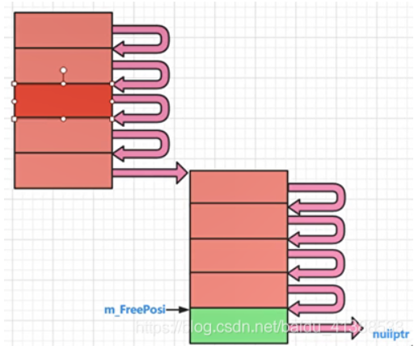
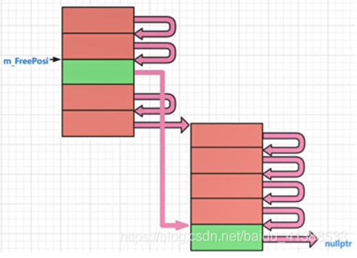
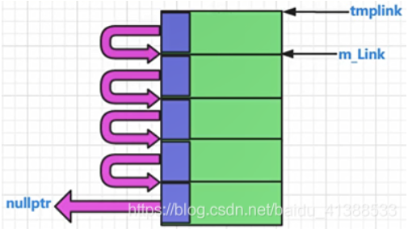
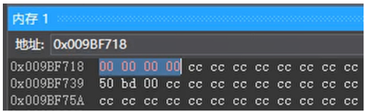

# 自定义内存管理

**关键字mutable**

- mutable是为了`突破const函数的限制`而设计的
- mutable成员变量将`永远处于可改变的状态`
- mutable在实际的项目开发中被`严禁滥用`

**mutable的深入分析**

- mutable成员变量`破坏了只读对象的内部状态`
- const成员函数保证只读`对象的状态不变性`
- mutable成员变量的出现`无法保证`状态不变性

 


**避免使用mutable，如下：**

 


**new关键字创建出来的对象位于什么地方**

- `new / delete`的本质是C++预定义的`操作符`
- C++对这两个操作符做了严格的行为定义
  - new：
    - 获取足够大的内存空间（`默认为堆空间`）
    - 在获取的空间中`调用构造函数创建对象`
  - delete：
    - 调用析构函数销毁对象
    - 归还对象所占用的空间（`默认为堆空间`）

**C++中能够重载new/delete操作符**

全局重载（不推荐）
局部重载（针对具体类进行重载）

- 重载new/delete的意义在`改变动态对象创建时的内存分配方式`（可以换静态存储区，不放在堆空间中）

 **new/delete的重载方式**

 

 

```c++
class Test
{
    static const unsigned int COUNT = 4;
    static char c_buffer[];
    static char c_map[];

    int m_value;

public:
    void *operator new(size_t size)
    {
        void *ret = nullptr;
        for (int i = 0; i < COUNT; i++)
        {
            if (!c_map[i])
            {
                c_map[i] = 1;
                ret = c_buffer + i * sizeof(Test);
                cout << "succeed to allocate memory: " << ret << endl;
                break;
            }
        }
        return ret;
    }
    void operator delete(void *p)
    {
        if (p != nullptr)
        {
            char *mem = reinterpret_cast<char *>(p);
            int index = (mem - c_buffer) / sizeof(Test);
            int flag = (mem - c_buffer) % sizeof(Test);

            if ((flag == 0) && (0 <= index) && (index < COUNT))
            {
                c_map[index] = 0;
                cout << "succeed to free memory: " << p << endl;
            }
        }
    }
};

char Test::c_buffer[sizeof(Test) * Test::COUNT] = {0};
char Test::c_map[Test::COUNT] = {0};

int main(int argc, char const *argv[])
{
    cout << "===== Test Single Object =====" << endl;
    Test *pt = new Test;
    delete pt;

    cout << "===== Test Object Array =====" << endl;
    Test *pa[5] = {0};
    for (int i = 0; i < 5; i++)
    {
        pa[i] = new Test;
        cout << "pa[" << i << "] = " << pa[i] << endl;
    }
    for (int i = 0; i < 5; i++)
    {
        cout << "delete" << pa[i] << endl;
        delete pa[i];
    }

    return 0;
}
```

**如何在指定的地址上创建C++对象**

- 在类中`重载new/delete`操作符
- 在new的操作符重载函数中`返回指定的地址`
- 在delete操作符重载中标`记对应的地址可用`

```c++
#include <iostream>
#include <cstdlib>

using namespace std;

class Test
{
    static unsigned int c_count;
    static char *c_buffer;
    static char *c_map;

    int m_value;

public:
    static bool setMemorySource(char *memory, unsigned int size)
    {
        bool ret = false;
        c_count = size / sizeof(Test);
        ret = (c_count && (c_map = reinterpret_cast<char *>(calloc(c_count, sizeof(char)))));

        if (ret)
        {
            c_buffer = memory;
        }
        else
        {
            free(c_map);
            c_map = nullptr;
            c_buffer = nullptr;
            c_count = 0;
        }

        return ret;
    }

    void *operator new(size_t size)
    {
        void *ret = nullptr;
        if (c_count > 0)
        {
            for (int i = 0; i < c_count; i++)
            {
                if (!c_map[i])
                {
                    c_map[i] = 1;
                    ret = c_buffer + i * sizeof(Test);
                    cout << "succeed to allocate memory: " << ret << endl;
                    break;
                }
            }
        }
        else
        {
            ret = malloc(size);
        }
        return ret;
    }
    void operator delete(void *p)
    {
        if (c_count > 0)
        {
            if (p != nullptr)
            {
                char *mem = reinterpret_cast<char *>(p);
                int index = (mem - c_buffer) / sizeof(Test);
                int flag = (mem - c_buffer) % sizeof(Test);

                if ((flag == 0) && (0 <= index) && (index < c_count))
                {
                    c_map[index] = 0;
                    cout << "succeed to free memory: " << p << endl;
                }
            }
        }
        else
        {
            free(p);
        }
    }
};

unsigned int Test::c_count = 0;
char *Test::c_buffer = nullptr;
char *Test::c_map = nullptr;

int main(int argc, char const *argv[])
{
    char buffer[12] = {0};
    Test::setMemorySource(buffer, sizeof(buffer));

    cout << "===== Test Single Object =====" << endl;
    Test *pt = new Test;
    delete pt;

    cout << "===== Test Object Array =====" << endl;
    Test *pa[5] = {0};
    for (int i = 0; i < 5; i++)
    {
        pa[i] = new Test;
        cout << "pa[" << i << "] = " << pa[i] << endl;
    }
    for (int i = 0; i < 5; i++)
    {
        cout << "delete" << pa[i] << endl;
        delete pa[i];
    }

    return 0;
}
```

**new[] / delete[] 与 new / delete 完全不同**

- 动态对象数组创建通过new[]完成
- 动态对象数组的销毁通过delete[] 完成
- new[] / delete[] 能够被重载，进而改变内存管理方式

**new[] / delete[] 的重载方式**

 


**注意事项：**

- new[] 实际需要`返回的内存空间`可能`比期望的要多`
- 对象数组占用的内存中`需要保存数组信息`
- 数组信息用于确定构造函数和析构函数的调用次数

```c++
class Test
{
    int m_value;

public:
    Test()
    {
        m_value = 0;
    }
    ~Test() {}

    void *operator new(size_t size)
    {
        cout << "operator new: " << size << endl;

        return malloc(size);
    }

    void operator delete(void *p)
    {
        cout << "operator delete: " << p << endl;

        free(p);
    }

    void *operator new[](size_t size)
    {
        cout << "operator new[]: " << size << endl;

        return malloc(size);
    }

    void operator delete[](void *p)
    {
        cout << "operator delete[]: " << p << endl;

        free(p);
    }
};

int main(int argc, char const *argv[])
{
    Test* pt = nullptr;
    pt = new Test;
    delete pt;

    pt = new Test[6];
    delete[] pt;

    return 0;
}
```

 

------

# 动态内存

**常见的动态内存分配代码**

```c++
//C代码
int* p = (int*)malloc(10 * sizeof(int));
if( p != NULL )
{
    ......
}

//C++代码
int* p = new int[10];
if( p != NULL )
{
    ......
}
```

**事实上：**

- malloc函数申请失败时返回`NULL`值
- new关键字申请失败时（根据编译器不同）
  - 返回`NULL`值
  - 抛出`std::bad_alloc`异常


**new关键字在C++规范中的标准行为**

- 在堆空间申请足够大的内存
  - 成功
    在获取的空间中调用构造函数创建对象
    返回对象的地址
  - 失败
    抛出std::bad_alloc异常
- new在分配内存时：
  - 如果空间不足，会调用全局的new_handler()函数
  - new_handler()函数中抛出std::bad_alloc异常
- 可以自定义new_handler()函数
  - 处理默认的new内存分配失败的情况


**new_handler()的定义和使用：**

```c++
void my_new_handler()
{
    cout << "No enough memory" << endl;
    exit(1);
}

int main()
{
    set_new_handler(my_new_handler);
    ......
    return 0;
}
```

通过set_new_handler(my_new_handler)函数告知编译器内存不足时，调用my_new_handler()；

- 参数说明
  - my_new_handler应为无参数且返回值类型为void
  - my_new_handler可以尝试获得更多的可用空间，也或者抛出异常，也或者终止程序。
  - my_new_handler如果是一个空指针，处理函数将被重置为默认值（将会执行抛出bad_alloc异常）。

- 返回值
  - 返回先前被设置的处理函数指针；如果尚未被设置或者已被重置，将返回空指针。
  - 返回的函数指针是无参的void返回值类型的函数指针。


**如何跨编译器统一new的行为，提高代码移植性？**

**解决方案**

- 全局范围（`不推荐`）
  重新定义new/delete的实现，不抛出异常
  自定义new_handler()函数，不抛出任何异常
- 类层次范围
  重载new/delete，不抛出任何异常
- 单次动态内存分配
  使用nothrow参数，指明new不抛出异常

 


实验二：屏蔽出现的段错误

 


实验三：禁止编译器抛出异常、在指定位置创建对象

 

 

**实验结论**

- `不是所有的编译器都遵循C++的标准规范`
- 编译器可能重定义new的实现，并在实现中`抛出bad_alloc异常`
- 编译器的默认实现中，可能`没有`设置全局的new_handler()函数
- 对于移植性要求较高的代码，需要考虑new的具体细节

------

# new与delete

**new类对象时加不加括号的差别**

- 如果是个空类，那么如下两种写法没有区别，现实中可能光写一个空类；
- 类A中有成员变量则： 带括号的初始化会把一些和成员变量有关的内存清0，但不是整个对象的内存全部清0；
- 当类A有构造函数 ，下面两种写法得到的结果一样了；

```C++
A *pa = new A(); //没构造函数，则清零；有构造函数，则像构造函数接管了一样。 		
A *pa = new A;
```

**new/delete干了什么**

new 可以叫 关键字/操作符，new 干了两个事：

- 一个是调用operator new(malloc)；
- 一个是调用了类A的构造函数；

delete干了两个事：

- 一个是调用了类A的析构函数；
- 一个是调用operator delete(free)；

 

```C++
class A
	{
	public:
		int m_i; //成员变量
		A(){
		}
		~A()
		{
		}
		//virtual void func() {}
	};
	void func()
	{
		
		A *pa = new A(); //看上去像函数调用
		....
		delete pa;		

		A *pa2 = new A;
		int *p3 = new int;  //初值随机
		int *p4 = new int(); //初值 0
		int *p5 = new int(100); //初值100
			
		operator new(120);    //F12查看调用，调用了malloc()
		
		//operator delete();
		//malloc()
		//free();

		int abc;
		abc = 6;
		
	}
```

------

# 内存池

内存池的概念和实现原理概述：

用malloc申请一大块内存，当你要分配的时候，我从这一大块内存中一点一点的分配给你，当一大块内存分配的差不多的时候，我再用malloc再申请一大块内存，然后再一点一点的分配给你；减少内存浪费，提高运行效率；

 

 

 

 

 

```C++
#define MYMEMPOOL 1
	//针对一个类的内存池实现演示代码
	//针对一个类的内存池 A,
	//A *pa = new A() ,delete pa; 用内存池的手段实现new,delete一个对象；
	class A
	{
	public:
		static void *operator new(size_t size);
		static void operator delete(void *phead);
		static int m_iCout; //分配计数统计，每new一次，就统计一次
		static int m_iMallocCount; //每malloc一次，我统计一次
	private:
		A *next;
		static A* m_FreePosi; //总是指向一块可以分配出去的内存的首地址
		static int m_sTrunkCout; //一次分配多少倍的该类内存
	};
	int A::m_iCout = 0;
	int A::m_iMallocCount = 0;
	A *A::m_FreePosi = nullptr;
	int A::m_sTrunkCout = 5; //一次分配5倍的该类内存作为内存池子的大小

	void *A::operator new(size_t size)
	{
#ifdef MYMEMPOOL
		A *ppoint = (A*)malloc(size);
		return ppoint;
#endif
		A *tmplink;
		if (m_FreePosi == nullptr)
		{
			//为空，我要申请内存，要申请一大块内存
			size_t realsize = m_sTrunkCout * size; //申请m_sTrunkCout这么多倍的内存
			m_FreePosi = reinterpret_cast<A*>(new char[realsize]); //传统new，调用的系统底层的malloc
			tmplink = m_FreePosi; 

			//把分配出来的这一大块内存（5小块），彼此要链起来，供后续使用
			for (; tmplink != &m_FreePosi[m_sTrunkCout - 1]; ++tmplink)
			{
				tmplink->next = tmplink + 1;
			}
			tmplink->next = nullptr;
			++m_iMallocCount;
		}
		tmplink = m_FreePosi;
		m_FreePosi = m_FreePosi->next;
		++m_iCout;
		return tmplink;
	}
	void A::operator delete(void *phead)
	{
#ifdef MYMEMPOOL
		free(phead);
		return;
#endif
		(static_cast<A*>(phead))->next = m_FreePosi;
		m_FreePosi = static_cast<A*>(phead);                //类似在可用链表进行头插入
	}

	void func()
	{
		clock_t start, end; //包含头文件 #include <ctime>
		start = clock();
		//for (int i = 0; i < 500'0000; i++)
		for (int i = 0; i < 15; i++)
		{
			A *pa = new A();
			printf("%p\n", pa);
		}
		end = clock();
		cout << "申请分配内存的次数为：" << A::m_iCout << " 实际malloc的次数为：" << A::m_iMallocCount << " 用时(毫秒): " << end - start << endl;
	}
```

------

# 嵌入式指针

嵌入式指针（embedded pointer）概念

一般应用在内存池相关的代码中； 成功使用嵌入式指针有个前提条件：（类A对象的sizeof必须不小于4字节）

嵌入式指针工作原理：借用A对象所占用的内存空间中的前4个字节，这4个字节用来 链住这些空闲的内存块；但是，一旦某一块被分配出去，那么这个块的前4个字节就不再需要，此时这4个字节可以被正常使用；

 

嵌入式指针演示：
sizeof()超过4字节的类就可以安全的使用嵌入式指针；因为，在当前的vs2017环境下，指针的sizeof值是4


struct里放了一个指针，它的大小为4个字节。这个指针的值，存着下一个内存的地址。

```C++
class TestEP
	{
	public:
		int m_i;
		int m_j;

	public:
		struct obj //结构        //定义一个类型，不放在外部，污染全局变量
		{
			//成员，是个指针
			struct obj *next;  //这个next就是个嵌入式指针
			                   //自己是一个obj结构对象，那么把自己这个对象的next指针指向 另外一个obj结构对象，最终，把多个自己这种类型的对象通过链串起来；
		};
	};
	
	void func()
	{
		TestEP mytest;
		cout << sizeof(mytest) << endl; //8
		TestEP::obj *ptemp;  //定义一个指针
		ptemp = (TestEP::obj *)&mytest; //把对象mytest首地址给了这个指针ptemp，这个指针ptemp指向对象mytest首地址；
		cout << sizeof(ptemp->next) << endl; //4
		cout << sizeof(TestEP::obj) << endl; //4
		ptemp->next = nullptr;

	}
```

 

 


**内存池代码的改进**

单独的为内存池技术来写一个类：专门的内存池类

```C++
class myallocator //必须保证应用本类的类的sizeof()不少于4字节；否则会崩溃或者报错；
	{
	public:
		//分配内存接口
		void *allocate(size_t size)
		{
			obj *tmplink;
			if (m_FreePosi == nullptr)
			{
				//为空，我要申请内存，要申请一大块内存
				size_t realsize = m_sTrunkCout * size; //申请m_sTrunkCout这么多倍的内存
				m_FreePosi = (obj *)malloc(realsize);
				tmplink = m_FreePosi;

				//把分配出来的这一大块内存（5小块），彼此用链起来，供后续使用
				for (int i = 0; i < m_sTrunkCout - 1; ++i) //0--3
				{
					tmplink->next = (obj *)((char *)tmplink + size);
					tmplink = tmplink->next;
				} //end for
				tmplink->next = nullptr;
			} //end if
			tmplink = m_FreePosi;
			m_FreePosi = m_FreePosi->next;
			return tmplink;
		}
		//释放内存接口
		void deallocate(void *phead)
		{
			((obj *)phead)->next = m_FreePosi;
			m_FreePosi = (obj *)phead;
		}
	private:
		//写在类内的结构，这样只让其在类内使用
		struct obj
		{
			struct obj *next; //这个next就是个嵌入式指针
		};
		int m_sTrunkCout = 5;//一次分配5倍的该类内存作为内存池子的大小
		obj* m_FreePosi = nullptr;
	};
```

**定义为宏，进行应用**

```C++
//------------------------
#define DECLARE_POOL_ALLOC()\
public:\
	static myallocator myalloc;\
	static void *operator new(size_t size)\
	{\
		return myalloc.allocate(size);\
	}\
	static void operator delete(void *phead)\
	{\
		return myalloc.deallocate(phead);\
	}\
//-----------
#define IMPLEMENT_POOL_ALLOC(classname)\
myallocator classname::myalloc;                 
//---------------静态变量

	class A
	{
		DECLARE_POOL_ALLOC()

	public:
		int m_i;
		int m_j; //为了保证sizeof(A)凑够4字节，老师演示时定义了两个int成员变量；	
	};
	IMPLEMENT_POOL_ALLOC(A)	
	
	void func()
	{
		A *mypa[100];
		for (int i = 0; i < 15; ++i)
		{
			mypa[i] = new A();    //调用重载的operator new/delete
			mypa[i]->m_i = 12;
			mypa[i]->m_j = 15;

			printf("%p\n", mypa[i]);
		}
		for (int i = 0; i < 15; ++i)
		{
			delete mypa[i];
		}

	}
}
```

