# 并发

- 两个或者更多的任务（独立的活动）同时发生（进行）：`一个程序同时执行多个独立的任务`。
- 单核cpu某一个时刻只能执行一个任务：由操作系统调度，每秒钟进行多次所谓的“任务切换”。这种切换（上下文切换）是有`时间开销`的。（不是真正的并发）
  - 比如操作系统要保存你切换时的各种状态，执行进度等信息，都需要时间，一会切换回来的时候要复原这些信息。
- 在一块芯片上有多核（多个）cpu：双核，4核，8核，10核.....，能够实现真正的并行执行多个任务（`硬件并发`）。
- 使用并发的原因：主要就是同时可以干多个事，提高性能。


**可执行程序**

- 磁盘上的一个文件：
  - windows下， 一个扩展名为. exe的。
  - linux（ ls -la查看）， rwxrwxrwx (x执行权限)。

**进程**

- 进程，就是一个可执行程序运行起来了，就叫创建了一个进程。
- 进程，就是处于运行状态的可执行程序，是一个动态的概念。

**线程**

- 每个进程（执行起来的可执行程序），都有一个主线程，这个主线程是唯一的，也就是一个进程中只能有一个主线程，系统创建的。
- 当你执行要给可执行程序，产生了一个进程后，这个主线程就随着这个进程黑默的启动起来了。
  - 比如运行一个程序，实际上是进程的主线程来执行（调用）这个main函数中的代码。
  - 主线程与进程唇齿相依，有你必然有我，有我必然有你，没有我必然没有你。
  - 线程：用来执行代码的。
- 线程这个东西理解成一条代码的执行通道。

 

- 除了主线程之外，我们可以通过自己写代码来创建其他线程，其他线程走的是别的道路，甚至去不同的地方
- 每创建一个新线程，就可以在同一个时刻，多干一个不同的事（多走一条不同的代码执行路径）。
- 多线程（并发）
  - 线程并不是越多越好，每个线程，都需要一个独立的堆栈空间（1M），线程之间的切换要保存很多中间状态。
  - 切换会耗费本该属于程序运行的时间。

 

**总结**

- 线程是用来执行代码的。把线程这个东西理解成一条代码的执行通路（道路），一个新线程代表一条新的通路。
- 一个进程自动包含一个主线程，主线程随着进程黑默黑默的启动并运行，我们可以通过编码来创建多个其他线程（非主线程）
  - 但是创建的数量最大都不建议超过200-300个，至于到底多少个合适，在实际的项目中可以不断调整和优化。
- 因为主线程是自动启动的，所以一个进程中最少也是有一个线程（主线程）。
- 多线程程序可以同时干多个事，所以运行效率高。但是到底有多高，仍旧需要在实际编程，实际项目中进行体会和调整优化。


**并发的实现方法**

- 两个或者更多的任务（独立的活动）同时发生（进行）实现并发的手段：
  - 通过多个进程实现并发。
  - 在单独的进程中，我们创建多个线程来实现并发；自己写代码来创建除了主线程之外的其他线程。

1. **多进程并发**
   - 进程之间通信（同一个电脑上：管道，文件，消息队列，共享内存）。
   - 不同电脑上：socket通信技术。
2. **多线程并发**
   - 多线程并发：单个进程中，创建了多个线程。
   - 线程：每个线程都有自己独立的运行路径，但是一个进程中的`所有线程共享地址空间`（共享内存）。
     - 全局变量，指针，引用都可以在线程之间传递，所以，使用多线程开销远远小于多进程。
   - 共享内存带来新问题，`数据一致性问题`。

> 多进程并发和多线程并发虽然可以混合使用，建议优先考虑多线程技术手段而不是多进程。
>
> - 和进程比，线程如下优点：
>   - 线程启动速度更快，更轻量级。
>   - 系统资源开销更少，执行速度更快，比如共享内存这种通信方式比任何其他的通信方式都快。
> - 缺点：
>   - 使用有一定难度，要小心处理数据的一致性问题。

------

# 线程

程序运行起来，生成一个进程，该进程所属的主线程开始自动运行。

 

- 主线程从main函数开始执行，那么自己创建的线程， 也需要`从一个函数开始运行`(初始函数），一旦这个函数运行完毕，就代表着这个线程运行结束（类似main函数）。
- 整个进程是`否执行完毕的标志是主线程是否执行完`。
- 一般情况下，如果想保持子线程（自己用代码创建的线程）的运行状态的话，那么就要让主线程一直保持运行，不要让主线程运行完毕。
- 包含头文件#include\<thread\>
- thread是标准库中的类

```C++
#include <iostream>
#include <thread>

using namespace std;

void myprint() {
	cout << "my thread start..." << endl;
	//...
	cout << "my thread end..." << endl;
}

int main()
{
	thread my_tobj(myprint);	//myprint是可调用对象。这句代码干了两件事：创建了线程，
    							//线程执行起点（入口）myprint()。myprint线程开始执行。
    
	my_tobj.join();	//阻塞主线程并等待子线程执行完

	std::cout << "Main Thread" << std::endl;

	return 0;
}
```

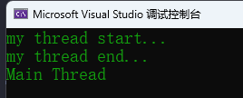 

有两个线程在跑，相当整个程序的执行有两条线在同时走， 所以可以同时干两个事， 即使一条线被堵住了，另外一条线还是可以通行的。

 


**join()**

加入/汇合，阻塞主线程，让主线程等待子线程执行完毕，然后子线程和主线程汇合，然后再往下走。

```C++
//主线程阻塞到这里等待myprint()执行完，当子线程执行完毕，这个join()就执行完毕，主线程就续往下走。
my_tobj.join();
```

注释掉 join() 语句，观察现象:

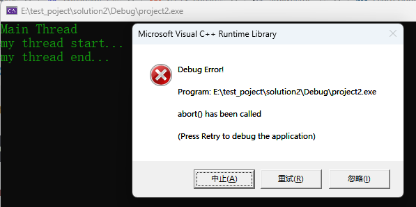 

如果主线程执行完毕了，但子线程没执行完毕，这种程序是不合格的，程序是不稳定的。


**detach()**

传统多线程程序主线程要等待子线程执行完毕，然后自己再最后退出；

- detach：分离，也就是主线程不和子线程汇合了
- 一旦detach()之后，与这个主线程关联的thread对象就会`失去与这个主线程的关联`。此时这个子线程就会理留在后台运行(主线程与跟该子线程关去联系）。
- 这个子线程就相当于被c++运行时库接管，当这个子线程执行完成后，由运行时库负责清理该线程相关的资源（守护线程）。
- 一旦`调用了detach()`， 就`不能再用join()`，否则系统会报告异常。


**joinable()**

- 判断是否可以成功使用join或者detach
  - 返回`true` (可以join或者detach)
  - `false`(不能join或者detach)。

```C++
void myprint() {
	cout << "my thread start..." << endl;
	//...
	cout << "my thread end..." << endl;
}

int main()
{
	thread my_tobj(myprint);
	if (my_tobj.joinable())
	{
		my_tobj.join();
	}

	std::cout << "Main Thread" << std::endl;

	return 0;
}
```

------

## 其他创建线程手法

**用类对象（可调用对象），以及一个问题范例**

```C++
#include <iostream>
#include <string>
#include <thread>
using namespace std;
 
class AE
{
public:
   void operator()(){
        cout << "我的线程operator()开始执行了" << endl;
        //...
        //...
        cout << "我的线程operator()执行结束了" << endl;
        }
};
 
int main()
{
    AE ae;
    thread mythread(ae); //ae: 可调用对象
    
    mythread.join();
  
    //主线程执行
    std::cout << "主线程收尾" << std::endl;
 
    return 0;
}
```

 

- 注意这种传引用，同时使用detach的情形。

```C++
#include <iostream>
#include <string>
#include <thread>
 
using namespace std;
 
class AE
{
    int& m_i;
public:
    AE(int& i):m_i(i){
        cout << "AE 构造函数执行了" << endl;
    }
    AE(const AE& other):m_i(other.m_i) {
        cout << "AE 拷贝构造函数执行了" << endl;
    }
    ~AE() {
        cout << "~AE 析构函数执行了" << endl;
    }
 
   void operator()(){
        cout << "m_i的值"<< m_i << endl;       
        }
};
 
 
int main()
{
    int myi = 69;
    AE ae(myi);
    thread mythread(ae); //ae: 可调用对象
    
    mythread.detach();
  
    //主线程执行
    std::cout << "主线程收尾" << std::endl;
 
    return 0;
}
```

疑问：一旦调用了detach()， 那我主线程执行结束了，我这里用的这个ae这个对象还在吗? (对象不在了)

- 这个对象实际上是被`复制（值拷贝方式）`到线程中去，执行完主线程后，ae会被销毁，但是所复制的AE对象依旧存在。
- 所以，只要这个`AE类对象里没有引用，没有指针`，那么`就不会产生问题`。

 

- 如果使用join()

 


**lambda方式**

```C++
#include <iostream>
#include <string>
#include <thread>
 
using namespace std;
 
int main()
{
    thread mythread([](){
            cout << "lambda表达式线程执行了" << endl;
            //...
            cout << "lambda表达式线程结束了" << endl;
            }); //lambda表达式: 可调用对象
    
    mythread.join();
  
    //主线程执行
    std::cout << "主线程收尾" << std::endl;
 
    return 0;
}
```

------

## 线程传参

**要避免的陷阱1**

```C++
void myprint(const int& i, char* pmybuf ) {
    cout << i << endl;
    cout << pmybuf << endl;
    return;
}
 
int main()
{
    int val = 1;
    int& val_y = val;
    char buf[] = "This is a Test!";
    thread mythread(myprint, val, buf);  //传递参数
 
    mythread.join();
    //主线程执行
    std::cout << "主线程收尾" << std::endl;
    return 0;
}
```

- 由于传递给myprint的是val的引用，如果主线程结束，会不会给子线程造成影响？
  - 答案是不会，虽然传给子线程看上去是引用传递，实际上是将val的值拷贝给了函数参数 i，实际上不是引用传递，是`值拷贝传递`。建议使用detach的时候，线程函数，不要写成引用传递。
- 针对线程函数第二个参数 pmybuf，通过调试查看地址，发现主线程中的buf地址和线程中的pmybuf内存地址相同，如果使用detach，就会产生问题。
- 所以使用detach的时候不要使用引用传递，尤其是不要使用指针（绝对有问题），这会引起错误。

**解决方式**

```C++
void myprint(const int i, const string & pmybuf ) {
    cout << i << endl;
    cout << pmybuf.c_str() << endl;
    return;
}
```

- 字符数组转string，隐式类型转换。
- 创建临时对象，最终赋值给string，这样就是不同的内存了。


**要避免的陷阱2**

buf究竟是什么时候传递给string的？是否main函数都执行完了（此时mybuf被回收了），才把mybuf往string转。事实上这种方式是有这样的风险。

- 更安全的做法（进行显示类型转换），将线程的pmybuf绑定到buf转换成的string临时对象。在整个main函数执行完毕之前，肯定已经构造出了临时对象并且传递到线程中去了。

```C++
 thread mythread(myprint, val, string(buf) );  //这是一个可以保证在线程中肯定有效的对象。
```

**总结**

- 若传递int这种简单类型参数，建议都是值传递，不要用引用，防止节外生枝。
- 如果传递类对象，`避免隐式类型转换`。全部都在`创建线程这一行就构建出临时对象`出来，然后在线程函参数里，`用引用来接`（否则系统还会构造临时对象来接，构造三次）。
- `建议不使用detach()，只使用join()`，这样就不存在局部变量失效导致线程对内存的非法引用问题。

------

## **临时对象作为线程参数**

**线程id概念**

- id是个数字，每个线程（不管是主线程还是子线程）实际上都对应着一个数字，而且每个线程对应的这个数字都不同。
- 线程id可以用c++标准库里的函数来获取。通过 `std::this_thread::get_id()` 来获取。

**临时对象构造时机抓捕**

- 使用显示类型转换，创建临时对象的方式，可以`主线程执行完毕之前将临时对象构造出来`，然后拷贝到子线程当中去。
- 如果线程函数中使用值拷贝，不用引用方式：就会在子线程中多执行了一次拷贝构造函数。
- 所以建议`在类作为参数传递时，使用引用方式传递`（虽然写的是引用方式，但是实际上是按值拷贝方式处理）。

------

## 传递类对象、智能指针作为线程参数

在线程中修改变量的值不会影响到主线程。虽然传进去的是引用，但是线程中对成员变量的值进行修改，不会影响到main函数中的a对象的成员变量的值。

```C++
class A {
public:
    mutable int m_i;
    //类型转换构造函数，可以把一个int转换为类A对象
    A(int i) :m_i(i) { cout << "A::A(int i)函数执行了" << this << "  ThreadId  " \
                        << std::this_thread::get_id()<< endl; }
    A(const A &other) :m_i(other.m_i) { cout << "A::A(const A &other)函数执行了" << this \
                        << "  ThreadId  " << std::this_thread::get_id() << endl; }
    ~A() { cout << "A:: ~A()函数执行了" << this << "  ThreadId  "  \
                        << std::this_thread::get_id() << endl; }
};
 
void myprint(const A  &p_a ) {
    p_a.m_i = 89;
    cout << "子线程myprint()参数地址：" << &p_a << "  ThreadId  " \
                        << std::this_thread::get_id() << endl;
    return;
}
 
int main()
{
    cout << "主线程ID" << std::this_thread::get_id() << endl;
    A a(1);
    thread mythread(myprint, a);   
    mythread.join();
 
    //主线程执行
    std::cout << "主线程结束" << std::endl;
    return 0;
}
```

- 传进去的是引用，但是线程中对m_i的值进行修改，不会影响到main函数中的a对象的m_i的值。
- 虽然对象a是以引用传递的方式传给p_a，但是这个过程是拷贝构造的过程，两个对象的内存地址不同。


**std::ref()**

如果需要真正的把对象引用传递到线程函数当中，就需要使用`std::ref()`

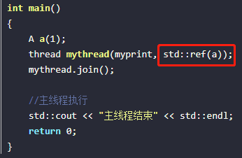 

- 使用了std::ref() 拷贝构造函数就没有了，且两个对象地址相同，实现真正的引用传递。

**std::move()**

智能指针，想从一个堆栈到另一个堆栈，需要使用`std::move()`

```C++
void myprint(unique_ptr<int> ptr_u) {
    cout << "子线程myprint()执行了"  << endl;
    return;
}
 
int main()
{
    unique_ptr<int> m_ptr(new int(100));
    thread mythread(myprint, std::move(m_ptr));
    mythread.join();
 
    //主线程执行
    std::cout << "主线程结束" << std::endl;
    return 0;
}
```

- 调试查看m_ptr信息：两者指向的地址相同。

> 注意：如果这里使用detach，就很危险，因为线程中的智能指针指向的是主线程中的一块内存，当主线程执行完毕而子线程中的智能指针还指向这块内存就会出错。

------

## 用成员函数指针做线程函数

```C++
class A {
public:
    int m_i;
    //类型转换构造函数，可以把一个int转换为类A对象
    A(int i) :m_i(i) { cout << "A::A(int i)函数执行了"<< endl; }
    A(const A &other) :m_i(other.m_i) { cout << "A::A(const A &other)函数执行了"  << endl; }
    void func(int i) { cout << "A::func(int i)函数执行了" << "  i =  " << i << endl; }
    ~A() { cout << "A:: ~A()函数执行了"  << endl; }
};
 
int main()
{
    A a_obj(11);
    thread mythread(&A::func, a_obj, 233);
    mythread.join();
 
    //主线程执行
    std::cout << "主线程结束" << std::endl;
    return 0;
}
```

 

```C++
//【注】类对象使用引用方式传递
thread mythread(&A::func, &a_obj, 233);

thread mythread(&A::func, std::ref(a_obj), 233);
```

- 使用引用或者std::ref不会调用拷贝构造函数，这时使用detach就要注意了。


**operator()带参数**

```C++
class A {
public:
    int m_i;
    //类型转换构造函数，可以把一个int转换为类A对象
    A(int i) :m_i(i) { cout << "A::A(int i)函数执行了"<< endl; }
    A(const A &other) :m_i(other.m_i) { cout << "A::A(const A &other)函数执行了"  << endl; }
    void operator()(int i) { cout << "A::operator()执行了" \
                            << "  i =  " << i << endl; }
    ~A() { cout << "A:: ~A()函数执行了"  << endl; }
};

int main()
{
    A a_obj(11);
    thread mythread(a_obj, 666);
    //thread mythread(std::ref(a_obj), 999); //改用std::ref() 传递可调用对象
    										//少了拷贝构造函数进行资源复制，使用detach要小心。
    mythread.join();
 
    //主线程执行
    std::cout << "主线程结束" << std::endl;
    return 0;
}
```

------

## 创建多个线程

```c++
#include <iostream>
#include <thread>
#include <vector>
using namespace std;

void myprint(int val) {
	cout << "thread start，num： " << val << endl;
	//...
	cout << "thread end, num： " << val << endl;
}

int main()
{
	vector<thread> my_threads;

	for (int i = 0; i < 10; i++) {
		my_threads.push_back(thread(myprint, i));	//创建10个线程，并且这10个线程开始执行
	}

	for (auto iter = my_threads.begin(); iter != my_threads.end(); ++iter) {
		iter->join();
	}

	cout << "main tread" << endl;
	return 0;
}
```

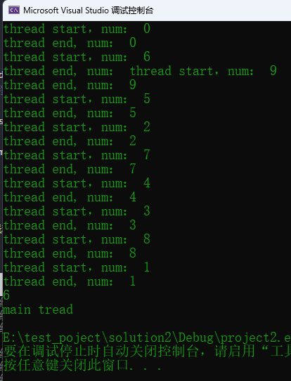 

- 多个线程执行顺序是乱的，跟操作系统内部对线程的运行调度机制有关。
- 主线程等待所有子线程运行结束，最后主线程结束，推荐这种join的写法，更容易写出稳定的程序。
- 把thread对象放入到容器里管理，看起来像个thread对象数组，这对一次创建大量的线程并对大量线程进行管理更加方便。

------

## 数据共享分析

**只读的数据**

- 只读的数据：是安全稳定的，不需要特别什么处理手段。直接读就可以。

**有读有写**

- 假设有读有写：2个线程写，8个线程读，如果代码没有特别的处理，那程序肯定崩溃。
- 最简单的不崩溃处理，读的时候不能写，写的时候不能读。

**共享数据的保护案例代码**

- 网络游戏服务器。两个创建的线程，一个线程收集玩家命令（用一个数字表示玩家发来的命令），并把命令数据写到一个队列中。
- 另外一个线程从队列中取出玩家发送来的命令进行解析，然后执行玩家需要的动作。
- 下面代码中两个线程同时对消息队列msgRecvQueue进行操作，读或者写，会`导致异常`，`需要引入互斥量`进行解决。

```C++
class A {
public:
	void inMsgRecvQueue() {
		for (int i = 1; i < 100; ++i) {
			cout << "inMsgRecvQueue插入一个元素 " << i << endl;
			msgRecvQueue.push_back(i);
		}
	}

	void outMsgRecvQueue() {
		for (int i = 1; i < 100; ++i) {
			if (!msgRecvQueue.empty()) {//消息队列不为空
				int command = msgRecvQueue.front();	//返回第一个元素，但不检查元素是否存在
				msgRecvQueue.pop_front();	//移除第一个元素，但不返回
				//具体的命令具体处理
			}else{
				//消息队列为空
				cout << "outMsgRecvQueue()，当前消息队列为空" << i << endl;
			}
		}
		cout << "outMsgRecvQueue()执行完毕" << endl;
	}
private:
	std::list<int> msgRecvQueue;	//消息队列
};

int main()
{
	A obja;
	thread inMsgThread(&A::inMsgRecvQueue, &obja);	//第二个参数是引用，保证线程里操作同一个对象
	thread outMsgThread(&A::outMsgRecvQueue, &obja);
	
	inMsgThread.join();
	outMsgThread.join();

	cout << "main thread end" << endl;

	return 0;
}
```

------

# 互斥量

**互斥量(mutex)的基本概念**

- 保护共享数据，操作时，某个线程用代码先把共享数据锁住、操作数据、解锁，其他想操作共享数据的线程必须等待解锁。
- 互斥量是个类对象
  - 理解成一把锁，多个线程尝试用 `lock()` 成员函数来加锁，`只有一个线程能锁定成功`（成功的标志是lock()函数返回）。
  - 如果没锁成功，那么流程阻塞在lock()这里不断的尝试去锁这把锁头。
- 互斥量使用要小心，保护数据应不多也不少；少了，没达到保护效果，多了，影响效率。

**互斥量的用法**

引入头文件  #include \<mutex\>

lock()， unlock()

- 步骤：先lock(), 操作共享数据，再unlock（）
- lock()和unlock()要成对使用，每调用一次lock()，必然应该调用一次unlock()。有lock，忘记unlock的问题，非常难排查
- 如果lock了，注意退出的地方（如 return）是不是加上了unlock，`几个出口几个unlock`

```C++
#include <iostream>
#include <thread>
#include <list>
#include <mutex>
using namespace std;
 
class A{
public:
    //把收到的消息（玩家命令）加入到一个队列的线程
    void inMsgRecvQueue() 
    {
        for (int i = 1; i < 10000; ++i) 
        {
            cout << "inMsgRecvQueue执行了，插入一个元素" << i << endl;
            my_mutex.lock();
            msgRecvQueue.push_back(i);    //假设这个数字就是玩家发来的命令，加入到消息队列中
            my_mutex.unlock();
        }
    }
 
    //在这个函数中加锁
    bool outMsgMutPro(int& command )
    {
        my_mutex.lock();
        if (!msgRecvQueue.empty()) {
            //消息队列不为空
            command = msgRecvQueue.front(); //返回第一个元素，但不检查元素是否存在
            msgRecvQueue.pop_front();           //移除第一个元素，但不返回
            my_mutex.unlock();
            return true;
        }
        my_mutex.unlock();
        return false;
    }
 
    //把消息从消息队列中取出的线程
    void outMsgRecvQueue() 
    {
        int command{};
       
        for (int i = 1; i < 10000; ++i) 
        {
            bool ret = outMsgMutPro(command);
            if (ret) 
            {
                cout << "outMsgMutPro执行了，取出一个元素" << command << endl;
                //这里就针对具体的命令具体处理
                //...
            }
            else {
                //消息队列为空
                cout << "outMsgRecvQueue执行了，但是当前消息队列为空" << i << endl;
            }
        }
        cout << "outMsgRecvQueue()执行完毕" << endl;
    }
 
private:
    std::list<int> msgRecvQueue;  //容器（消息队列），专门代表玩家给我们发来的命令
    std::mutex my_mutex;
};
 
int main()
{
    A obja;
    std::thread outMsgThread(&A::outMsgRecvQueue, &obja); //第二个参数是引用，保证线程里操作同一个对象
    std::thread inMsgThread(&A::inMsgRecvQueue, &obja);
 
    inMsgThread.join();
    outMsgThread.join();
 
    //主线程执行
    std::cout << "主线程结束" << std::endl;
    return 0;
}
```

------

##  **std::lock_guard类模板**

- 为了防止忘记unlock()，引入了一个叫std::lock_guard的类模板
- std::lock_guard 类模板：直接取代lock() 和unlock()；用了lock_guard之后，`再不能`使用lock()和unlock()了
- lock_guard`构造函数`里执行了mutex::lock()。lock_guard`析构函数`里执行了mutex::unlock()。
- 结合 {} ，可以控制作用的范围（RAII）

```C++
void inMsgRecvQueue() 
{
    for (int i = 1; i < 10000; ++i)
    {
        cout << "inMsgRecvQueue执行了，插入一个元素" << i << endl;
        {
            std::lock_guard<mutex> mutex_guard_in(my_mutex);
            msgRecvQueue.push_back(i);    //加入到消息队列中
        }
        //其他代码...
    }
}

//在这个函数中加锁
bool outMsgMutPro(int& command )
{
    std::lock_guard<mutex> mutex_guard_out(my_mutex);
    if (!msgRecvQueue.empty()) 
    {
        //消息队列不为空
        command = msgRecvQueue.front(); //返回第一个元素，但不检查元素是否存在
        msgRecvQueue.pop_front();           //移除第一个元素，但不返回
        return true;
    }
    return false;
}
```

------

## 死锁

- 死锁这个问题是由至少两个锁头也就是`两个互斥量`才能产生；
- 两个线程 A,B
  - (1) 线程A执行的时候，这个线程先锁金锁，把金锁lock()成功了，然后它去lock银锁。
  - 出现了上下文切换
  - (2) 线程B执行了，这个线程先锁银锁，因为银锁还没有被锁，所以银锁会lock()成功，线程B要去lock金锁。
  - 此时此刻，死锁就产生了。
  - (3) 线程A因为拿不到银锁头，流程走不下去（后边代码有解锁金锁锁头的但是流程走不下去，所以金锁头解不开）。
  - (4) 线程B因为拿不到金锁头，流程走不下去（后边代码有解锁银锁锁头的但是流程走不下去，所以银锁头解不开）。

**死锁的一般解决方案**

- 只要保证这两个互斥量`上锁的顺序一致`就不会死锁。

**std::lock()函数模板**

- 用来处理`多个互斥量`的时候才出场
- 能力：一次锁住`两个或者两个以上的互斥量`（至少两个，多了不限，1个不行）
  - 如果互斥量中有一个没锁住，它就在那里等着，等所有互斥量都锁住，它才能往下走（返回）。
  - 要么两个互斥量都锁住，要么两个互斥量都没锁住。
  - 如果只锁了一个，另外`一个没锁成功`，则它`立即把已经锁住的解锁`。

```C++
void inMsgRecvQueue()
{
    for (int i = 1; i < 1000; ++i)
    {
        cout << "inMsgRecvQueue执行了，插入一个元素" << i << endl;
        std::lock(my_mutex1, my_mutex2);
        msgRecvQueue.push_back(i);    //假设这个数字就是玩家发来的命令，加入到消息队列中
        my_mutex1.unlock();
        my_mutex2.unlock();
    }
}

bool outMsgMutPro(int& command)
{
    std::lock(my_mutex1, my_mutex2);
    if (!msgRecvQueue.empty()) {
        //消息队列不为空
        command = msgRecvQueue.front(); //返回第一个元素，但不检查元素是否存在
        msgRecvQueue.pop_front();           //移除第一个元素，但不返回
        my_mutex1.unlock();
        my_mutex2.unlock();
        return true;
    }
    my_mutex1.unlock();
    my_mutex2.unlock();
    return false;
}
```

**std::lock_guard的std::adopt_lock参数**

- std::adopt_lock是个结构体对象，起一个标记作用：作用就是`表示这个互斥量已经lock()`
- `不需要`再std::lock_guard\<std::mutext\>`构造函数`里再面对对象进行`再次lock()`

```c++
void inMsgRecvQueue()
{
    for (int i = 1; i < 1000; ++i)
    {
        cout << "inMsgRecvQueue执行了，插入一个元素" << i << endl;
        std::lock(my_mutex1, my_mutex2);
        
        //构造函数不会再lock
        std::lock_guard<mutex> in_mutex_guard1(my_mutex1, std::adopt_lock);
        std::lock_guard<mutex> in_mutex_guard2(my_mutex2, std::adopt_lock);
        
        msgRecvQueue.push_back(i);    //假设这个数字就是玩家发来的命令，加入到消息队列中
        //my_mutex1.unlock();
        //my_mutex2.unlock();
    }
}
```

> std::lock()：一次锁定多个互斥量，谨慎使用（建议一个一个锁）。

------

## unique_lock

- unique_lock是个类模板，工作中一般用lock_guard(推荐使用)，lock_guard取代了mutex的lock()和unlock()
- unique_lock比lock_guard灵活很多，效率上差一点，内存占用多一点
- 缺省情况下，unique_lock和lock_guard作用相同

```C++
void inMsgRecvQueue()
{
    for (int i = 1; i < 10000; ++i)
    {
        cout << "inMsgRecvQueue执行了，插入一个元素" << i << endl;
        //std::lock_guard<mutex> in_mutex_guard(my_mutex);
        std::unique_lock<mutex> in_mutex_guard(my_mutex);           
        msgRecvQueue.push_back(i); 
        //其他代码
    }
}
```

**unique_lock的第二个参数**

**std::adopt_lock**

- 表示这个互斥量已经被lock了（必须要把互斥量提前lock了，否则会报异常）
  - 标记的效果就是"假设调用方线程已经拥有了互斥的所有权"`（表示已经lock()成功了）`
- unique_lock也可以带std::adopt_lock标记，含义相同，就是不希望再unique_lock()的构造函数中lock这个mutex。

```C++
 my_mutex.lock(); //要先lock，后续才能使用unique_lock的adopt_lock参数
 std::unique_lock<mutex> in_mutex_guard(my_mutex, std::adopt_lock); 
```

**std::try_to_lock**

- [例]：其中一个线程执行拿到锁后，阻塞20秒，另一个线程由于拿不到锁，也跟着阻塞20秒。
- try_to_lock
  - 使用try_to_lock时，尝试用mutex的lock去锁定这个mutex，但如果`没有锁定成功`，也会`立即返回`，并不会阻塞在那里
  - 用这个try_to_lock的前提是`不能先去lock`。同一个mutex调用两次lock()，程序会卡死

```C++
class A
{
public:
    //把收到的消息（玩家命令）加入到一个队列的线程
    void inMsgRecvQueue()
    {
        for (int i = 1; i < 10000; ++i)
        {
            cout << "inMsgRecvQueue执行了，插入一个元素" << i << endl;
            //使用try_to_lock参数
            std::unique_lock<mutex> in_mutex_guard(my_mutex, std::try_to_lock);
            if (in_mutex_guard.owns_lock()) 
            {   
                //拿到了锁
                msgRecvQueue.push_back(i);    //假设这个数字就是玩家发来的命令，加入到消息队列中
                //其他代码
            }
            else 
            {
                //没拿到锁
                cout << "inMsgRecvQueue()执行了，但没拿到锁，只能干其他的事" << i << endl;
            }
            
        }
    }
 
    //在这个函数中加锁
    bool outMsgMutPro(int& command)
    {
 
        //std::lock_guard<mutex> out_mutex_guard1(my_mutex);
        std::unique_lock<mutex> out_mutex_guard1(my_mutex);
        std::chrono::milliseconds dura(2000); // 1秒 = 1000毫秒
        std::this_thread::sleep_for(dura);    //休息一定的时长
 
        if (!msgRecvQueue.empty())
        {
            //消息队列不为空
            command = msgRecvQueue.front(); //返回第一个元素，但不检查元素是否存在
            msgRecvQueue.pop_front();           //移除第一个元素，但不返回
            return true;
        }
        return false;
    }
 
    //把消息从消息队列中取出的线程
    void outMsgRecvQueue()
    {
        int command{};
 
        for (int i = 1; i < 10000; ++i)
        {
            bool ret = outMsgMutPro(command);
            if (ret)
            {
                cout << "outMsgMutPro执行了，取出一个元素" << command << endl;
                //这里就针对具体的命令具体处理
                //...
            }
            else {
                //消息队列为空
                cout << "outMsgRecvQueue执行了，但是当前消息队列为空" << i << endl;
            }
        }
        cout << "outMsgRecvQueue()执行完毕" << endl;
    }
 
private:
    std::list<int> msgRecvQueue;  //容器（消息队列），专门代表玩家给我们发来的命令
    std::mutex my_mutex;
};
```

**std::defer_lock**

- 用这个defer_lock的前提是`不能自己先lock`，否则会报异常
- efer_lock的意思就是并没有给mutex加锁： `初始化了一个没有加锁的mutex`


**unique_lock的成员函数**

lock()

```C++
std::unique_lock<mutex> in_mutex_guard(my_mutex, std::defer_lock); //没加锁的my_mutex
in_mutex_guard.lock(); //后面会自己unlock
```

 unlock()

- 有时有一些分共享代码需要处理，所以需要把锁解开去处理非共享代码。
- 处理完后又想处理共享代码，再次调用lock() 上锁。
- `方便随时锁上，随时开锁`

```C++
std::unique_lock<std::mutex> uniq_mux(my_mutex, std::defer_lock); 没有加锁的my_mutex
uniq_mux.lock(); //后面可以自己unlock			
//处理共享代码			
uniq_mux.unlock();
//处理一些非共享代码
uniq_mux.lock();
//处理共享代码	
```

try_lock()

- 尝试给互斥量加锁，如果拿不到锁，则返回false，如果拿到了锁，返回true，这个函数不阻塞的

```C++
void inMsgRecvQueue()
{
    for (int i = 1; i < 10000; ++i)
    {
        cout << "inMsgRecvQueue执行了，插入一个元素" << i << endl;
        //使用defer_lock参数
        std::unique_lock<mutex> in_mutex_guard(my_mutex, std::defer_lock); //没加锁的my_mutex
        //使用try_lock()函数
        if (in_mutex_guard.try_lock() == true) 
        {
            //拿到锁了
            msgRecvQueue.push_back(i);    //假设这个数字就是玩家发来的命令，加入到消息队列中    
        }
        else 
        {
            //没拿到锁
            cout << "inMsgRecvQueue() 执行，但没有拿到锁，只能干点别的事" << i << endl;
        }  
    }
}
```

release()

- 返回它所管理的`mutex对象指针`，并释放所有权，也就是说，这个`unique_lock和mutext不再有关系`
- 如果原来mutex对象处于加锁状态，你有责任接管过来并负责解锁。（`release返回的是原始mutex指针`）

```C++
void inMsgRecvQueue()
{
    for (int i = 1; i < 10000; ++i)
    {
        cout << "inMsgRecvQueue执行了，插入一个元素" << i << endl;
        std::unique_lock<mutex> in_mutex_guard(my_mutex); 
        std::mutex* ptr_mutex = in_mutex_guard.release();
 
        msgRecvQueue.push_back(i);    //假设这个数字就是玩家发来的命令，加入到消息队列中
        //获取mutex指针后，需要自行unlock()
        ptr_mutex->unlock();
    }
}
```

**unique_lock()函数使用小结**

- 为什么有时候需要unlock()：
  - 因为你lock锁住的代码段越少，执行越快，整个程序运行效率越高。
- 有人也把锁头锁住的代码多少称为`锁的粒度`：
  - 锁住的代码少，这个粒度叫细，执行效率高。
  - 锁住的代码多，粒度叫粗，那执行效率就低。
- 要学会尽量选择合适粒度的代码进行保护，粒度太细，可能漏掉共享数据的保护，粒度太粗，影响效率。

**unique_lock所有权的传递**

```C++
std::unique_lock<std::mutex> mutex_guard(my_mutex);  //所有权概念
```

- mutex_guard拥有my_mutex的所有权。
- mutex_guard可以把自己对mutex (比如my_mutex) 的所有权转移给其他的unique_lock对象。
- 所以，unique_lock对象这个mutex的所有权是`属于可以转移`，但是`不能复制`

```C++
std::unique_lock<std::mutex> mutex_guard1(my_mutex);
 
std::unique_lock<std::mutex> mutex_guard2(mutex_guard1); //复制所有权是非法的
 f
std::unique_lock<std::mutex> mutex_guard2(std::move(mutex_guard1)); 
//移动语义，现在相当于mutex_guard2和my_mutex绑定到一起了,现在mutex_guard1指向空, mutex_guard2指向了my_mutex	
```

- 另外一种转移所有权的方式：

```C++
std::unique_lock<std::mutex> rtn_unique_lock(){
	std::unique_lock<std::mutex> tmp_guard(my_mutex);
	return tmp_guard; 
	//从函数返回一个局部的unique_lock对象时可以的。
	//返回这种局部对象tmpguard会导致系统生成临时unique_lock对象，并调用unique_lock的移动构造函数
}

//调用
std::unique_lock<mutex> mutex_guard = rtn_unique_lock();
```

------

## 其他各种mutex互斥量

**递归的独占互斥量 std::recursive_mutex**

- std::mutex `独占式互斥量`，自己lock时别人lock不了
- std::recursive_mutex：`递归的独占互斥量`，有lock也有unlock，它`允许在同一个线程中同一个互斥量多次被lock()` 。
- 但是递归加锁的次数是有限制的，太多可能会报异常，`效率要比mutex低`。
- 如果真的用了recursive_mutex要考虑代码是否有优化空间，如果能调用一次lock()就不要调用多次。


**带超时的互斥量 std::timed_mutex 和 std::recursive_timed_mutex**

- timed_mutex有mutex的功能且多了以下两个函数。

  - try_lock_for()：*等待一段时间*，如果拿到了锁，或者超时了未拿到锁，就继续执行（有选择执行）如下：

    ```C++
    //在inMsgRecvQueue函数里
    	void inMsgRecvQueue()
    	{
    		for (size_t i = 0; i < 1000; ++i)
    		{
    			cout << "收到消息，并放入队列 " << i << endl;
    			std::chrono::milliseconds timeout(100);
    			if (my_mutex.try_lock_for(timeout)) {//等待100ms尝试获取锁
    				//在100ms内拿到了锁
    				msgRecvQueue.push_back(i);
    				my_mutex.unlock();//用完了解锁
    			}
    			else {//100ms内没拿到锁
    				std::chrono::milliseconds sleeptime(100);
    				std::this_thread::sleep_for(sleeptime);
    			}
    		}
    		cout << "消息入队结束" << endl;
    	}
    private:
    	list<int> msgRecvQueue;
    	std::timed_mutex my_mutex;//类中定义带超时功能的独占互斥量
    ```

  - try_lock_until()：参数是一个未来的时间点，在这个未来的时间没到的时间内，如拿到了锁头，流程就走下来，如果时间到了没拿到锁，流程也可以走下来。

    ```C++
    //在inMsgRecvQueue函数里
    std::chrono::milliseconds timeout(100);
    if (my_mymutex.try_lock_until(chrono::steady_clock::now() + timeout)){//当前时间点+100ms
        //在未来的100ms内拿到了锁
        msgRecvQueue.push_back(i);
    	my_mutex.unlock();//用完了解锁
    }
    else{
        std::chrono::milliseconds sleeptime(100);
        std::this_thread::sleep_for(sleeptime);
    }
    ```

  - 两者的区别就是一个参数是时间段，一个参数是未来的时间点。

- std::recursive_timed_mutex：综合了recursive_mutex和timed_mutex的功能，允许同一个线程多次获取这个互斥量，多次lock。且有try_lock_for和try_lock_until函数。

------

# 单例设计模式

- 单例：整个项目中，有某个或者某些特殊的类，属于该类的对象，`只能创建1个`，多了创建不了
- 注意delete指针的技巧：类中套类，利用类对象回收时调用析构函数进行指针等资源的释放

```C++
class singleClass
{
private:
    singleClass() {};  //私有化构造函数
    static singleClass* m_instance;  //静态成员变量
 
public:
    static singleClass* GetInstance()
    {
        if (m_instance == NULL)
        {
            m_instance = new singleClass();
            static GuiderPtr gc;
        }
        return m_instance;
    }
    class GuiderPtr   //类中套类，用来释放对象
    {
    public:
        ~GuiderPtr()
        {
            if (singleClass::m_instance)
            {
                delete singleClass::m_instance;
                singleClass::m_instance = NULL;
            } 
        }  
    };
 
    void func() {
        cout << "This is a Test" << endl;
    }
};
    //类静态变量初始化
singleClass*  singleClass::m_instance = NULL;
 
int main()
{
    singleClass* sg_ptr = singleClass::GetInstance();  //创建一个singleClass类，并返回指针
    singleClass* sg_ptr1 = singleClass::GetInstance();  //返回的之前创建的指针
 
    sg_ptr->func();
    sg_ptr1->func();
    singleClass::GetInstance()->func();
 
    return 0;
}
```

**共享数据分析**

- 建议：在创建所有其他线程之前，`在主线程中创建出单例对象`，加载数据，后续使用。
- 需要在自己创建的线程（而不是主线程）中来创建singleClass这个单例类的对象，可能会面临GetInstance()这种成员函数要互斥。

```C++
#include <iostream>
#include <thread>
#include <mutex>

using namespace std;
mutex res_mutex;

class singleClass
{
private:
	singleClass() {};  //私有化构造函数
	static singleClass* m_instance;  //静态成员变量

public:
	static singleClass* GetInstance()
	{
		if (m_instance == nullptr) //双重检查，提高程序执行效率
		{
			std::unique_lock<mutex> mutex_getInstance(res_mutex);	//自动加锁
			if (m_instance == nullptr)
			{
				m_instance = new singleClass();
				static GuiderPtr gp;
			}
		}
		return m_instance;
	}
	class GuiderPtr   //类中套类，用来释放对象
	{
	public:
		~GuiderPtr()
		{
			if (singleClass::m_instance)
			{
				delete singleClass::m_instance;
				singleClass::m_instance = nullptr;
			}
		}
	};

	void func() {
		cout << "This is a Test" << endl;
	}
};
//类静态变量初始化
singleClass* singleClass::m_instance = nullptr;

void mythread() {
	cout << "线程函数开始执行了" << endl;
	singleClass* sg_ptr = singleClass::GetInstance();
	sg_ptr->func();
	cout << "线程函数执行完毕了" << endl;
}

int main()
{
	thread t_obj1(mythread);
	thread t_obj2(mythread);

	t_obj1.join();
	t_obj2.join();

	return 0;
}
```

**std::call_once(）**

- C++11引入的函数，该函数的第二个参数是一个函数名a()
- call_once 功能是`能够保证函数a()只被调用一次`
- call_once `具备互斥量能力`，而且效率上，比互斥量消耗的资源更少
- call_once()`需要与一个标记结合使用`，这个标记 std::once_flag是一个结构体
- call_once()就是通过这个标记来决定对应的函数a()是否执行，调用call_once成功后，call_once()就把这个标记设置为一种已调用状态
  - 后续再次调用call_once() ,只要once_flag被设置为了“已调用”状态，那么对应的函数a()就不会再被执行

```C++
#include <iostream>
#include <thread>
#include <mutex>

using namespace std;
std::mutex res_mutex;
std::once_flag g_flag; //全局变量，定义的标记
 
class singleClass
{
private:
    singleClass() {};  //私有化构造函数
    static singleClass* m_instance;  //静态成员变量
 
    static void CreatInstance()      //只被调用一次
    {   
        std::chrono::milliseconds dura(2000);
        std::this_thread::sleep_for(dura);
        cout << "CreatInstance()执行了" << endl;
 
        m_instance = new singleClass();
        static GuiderPtr gc;
    }
 
public:
    static singleClass* GetInstance()
    {
        //两个线程同时执行到这里，其中一个线程要等另外一个线程执行完毕CreateInstance（）；
        std::call_once(g_flag, CreatInstance);
        cout << "GetInstance()执行了" << endl;
        return m_instance;
    }
    class GuiderPtr   //类中套类，用来释放对象
    {
    public:
        ~GuiderPtr()
        {
            if (singleClass::m_instance)
            {
                delete singleClass::m_instance;
                singleClass::m_instance = NULL;
            } 
        }  
    };
 
    void func() {
        cout << "This is a Test" << endl;
    }
};
//类静态变量初始化
singleClass*  singleClass::m_instance = NULL;
 
//线程入口函数
void mythread() {
    cout << "线程函数开始执行了" << endl;
    singleClass* sgPtr = singleClass::GetInstance();  //这里可能有问题
    sgPtr->func();
    cout << "线程函数执行完毕了" << endl;
    return;
}

int main()
{
    std::thread t_obj1(mythread);
    std::thread t_obj2(mythread);
    
    t_obj2.join();
    t_obj1.join();
    
    return 0;
}
```

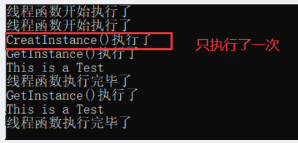 

>综上，还是建议优先在主线程中先创建单例对象。

------

# condition_variable、wait、notify_one

**条件变量std::condition_variable、wait()、notify_one()**

- 线程A: 等待一个条件满足
- 线程B: 专门往消息队列中放入消息（数据），达到一定条件，通知处于等待中的线程A。
- `std::condition_variable`实际上是一个`类`，是一个和条件相关的一个类，`就是等待一个条件达成`。
- 这个类是需要和互斥量来配合工作，用的时候要生成这个类的对象。

 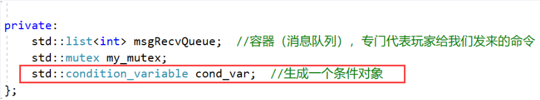

- wai() 用来等一个东西。

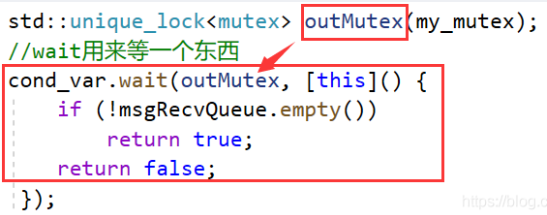 

- 如果第二个参数lambda表达式返回值是`true`，那wait（）`直接返回，继续往下执行`。
- 如果第二个参数lambda表达式返回值是`false`，那么wait()将`解锁互斥量，并堵塞到本行`。
  - 堵塞到`其他某个线程`调用`notify_one()`成员函数为止。
- 如果wait()没有第二个参数: my_cond.wait(outMutex)
  - 那么就跟第二个参数lambda表达式返回`false`效果一样
  - wait()将解锁互斥量，并堵塞到本行，`堵塞到其他某个线程调用notify_one() 成员函数为止`。

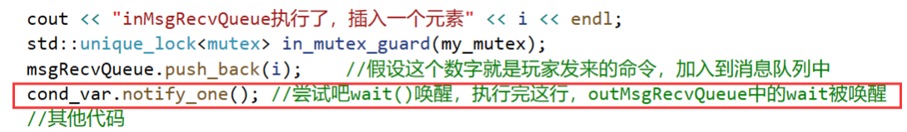 


- 当其他线程用notify_one() 将本wait（原来是阻塞）的状态唤醒后，wait就开始往下执行
  - a) wait() `不断的尝试重新获取互斥量锁`，如果获取不到，那么流程就卡在wait这里等着获取，如果获取到了，那么wait就走下来。
  - b1)如果wait有第二个参数（lambda）,就判断这个lambda表达式，如果lambda表达式为false，那wait又对互斥量解锁，然后又休眠这里等待再次被notify_one唤醒。
  - b2) 如果lambda表达式为true，则wait返回，往下执行。（此时互斥锁被锁着）
  - b3) 如果wait没有第二个参数，则wait返回，往下执行。

>注：还有一种唤醒方式notify_all()，通知所有线程。

```C++
#include <iostream>
#include <thread>
#include <mutex>
 
using namespace std;
 
class A
{
public:
    //把收到的消息（玩家命令）加入到一个队列的线程
    void inMsgRecvQueue()
    {
        for (int i = 1; i < 10000; ++i)
        {
            cout << "inMsgRecvQueue执行了，插入一个元素" << i << endl;
            std::unique_lock<mutex> in_mutex_guard(my_mutex);
            msgRecvQueue.push_back(i);    //假设这个数字就是玩家发来的命令，加入到消息队列中
            cond_var.notify_one(); //尝试吧wait()唤醒，执行完这行，outMsgRecvQueue中的wait被唤醒
            //假如outMsgRecvQueue（）正在处理一个事务需要一段时间，而不是正卡在wait()那里等待你唤醒，那么此时这个notify_one()这个调用也许就没效果.
        }
    }   
 
    //把消息从消息队列中取出的线程
    void outMsgRecvQueue()
    {
        int command{};
        while (true)
        {
            std::unique_lock<mutex> outMutex(my_mutex);
            //wait用来等一个东西
            cond_var.wait(outMutex, [this]() {
                if (!msgRecvQueue.empty())
                    return true;
                return false;
             });
 
            //流程只要能走到这里来，这个互斥锁一定是锁着的。同时msgRecvQueue至少是有一条数据的。
            command = msgRecvQueue.front(); // 返回第一个元素，但不检查元素是否存在
            msgRecvQueue.pop_front();       //移除第一个元素，但不返回
            outMutex.unlock();              //因为unique_lock 的灵活性，所以我们可以随时的unlock解锁，以免锁住太长时间
            cout << "outMsgRecvQueue()执行，取出一个元素" << command << endl;
 
        }//end while
        
    } //end outMsgRecvQueue()
 
private:
    std::list<int> msgRecvQueue;  //容器（消息队列），专门代表玩家给我们发来的命令
    std::mutex my_mutex;
    std::condition_variable cond_var;  //生成一个条件变量对象
}; //end A
 
int main()
{
    A obja;
    std::thread outMsgThread(&A::outMsgRecvQueue, &obja); //第二个参数是引用，保证线程里操作同一个对象
    std::thread inMsgThread(&A::inMsgRecvQueue, &obja);
 
    inMsgThread.join();
    outMsgThread.join();
 
    //主线程执行
    std::cout << "主线程结束" << std::endl;
    return 0;
}
```

**虚假唤醒**

- notify_one或者notify_all唤醒wait()后，实际有些线程可能不满足唤醒的条件，就会造成虚假唤醒，可以`在wait中再次进行判断解决虚假唤醒`。
- 解决：wait中要有第二个参数（lambda表达式），并且这个lambda表达式中要正确判断所处理的公共数据是否存在，如果存在则返回true，流程走下来，互斥锁本线程拿到；否则返回false，解锁并休眠，卡在wait等待被再次唤醒。

------

# async、future、packaged_task、promise

**std::async、std::future创建后台任务并返回值**

需求：希望线程返回一个结果

- std::async是个`函数模板`，用来`启动一个异步任务`，启动一个异步任务之后，`返回一个std::future对象`，std::future是个`类模板`。
  - “启动一个异步任务”，就是`自动创建一个线程并开始执行对应的线程入口函数`，它返回一个std::future对象。
    - 这个std::future对象里边就含有线程入口函数所返回的结果（线程返回的结果），可以通过调用future对象的成员函数get()来获取结果。
    - std::future提供了一种访问异步操作结果的机制，就是说这个结果你可能没有办法马上拿到，但在线程执行完毕的时候，就能够拿到结果，所以可理解为：这个future（对象）里会保存一个值，在将来的某个时刻能够拿到。
  - 这个get()函数不拿到值就卡在这里等待拿值。
  - `get()只能调用一次`，不能调用多次。
  - `wait()`，类似于join()等待线程返回，本身并不返回结果。

```C++
#include <iostream>
#include <thread>
#include <future>
 
using namespace std;
 
int mythread() //线程入口函数
{
    cout << "mythread start" << "ThreadId = " << std::this_thread::get_id() << endl;  //打印线程id
    std::chrono::milliseconds dura(5000);  //休息5秒
    std::this_thread::sleep_for(dura);
    cout << "mythread end" << "ThreadId = " << std::this_thread::get_id() << endl;  //打印线程id
    return 100;
}
 
int main()
{
    cout << "MianThreadID = " <<  std::this_thread::get_id() << endl;  //打印主线程id
    std::future<int> ret = std::async(mythread);  //创建线程并开始执行,将future对象与async创建的线程绑定到一起
                   								//流程不卡在这里，继续运行
 
    std::cout << ret.get() << std::endl;  //卡在这里等待mythread执行完毕，拿到结果
    //主线程执行
    std::cout << "主线程结束" << std::endl;
    return 0;
}
```

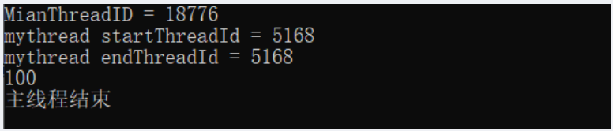 

- 使用类成员函数作为线程入口函数

```C++
#include <iostream>
#include <thread>
#include <future>
 
using namespace std;
 
class A{
public:
    int a_thread(int var) //线程入口函数
    {
        cout << var << endl;
        cout << "mythread start" << "ThreadId = " << std::this_thread::get_id() << endl;  //打印线程id
        std::chrono::milliseconds dura(5000);  //休息5秒
        std::this_thread::sleep_for(dura);
        cout << "mythread end" << "ThreadId = " << std::this_thread::get_id() << endl;  //打印线程id
        return 100;
    }
};
 
int main()
{
    A a;
    int tmp{666};
    cout << "MianThreadID = " <<  std::this_thread::get_id() << endl;  //打印主线程id
    std::future<int> ret = std::async(&A::a_thread, &a, tmp);  //第二个参数是一个对象引用,才能保证线程里使用的是同一个对象
 
    std::cout << ret.get() << std::endl;  //卡在这里等待mythread执行完毕，拿到结果
    //主线程执行
    std::cout << "主线程结束" << std::endl;
    return 0;
}
```

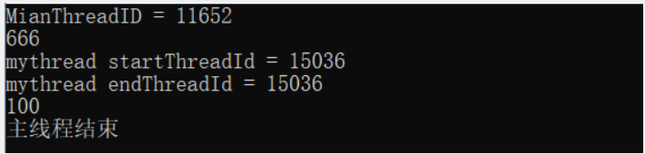 

如果上面代码中不使用get函数，结果如下：

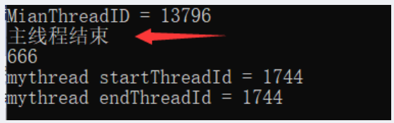 

- 通过额外向std::async()传递一个参数，该参数类型是`std::lunnch类型`（枚举类型）来达到一些特殊的目的。

  - std::launch::deferred: 表示线程入口函数调用被`延迟`到std::future的wait()或者get()函数`调用时才执行`。并且`不创建新线程`，在主线程中调用的线程入口函数。

    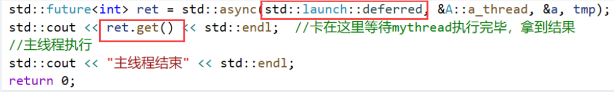 

    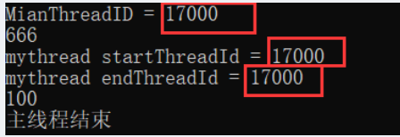 

    - 如果wait()或者get()`没有被调用`，那么线程`不会执行`，实际上，线程根本就`没创建`。

      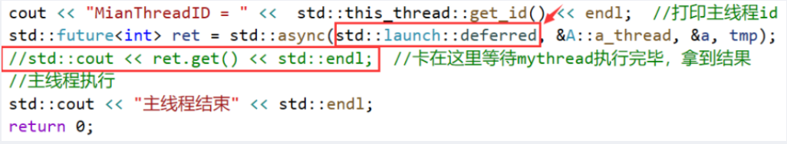 

      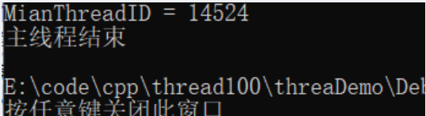 

  - std::launch::async：在调用async函数的时候就开始创建线程，即`立即执行`。

    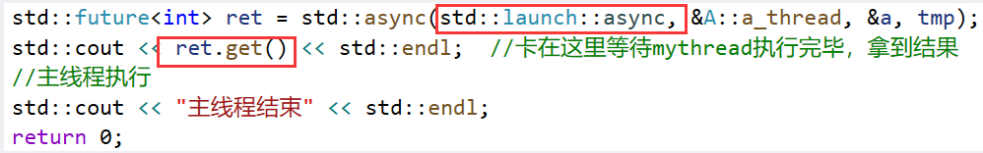 

    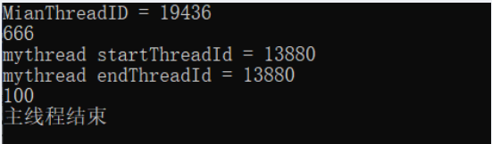 


**std::packaged_task（包装各种可调用对象），配合thread类、future类使用**

- std::packaged_task是个类模板，它的模板参数是各种可调用对象；通过std::packaged_task来把各种可调用对象包装起来，将来作为线程入口函数来调用。

```C++
#include <iostream>
#include <thread>
#include <mutex>
#include <future>
 
using namespace std;
 
int mythread(int var) //线程入口函数
{
    cout << var << endl;
    cout << "mythread start" << "ThreadId = " << std::this_thread::get_id() << endl;  //打印线程id
    std::chrono::milliseconds dura(5000);  //休息5秒
    std::this_thread::sleep_for(dura);
    cout << "mythread end" << "ThreadId = " << std::this_thread::get_id() << endl;  //打印线程id
    return 100;
}
 
int main()
{
    cout << "MianThreadID = " <<  std::this_thread::get_id() << endl;  //打印主线程id
    std::packaged_task<int(int)> myTask(mythread); //将函数mythread包装起来
    int tmp{ 233 };
    std::thread objThread(std::ref(myTask), tmp);  //线程直接开始执行，第二个参数作为线程入口函数的参数
   
    objThread.join();   //等待线程执行完毕
    std::future<int> ret = myTask.get_future(); //future包含有线程入口函数的返回结果，这里保存mythread的返回结果
    cout << ret.get() << endl;
 
    //主线程执行
    std::cout << "主线程结束" << std::endl;
    return 0;
}
```

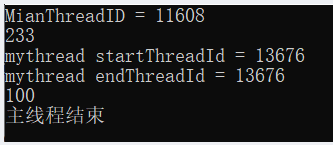 

- 使用lambda表达式

```C++
#include <iostream>
#include <thread>
#include <future>
 
using namespace std;
 
int main()
{
    cout << "MianThreadID = " <<  std::this_thread::get_id() << endl;  //打印主线程id
    std::packaged_task<int(int)> myTask([](int var) {
            cout << var << endl;
            cout << "mythread start" << "ThreadId = " << std::this_thread::get_id() << endl;  //打印线程id
            std::chrono::milliseconds dura(5000);  //休息5秒
            std::this_thread::sleep_for(dura);
            cout << "mythread end" << "ThreadId = " << std::this_thread::get_id() << endl;  //打印线程id
            return 100; 
        }); //将lambda表达式包装起来
    int tmp{ 233 };
    std::thread objThread(std::ref(myTask), tmp);  //线程直接开始执行，第二个参数作为线程入口函数的参数
   
    objThread.join();   //等待线程执行完毕
    std::future<int> ret = myTask.get_future(); //future包含有线程入口函数的返回结果，这里保存lambda表达式的返回结果
    cout << ret.get() << endl;
 
    //主线程执行
    std::cout << "主线程结束" << std::endl;
    return 0;
}
```

- packaged_task包装起来的可调用对象还可以直接调用，所以从这个角度来讲，`packaged_task对象也是一个可调用对象`。

```c++
#include <iostream>
#include <thread>
#include <future>
 
using namespace std;
int main()
{
    cout << "MianThreadID = " <<  std::this_thread::get_id() << endl;  //打印主线程id
    std::packaged_task<int(int)> myTask([](int var) {
            cout << var << endl;
            cout << "mythread start" << "ThreadId = " << std::this_thread::get_id() << endl;  //打印线程id
            std::chrono::milliseconds dura(5000);  //休息5秒
            std::this_thread::sleep_for(dura);
            cout << "mythread end" << "ThreadId = " << std::this_thread::get_id() << endl;  //打印线程id
            return 100; 
        }); //将lambda表达式包装起来
    int tmp{ 233 };
    myTask(tmp);    //直接调用，相当于直接调用
    std::future<int> ret = myTask.get_future(); //future包含有线程入口函数的返回结果，这里保存返回结果
    cout << ret.get() << endl;
 
    //主线程执行
    std::cout << "主线程结束" << std::endl;
    return 0;
}
```

- 结合容器和移动语义使用

```C++
#include <iostream>
#include <thread>
#include <vector>
#include <future>
 
using namespace std;
std::vector<std::packaged_task< int(int)>>  TaskVector;
int main()
{
    cout << "MianThreadID = " <<  std::this_thread::get_id() << endl;  //打印主线程id
    std::packaged_task<int(int)> myTask([](int var) {
            cout << var << endl;
            cout << "mythread start" << "ThreadId = " << std::this_thread::get_id() << endl;  //打印线程id
            std::chrono::milliseconds dura(5000);  //休息5秒
            std::this_thread::sleep_for(dura);
            cout << "mythread end" << "ThreadId = " << std::this_thread::get_id() << endl;  //打印线程id
            return 100; 
        }); //将lambda表达式包装起来
    
    TaskVector.push_back(std::move(myTask));  //加入至容器，使用了移动语义，进去后myTask就为空
    //...
    //取出来调用
    std::packaged_task< int(int)>  myTask2;
    auto iter = TaskVector.begin();
    myTask2 = std::move(*iter);
    TaskVector.erase(iter);   //删除第一个元素，之后迭代器就失效了，后面不可以使用iter了
    
    myTask2(72);    //直接调用，相当于直接调用
    std::future<int> ret = myTask2.get_future(); //future包含有线程入口函数的返回结果，这里保存返回结果
    cout << ret.get() << endl;
 
    //主线程执行
    std::cout << "主线程结束" << std::endl;
    return 0;
}
```

**std::promise**

- 能够在某个线程中给它赋值，然后在其他线程中把这个值取出来用。

```C++
#include <iostream>
#include <thread>
#include <future>
 
using namespace std;
 
void mythread(std::promise<int>& tmp, int clc)
{
    cout << "mythread start" << "ThreadId = " << std::this_thread::get_id() << endl;  //打印线程id
    //做一系列复杂运算
    clc++;
    clc *= 233;
    //其他运算，比如花费了5秒钟
    std::chrono::milliseconds dura(5000);  //休息5秒
    std::this_thread::sleep_for(dura);
    //计算出结果
    int ret = clc;  //保存结果
    tmp.set_value(ret); //结果保存到tmp中
    cout << "mythread end" << "ThreadId = " << std::this_thread::get_id() << endl;  //打印线程id
}
 
int main()
{
    cout << "MianThreadID = " <<  std::this_thread::get_id() << endl;  //打印主线程id
    
    std::promise<int> var_pro;  //创建一个promise对象，用来保存int类型的值
    std::thread objThread(mythread, std::ref(var_pro), 10);
    //获取结果
    objThread.join();
    std::future<int>  t1 = var_pro.get_future(); //promise和线程绑定，用于获取线程返回值
    auto val1 = t1.get();
    cout << val1 << endl;
    
    //主线程执行
    std::cout << "主线程结束" << std::endl;
    return 0;
}
```

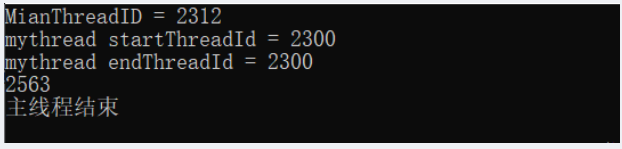 

- 线程1中返回值，线程2调用（promise + future 起连接作用），实现两个线程之间数据传递

```C++
#include <iostream>
#include <thread>
#include <future>
 
using namespace std;
 
void mythread(std::promise<int>& tmp, int clc)
{
    cout << "mythread start" << "ThreadId = " << std::this_thread::get_id() << endl;  //打印线程id
    //做一系列复杂运算
    clc++;
    clc *= 233;
    //其他运算，比如花费了5秒钟
    std::chrono::milliseconds dura(5000);  //休息5秒
    std::this_thread::sleep_for(dura);
    //计算出结果
    int ret = clc;  //保存结果
    tmp.set_value(ret); //结果保存到tmp中
    cout << "mythread end" << "ThreadId = " << std::this_thread::get_id() << endl;  //打印线程id
    return;
}
void mythread2(std::future<int>& tmp)
{
    cout << "mythread2 start" << "ThreadId = " << std::this_thread::get_id() << endl;  //打印线程id
    auto val = tmp.get();
    cout <<"mythread2 val = " <<  val << endl;    
    cout << "mythread2 end" << "ThreadId = " << std::this_thread::get_id() << endl;  //打印线程id
    return;
}
 
int main()
{
    cout << "MianThreadID = " <<  std::this_thread::get_id() << endl;  //打印主线程id
    
    std::promise<int> var_pro;  //创建一个promise对象，用来保存int类型的值
    std::thread objThread(mythread, std::ref(var_pro), 10);
    //获取结果
    objThread.join();
    std::future<int>  t1 = var_pro.get_future(); //promise和线程绑定，用于获取线程返回值
    std::thread objThread2(mythread2, std::ref(t1));
    //获取结果
    objThread2.join();        //等线程2执行完毕
    
    //主线程执行
    std::cout << "主线程结束" << std::endl;
    return 0;
}
```

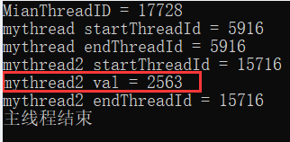 


**std::future的其他成员函数**

std::future_status 枚举值  +  future对象.wait_for

- future_status源码定义

```C++
// ENUM future_status
enum class future_status { // names for timed wait function returns
    ready,
    timeout,
    deferred
};
```

- std::future_status::timeout 示例

```C++
#include <iostream>
#include <thread>
#include <future>
 
using namespace std;
 
int mythread() //线程入口函数
{
    cout << "mythread start" << "ThreadId = " << std::this_thread::get_id() << endl;  //打印线程id
    std::chrono::milliseconds dura(5000);  //休息5秒
    std::this_thread::sleep_for(dura);
    cout << "mythread end" << "ThreadId = " << std::this_thread::get_id() << endl;  //打印线程id
    return 100;
}
 
int main()
{
    cout << "MianThreadID = " << std::this_thread::get_id() << endl;  //打印主线程id
    std::future<int> ret = std::async(mythread);  //创建线程并开始执行
                   //将future对象与async创建的线程绑定到一起，流程不卡在这里，继续运行
    std::future_status status = ret.wait_for(std::chrono::seconds(1));
    if (std::future_status::timeout == status)  //超时，等一秒中希望该线程返回，实际却没有返回
    {
        //表示等待的线程没有执行完毕
        cout << "超时，线程没有执行完" << endl;
    }
 
    //主线程执行
    std::cout << "主线程结束" << std::endl;
    return 0;
}
```

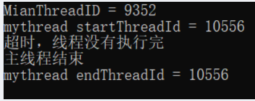 

- std::future_status::ready 示例

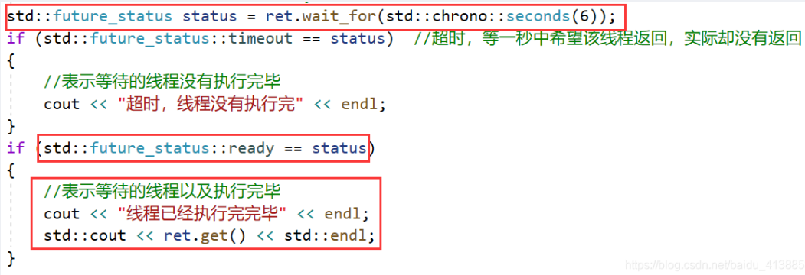 

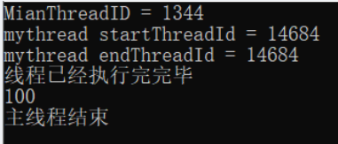 

- std::future_status::deferred 示例

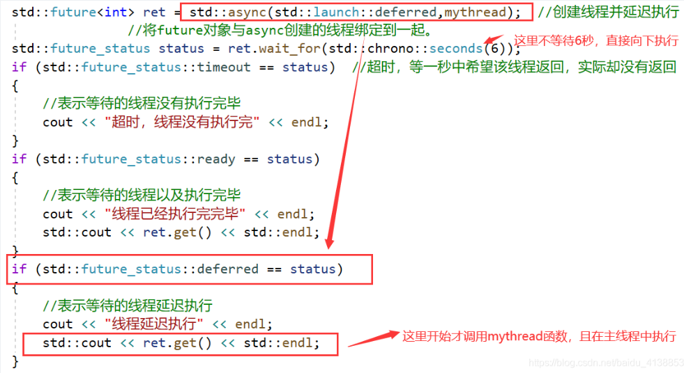 

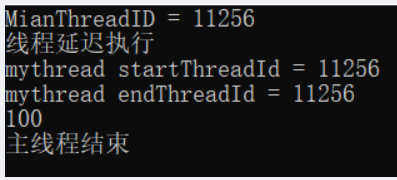 

- 案例源码

```C++
#include <iostream>
#include <thread>
#include <future>
 
using namespace std;
 
int mythread() //线程入口函数
{
    cout << "mythread start" << "ThreadId = " << std::this_thread::get_id() << endl;  //打印线程id
    std::chrono::milliseconds dura(5000);  //休息5秒
    std::this_thread::sleep_for(dura);
    cout << "mythread end" << "ThreadId = " << std::this_thread::get_id() << endl;  //打印线程id
    return 100;
}
 
int main()
{
    cout << "MianThreadID = " << std::this_thread::get_id() << endl;  //打印主线程id
    std::future<int> ret = std::async(std::launch::deferred,mythread);  //创建线程并延迟执行
                   //将future对象与async创建的线程绑定到一起。
    std::future_status status = ret.wait_for(std::chrono::seconds(6));
    if (std::future_status::timeout == status) 
    {
        //表示等待的线程没有执行完毕
        cout << "超时，线程没有执行完" << endl;
    }
    if (std::future_status::ready == status)  
    {
        //表示等待的线程以及执行完毕
        cout << "线程已经执行完完毕" << endl;
        std::cout << ret.get() << std::endl;
    }
    if (std::future_status::deferred == status)
    {
        //表示等待的线程延迟执行
        cout << "线程延迟执行" << endl;
        std::cout << ret.get() << std::endl;
    }
 
    //主线程执行
    std::cout << "主线程结束" << std::endl;
    return 0;
}
```

------

# shared_future、atomic

**std::shared_future** 

- shared_future是个类模板，get()函数`复制`数据
- 对于future对象,可以通过get()获取值，但只能get一次，否则会报异常。主要是因为get函数的设计，是一个移动语义。

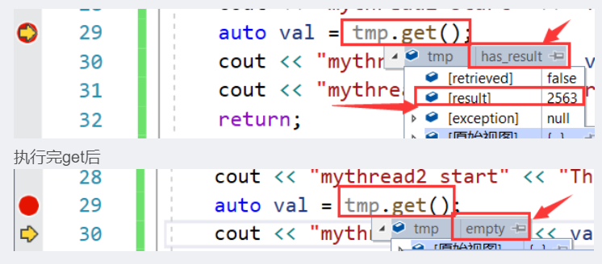 

- std::shared_future 示例

```C++
#include <iostream>
#include <thread>
#include <future>
 
using namespace std;
 
void mythread(std::promise<int>& tmp, int clc)
{
    cout << "mythread start" << "ThreadId = " << std::this_thread::get_id() << endl;  //打印线程id
    //做一系列复杂运算
    clc++;
    clc *= 233;
    //其他运算，比如花费了5秒钟
    std::chrono::milliseconds dura(5000);  //休息5秒
    std::this_thread::sleep_for(dura);
    //计算出结果
    int ret = clc;  //保存结果
    tmp.set_value(ret); //结果保存到tmp中
    cout << "mythread end" << "ThreadId = " << std::this_thread::get_id() << endl;  //打印线程id
    return;
}
void mythread2(std::shared_future<int>& tmp)
{
    cout << "mythread2 start" << "ThreadId = " << std::this_thread::get_id() << endl;  //打印线程id
    auto val = tmp.get();
    cout << "mythread2 val = " << val << endl;
    cout << "mythread2 end" << "ThreadId = " << std::this_thread::get_id() << endl;  //打印线程id
    return;
}
 
int main()
{
    cout << "MianThreadID = " << std::this_thread::get_id() << endl;  //打印主线程id
 
    std::promise<int> var_pro;  //创建一个promise对象，用来保存int类型的值
    std::thread objThread(mythread, std::ref(var_pro), 10);
    //获取结果
    objThread.join();
    std::future<int>  ret = var_pro.get_future(); //promise和线程绑定，用于获取线程返回值
 
    bool ifcanget = ret.valid();  //判断future对象中是否有有效值
    cout << "ret.valid() get前的值 " << ifcanget << endl;
 
    //std::shared_future<int> ret_s(std::move(ret)); //执行完毕后result_s里有值，而result里空了
    std::shared_future<int> ret_s(ret.share());   //执行完毕后result_s里有值，而result里空了
    ifcanget = ret.valid();
    cout << "ret.valid() get后的值 " << ifcanget << endl;
 
    //连续从ret_s中get两次值
    auto mythreadResualt = ret_s.get();
    mythreadResualt = ret_s.get();
    cout << "ret_s.valid() 连续get两次后的值 " << ret_s.valid() << endl;
 
    std::thread objThread2(mythread2, std::ref(ret_s));
    //获取结果
    objThread2.join();        //等线程2执行完毕
 
    //主线程执行
    std::cout << "主线程结束" << std::endl;
    return 0;
}
```

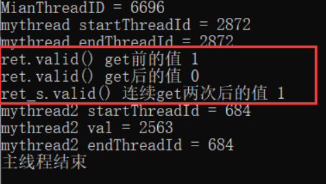 

- 可直接通过get_future()返回值`直接构造`一个shared_future对象

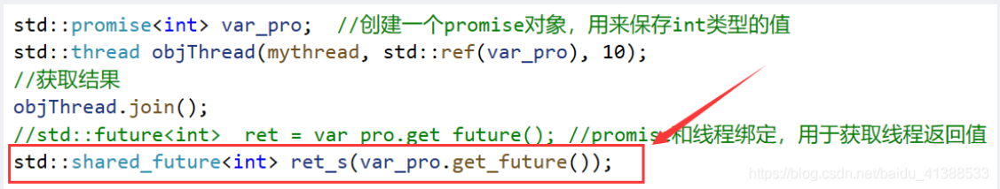 


**原子操作std::atomic**

例如有两个线程，对一个变量进行操作，这个线程读该变量值，另一个线程往这个变量中写值。有两种方法保证结果正确。

互斥量：多线程编程中保护共享数据： 锁，操作共享数据，开锁。能保证最终结果正确，但是效率较低。

原子操作：理解成一种`不需要用到互斥量加锁（无锁）技术的多线程并发编程方式`。

- 原子操作: 在多线程中不会被打断的程序执行片段。`比互斥量效率上更胜一筹`。
- 互斥量的加锁一般是针对一个代码段（几行代码），而`原子操作针对的一般都是一个变量，而不是一个代码段`。
- 原子操作，一般都是指“`不可分割的操作`”，也就是说这种操作状态要么是完成的，要么是没完成的，不可能出现半完成状态。
- std::atomic来代表原子操作，`std::atomic是个类模板`。std::atomic这个东西是用来`封装某个类型的值的`。

基本的std::atomic用法范例

```C++
#include <iostream>
#include <thread>
#include <mutex>
#include <future>
 
std::atomic<int> my_count{0};  //封装了一个int类型的对象（值），可以像操作一个int类型的变量一样操作my_count
 
void my_thread()  //线程入口函数
{
    for (int i = 0; i < 1000000; i++)
    {
        my_count++;  //对应的是一个原子操作，不会被打断
    }
    return;
}
 
int main()
{
    std::thread threadObj1(my_thread);
    std::thread threadObj2(my_thread);
 
    threadObj1.join();
    threadObj2.join();
 
    std::cout << "两个线程执行完毕，最终 my_count的值是" << my_count << std::endl;
 
    return 0;
}
```

 

std::atomic示例2

```C++
#include <iostream>
#include <thread>
#include <mutex>
#include <future>
 
std::atomic<bool> thread_end{false};  //线程退出标记
 
void my_thread()  //线程入口函数
{
    std::chrono::milliseconds dura(2000); //2s
    while (false == thread_end)
    {
        //系统每要求线程退出，继续执行
        std::cout << "ThreadID = " << std::this_thread::get_id() << "线程执行中..." << std::endl;
        std::this_thread::sleep_for(dura);
    }
    std::cout << "ThreadID = " << std::this_thread::get_id() << "线程结束" << std::endl;
    return;
}
 
int main()
{
    std::thread threadObj1(my_thread);
    std::thread threadObj2(my_thread);
 
    std::chrono::milliseconds dura(4000); //5s
    std::this_thread::sleep_for(dura);
    thread_end = true;  //对原子对象的写操作，让线程自行运行结束
 
    threadObj1.join();
    threadObj2.join();
    std::cout << "程序执行完毕，退出" << std::endl;
 
    return 0;
}
```

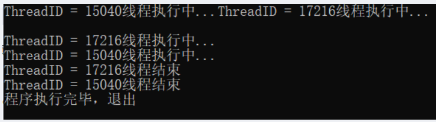 

> 原子用途：一般用于`计数`或者`统计`（例如累计发送出去了多少个数据包，累计接收到了多少个数据包）。


**原子操作std::atomic续谈**

```C++
#include <iostream>
#include <thread>
#include <future>
 
std::atomic<int> my_count{ 0 };  //封装了一个int类型的对象（值），可以像操作一个int类型的变量一样操作my_count
 
void my_thread()  //线程入口函数
{
    for (int i = 0; i < 1000000; i++)
    {
       // my_count++;  //对应的是一个原子操作，不会被打断
        my_count += 1;
    }
    return;
}
 
int main()
{
    std::thread threadObj1(my_thread);
    std::thread threadObj2(my_thread);
 
    threadObj1.join();
    threadObj2.join();
 
    std::cout << "两个线程执行完毕，最终 my_count的值是" << my_count << std::endl;
 
    return 0;
}
```

 

- 上述my_count++ ，及my_count += 1；都能保证是原子操作，结果正确；如果改为my_count = my_count + 1；则结果不正确：

 

>一般atomic原子操作，针对++,--,+=,&=,|=,^=是支持的。其他的可能不支持。


**补充知识点**

```C++
std::atomic<int> atm = 0;
cout << atm << endl;
```

- 这里只有读取atm是原子操作，但是整个这一行代码 cout << atm << endl; 并不是原子操作，导致最终显示在屏幕上的值是一个“曾经值”。

```C++
std::atomic<int> atm = 0;
auto atm2 = atm; //这种定义时初始化操作不允许，编译报错：“尝试引用已删除的函数”，编译器内部肯定把拷贝构造函数给干掉了
atomic<int> atm3 = atm;//也不允许
atomic<int> atm2;
atm2 = atm;//拷贝赋值运算符也不让用
```

- 这种拷贝初始化不可以，编译会报错。

```C++
atomic<int> atm2(atm.load());
auto atm3(atm.loac()):
```

- 读可以用load()：以原子方式读atomic对象的值。

```C++
atm2.store(12);
atm2 = 12;
```

- 写用store()：以原子方式写入内容。
- `原子操作实质`上是：不允许在进行原子对象操作时进行CPU的上下文切换。

------

# std::async与std::thread

std::async参数详述 ,async用来创建一个异步任务

```C++
#include <iostream>
#include <thread>
#include <future>
 
using namespace std;
 
int mythread() //线程入口函数
{
    cout << "mythread start" << "ThreadId = " << std::this_thread::get_id() << endl;  //打印线程id
  
    cout << "mythread end" << "ThreadId = " << std::this_thread::get_id() << endl;    //打印线程id
    return 100;
}
 
int main()
{
    cout << "MianThreadID = " << std::this_thread::get_id() << endl;  //打印主线程id
    std::future<int> ret = std::async(mythread);  //创建线程并开始执行
                   //将future对象与async创建的线程绑定到一起，流程不卡在这里，继续运行
    std::cout << ret.get() << std::endl;
  
    std::cout << "主线程结束" << std::endl;
    return 0;
}
```

- 使用std::thread() 创建线程，如果系统资源紧张，那么可能创建线程就会失败，那么执行std::thread()时整个程序可能崩溃。
- std::async()一般不叫创建线程，一般叫它`创建一个异步任务`。std::async和std::thread最明显的不同，就是async有时候并不创建新线程。
- async()参数 std::launch::deferred【延迟调用】 ，以及std::launch::async【强制创建一个线程】
  - std::launch::deferred`延迟调用`，并且`不创建新线程`，延迟到future对象调用 get()或者 wait() 的时候才执行mythread()。
    - 如果没有调用get或者wait，那么这个mythread()`不会执行`。
  - std::launch::async：`强制这个异步任务在新线程上执行`，意味着系统必须要创建出新线程来运行mythread()。
  - std::launch::async | std::launch::deferred，这里这个 | ：意味着调用async的行为可能是两种情况其一。
  - 不带额外参数，只给async函数一个入口函数名：
    - `默认值`应该是std::launch::async | std::launch::deferred；
    - 换句话说：`系统会自行决定是异步`(创建新线程)`还是同步`（不创建新线程）方式运行。


**std::async和std::thread的区别（重点）**

【std::thread】

 - std::thread创建线程，如果系统资源紧张，创建线程失败，那么整个程序就会报异常崩溃。
 - std::thread创建线程的方式，如果线程返回值，想拿到这个值也不容易。

【std::async】

- std::async创建异步任务。可能创建也可能不创建线程。
- std::async调用方法很容易拿到线程入口函数的返回值。

【系统资源限制的影响】

- 如果用std::thread创建的线程太多，则可能创建失败，系统报告异常，崩溃。
- 如果用std::async，一般就不会报异常不会崩溃，因为如果系统资源紧张导致无法创建新线程的时候，std::async这种不加额外参数的调用就不会创建新线程。而是后续谁调用了result.get()来请求结果，那么这个异步任务mythread就运行在执行这条get()语句所在的线程上。
  - 如果强制std::async一定要创建新线程，那么就必须使用  std::launch::async。承受的代价就是系统资源紧张时，程序崩溃。
- 经验：一个程序里，`线程数量不宜超过100-200`，原因是时间片的切换。


**std::async不确定性问题的解决**

- 可以通过 future的状态来进行判断，利用std::future对象的wait_for函数等待0秒。（注意等待 0 秒进行判断系统采用的策略，相当于执行到这里就立即得到future对象的状态）。

  - 如果系统采用的是std::launch::deferred方式，那么std::future对象就是std::launch::deferred状态。

  - 如果系统采用的是std::launch::async方式，那么std::future对象有可能有两种状态，因为在新线程可能执行完也有可能没有执行完，此时需要判断std::future对象状态是std::future_status::ready还是std::future_status::timeout。

```C++
std::future<int>  result = std::async(mythread); //想判断async到底有没有创建新线程立即执行还是延迟（没创建新线程）执行
 
std::future_status status = result.wait_for(0s);   //(std::chrono::seconds(0));
if (status == std::future_status::deferred)
{
	//线程被延迟执行了(系统资源紧张了，它给我采用std::launch::deferred策略了)
	cout << result.get() << endl; //这个时侯才去调用了mythread（）；
}
else
{
	//任务没有被推迟，已经开始运行了被，线程被创建了；
	if (status == std::future_status::ready)
	{
		//线程成功返回
		cout << "线程成功执行完毕并返回!" << endl;
		cout << result.get() << endl;
	}
	else if (status == std::future_status::timeout)
	{
		//超时线程还没执行完
		cout << "超时线程没执行完!" << endl;
		cout << result.get() << endl;
	}
}
```

------

# windows临界区

**windows临界区**

- windows临界区是windows编程中的内容，效果几乎可以等同于c++11的mutex，可以保护一个代码段。
- Windows临界区，“同一个线程‘”是可以重复进入的，但是`进入的次数与离开的次数必须相等`，而不会引起程序异常报错。
- C++互斥量mutex则不允许同一个线程重复加锁，会报异常。

```C++
#include <iostream>
#include <thread>
#include <list>
#include <mutex>
#include <Windows.h>//包含头文件

#define __WINDOWSJQ_//定义一个开关
using namespace std;

class A
{
public:
	// 把收到的消息传入队列
	void inMsgRecvQueue()
	{
		for (size_t i = 0; i < 1000; ++i)
		{
			cout << "收到消息，并放入队列 " << i << endl;

#ifdef  __WINDOWSJQ_
			EnterCriticalSection(&my_winsec);	//	进入临界区，类似lock加锁
			//EnterCriticalSection(&my_winsec);	//	可以再次进入临界区,程序不会出错
			msgRecvQueue.push_back(i);
			LeaveCriticalSection(&my_winsec);	//	离开临界区，类似unlock解锁
			//LeaveCriticalSection(&my_winsec);	//	如果进入两次，必须离开两次不会报错
#else
			my_mutex.lock();
			msgRecvQueue.push_back(i);//假设这个数字是我收到的命令，我直接弄到消息队列里来
			my_mutex.unlock();
#endif //  __WINDOWSJQ_
		}
		cout << "消息入队结束" << endl;
	}
	// 从队列中取出消息
	void outMsgRecvQueue()
	{
		for (size_t i = 0; i < 1000; ++i)
		{
#ifdef  __WINDOWSJQ_
			EnterCriticalSection(&my_winsec);	//	进入临界区
			if (!msgRecvQueue.empty())
			{
				// 队列不为空
				int num = msgRecvQueue.front();
				cout << "从消息队列中取出 " << num << endl;
				msgRecvQueue.pop_front();
			}
			else
			{
				// 消息队列为空
				cout << "消息队列为空 " << endl;
			}
			LeaveCriticalSection(&my_winsec);	//	离开临界区
#else
			my_mutex.lock();
			if (!msgRecvQueue.empty())
			{
				// 队列不为空
				int num = msgRecvQueue.front();
				cout << "从消息队列中取出 " << num << endl;
				msgRecvQueue.pop_front();
				my_mutex.unlock();
			}
			else
			{
				// 消息队列为空
				cout << "消息队列为空 " << endl;
				my_mutex.unlock();
			}
#endif //  __WINDOWSJQ_
		}
		cout << "消息出队结束" << endl;
	}
	A()//类A的构造函数
	{
#ifdef __WINDOWSJQ_
		InitializeCriticalSection(&my_winsec);	//用windows的临界区之前要初始化，而mutex不用
#endif // __WINDOWSJQ_
	}
private:
	list<int> msgRecvQueue;//容器，用来代表玩家发送来的命令
	std::mutex my_mutex;//创建互斥量

#ifdef __WINDOWSJQ_
	CRITICAL_SECTION my_winsec;	//定义windows中的临界区，非常类似C++11中的mutex
#endif // __WINDOWSJQ_

};

int main()
{
	A myobj;
	std::thread	myInMsgObj(&A::inMsgRecvQueue, &myobj);
	std::thread	myOutMsgObj(&A::outMsgRecvQueue, &myobj);
	myInMsgObj.join();
	myOutMsgObj.join();

	return 0;
}
```

**自动析构技术**

- C++11：lock_guard防止忘了释放信号量，是在析构时自动释放。
- windows：可以写个类，用于自动释放临界区，防止忘记LeaveCriticalSection导致死锁情况的发生。

```C++
//写个类
class CWinLock {
public:
    CWinLock(CRITICAL_SECTION *pCritmp)//构造函数
    {
        my_winsec = pCritmp;
        EnterCriticalSection(my_winsec);
    }
    ~CWinLock()//析构函数
    {
        LeaveCriticalSection(my_winsec)
    };
private:
    CRITICAL_SECTION *my_winsec;
};
//main里这样用
#ifdef  __WINDOWSJQ_
	CWinLock winlock(&my_winsec);
	CWinLock winlock2(&my_winsec);//多次调用也没问题
	msgRecvQueue.push_back(i);

```

> 上述这种CWinLock类叫**RAII类**（Resource Acquisition is initialization），即资源获取及初始化（构造函数初始化一个东西，析构函数中释放一个东西）。
>
> 容器，智能指针都属于这种类。

------

# 线程池

场景设想：服务器程序， 每来一个客户端，就创建一个新线程为这个客户提供服务。

- 线程池：把一堆线程弄到一起，统一管理。这种统一管理调度，循环利用的方式，就叫做线程池。
- 实现方式：程序启动时，一次性创建好一定数量的线程，用完了再放回到池子里，哪个空闲用哪个。没有空闲的线程就等待。这种方式让人更放心，觉得程序代码更稳定，效率高。


**线程创建数量谈**

- 线程创建的数量极限的问题
  - 一般来讲，2000个线程基本就是极限，再创建就会崩溃。
- 线程创建数量建议
  - 采用某些技术开发程序，接口提供商的建议（创建线程数量=cpu数量，cpu*2，cpu*2+2等等），遵照建议和指示来确保程序高效执行。
  - 创建多线程完成业务，考虑可能被阻塞的线程数量，创建多于最大被阻塞线程数量的线程，如100个线程被阻塞在充值业务，开110个线程就很合适。
  - 线程创建数量尽量不要超过500个，因为CPU要切换要调度要恢复内存数据等等，执行效率会降低，所以`尽量控制在200个之内`。

