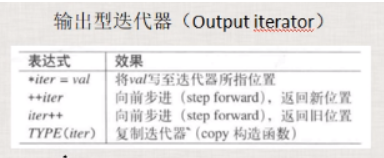

C++标准库： C++ standard Library。

C++标准模板库：Standard Template Library（STL）

泛型编程：使用模板为主要的编程手段来编程编写的代码。


**STL组成部分：**

- 容器：vector, list , map;
- 迭代器：用于遍历或者访问容器中的元素；
- 算法：（函数），用来实现一些功能，search,sort,copy.....
- 分配器（内存分配器）；
- 其他：适配器、仿函数等等；

 

------

# 顺序容器 

- 顺序容器：放进去在哪里元素就排在哪里。如：arrary、vector、deque、list、forward_list；

- 关联容器：元素是 键/值 对，特别适合做查找。你能控制插入内容，但是一般来讲你不能控制插入位置。如：hash_set、hash_map、hash_multiset、hash_multimap；

- 无序容器：元素位置不重要，重要的是这个元素在容器中。无序容器也属于一种关联容器。

 

>C++11标准并没有规定任何容器必须使用特定的实现手段。

------

## arrary

顺序容器，其实是个数组，内存空间是连续的，大小是固定的；申请的时候多大，他就是多大，不能在改变它的大小。

```C++
namespace nmsp1 {
 
	void func() {
		array<string, 5> mystring{ "I","Love1Love2Love3Love4Love5Love6Love7","China" };
		cout << "myString.size() = " << mystring.size() << endl;
		mystring[0] = "It is very long~~~~~~~~~~~~~~~~~long~~~~~~~~~~~~~~long";
		mystring[4] = "It is very long~~~~~~~~~~~~~~~~~long~~~~~~~~~~~~~~long";
		cout << "sizeof(string) = " << sizeof(string) << endl;
		for (size_t i = 0; i < mystring.size(); ++i) {
			const char *p = mystring[i].c_str();
			cout << "-------------------begin----------------------" << endl;
			cout << "数组元素值= " << p << endl;
			printf("对象地址：%p\n", &mystring[i]);
			printf("对象指向的字符串地址：%p\n", p);
			cout << "------------------end--------------------------" << endl;
		}
		const char *p1 = "This is my life, This is my life";
		const char *p2 = "This is my life, This is my life";
 
		printf("p1字符串地址：%p\n", p1);
		printf("p2字符串地址：%p\n", p2);
	}
}
 
int main() {
	nmsp1::func();
	return 0;
}
```

 

由上可知，字符串的存储形式如下，当存储的字符串大于string的存储空间时，编译器会在外边找一块空间用来存放这个字符串。 p1、p2指向的内存地址相同。

 

------

## Vector

标准库中的向量（Vector）是一个封装了动态大小数组的顺序容器；简单的认为，Vector是一个能够存放任意类型的动态数组或集合。（Vector本身就是个类模板）

**基本用法**：

1. Vector<类型>标识符
2. Vector<类型>标识符(最大容量)
3. Vector<类型>标识符(最大容量,初始所有值)
4. Int i[5]={1,2,3,4,5}
   Vector<类型>vi(I,i+2);//得到i索引值为3以后的值
5. Vector< vector< int> >v; 二维向量//这里最外的<>要有空格。否则在比较旧的编译器下无法通过

```c++
#include < vector> 
using namespace std;

vector<Student> stu_list;
vector<vector<string>> str_list;	//该集合里面每个元素又是一个Vector<string>对象
vector<int*> p_list;				//注意不能往Vector装引用类型
```

**Vector特性：**

- 往后边增加元素和删除元素很快。

- 往中间插入元素可能导致很多元素析构，重新构造，效率会非常低。
- 查找速度应该不会太快。

```C++
namespace nmsp2 {
	class A {
	public:
		int m_i;
		A(int tmpv) :m_i(tmpv) {
			cout << "A::A()构造函数执行" << endl;
		}
 
		A(const A &tmpa) :m_i(tmpa.m_i) {
			cout << "A::A()拷贝构造函数执行" << endl;
		}
 
		~A() {
			cout << "A::~A()析构函数执行" << endl;
		}
 
	};
 
	void func() {
		vector<A> myveca;
		for (int i = 0; i < 1; ++i) {
			cout << "---------------------begin-----------------------" << endl;
			myveca.push_back(A(i));
			cout << "----------------------end------------------------" << endl;
		}
	}
}

int main() {
	nmsp2::func();
	return 0;
}
```

 

```C++
namespace nmsp2 {
	class A {
	public:
		int m_i;
		A(int tmpv) :m_i(tmpv) {
			cout << "A::A()构造函数执行" << endl;
		}
 
		A(const A &tmpa) :m_i(tmpa.m_i) {
			cout << "A::A()拷贝构造函数执行" << endl;
		}
 
		~A() {
			cout << "A::~A()析构函数执行" << endl;
		}
 
	};
 
	void func() {
		vector<A> myveca;
		for (int i = 0; i < 5; ++i) {
			cout << "---------------------begin-----------------------" << endl;
			myveca.push_back(A(i));
			cout << "----------------------end------------------------" << endl;
		}
	}
}
 
int main() {
	nmsp2::func();
	return 0;
}
```

 

- vector容器内存空间是也是挨着的，vector容器有一个“空间”的概念。
  - 过程大概是这样的：首先编译器找一个能存放一个元素的空间存入该元素，在此插入元素时空间不够了，因为要要求存储空间连续所以，编译器要释放掉现有的内存，重新找一块能容纳两个元素的空间，放入这两个元素（一个先构造在拷贝，一个直接拷贝），过程以此类推。

- 容器里有`多少个元素可以用size()`来看，而容器`有多少空间可以用 capacity()`来看；

- capacity()一定不会小于size()；

```C++
namespace nmsp2 {
	class A {
	public:
		int m_i;
		A(int tmpv) :m_i(tmpv) {
			cout << "A::A()构造函数执行" << endl;
		}
 
		A(const A &tmpa) :m_i(tmpa.m_i) {
			cout << "A::A()拷贝构造函数执行" << endl;
		}
 
		~A() {
			cout << "A::~A()析构函数执行" << endl;
		}
 
	};
 
	void func() {
		vector<A> myveca;
		for (int i = 0; i < 6; ++i) {
			cout << "---------------------begin-----------------------" << endl;
			cout << "容器插入元素之前size= " << myveca.size() << endl;
			cout << "容器插入元素之前capacity= " << myveca.capacity() << endl;
			myveca.push_back(A(i));
			cout << "容器插入元素之后size= " << myveca.size() << endl;
			cout << "容器插入元素之后capacity= " << myveca.capacity() << endl;
			cout << "----------------------end------------------------" << endl;
		}
	}
}

int main() {
	nmsp2::func();
	return 0;
}
```

 

```C++
vector<A> myveca;
myveca.reserve(10);
```

>reserve(int size)用于预留空间，前提是你知道这个容器最多会容纳多少个元素；可以大大提高程序效率。

------

## deque

- deque(double end queue)：双向开口。相当于动态数组：头部和尾部插入和删除数据头很快；

如果像中间插入元素，那么可能涉及到要移动其他元素，效率会比较低；

**分段连续：**

 

- queue：队列，这是个普通队列，先进先出，后进后出，基本的数据结构

 

------

## stack

stack：栈（堆栈），先进后出，只有一个开口，只要把的却左边开口封死我们就可以认为它变成了一个stack；


**和vector的区别：**

- vector支持从中间插入与删除元素，虽然效率不高。

- stack只支持从栈顶放入与取出元素，这种设计是stack的初衷，deque实际上包含着stack的功能

 

------

## list

list：队列，这是一个双向链表，不需要各个元素之间的内存连在一起；查找效率不突出，在任意位置插入和删除元素非常迅速；


**vector和list的区别：**

- vector类似于数组，它的内存是连续的，list是双向链表，内存空间不连续至少不要求内存是连续的。

- vector从中间或开头插入元素的效率比较低；但是list的效率非常高；

- vector当内存不够时会重新找一块内存，对原来内存对象做析构，在找的新内存重新构造对象；

- vector能够高效的随机存取，而list不行；list要从第一个开始找（从第一个数据中找第二个数据的内存地址，到第二个数据中找第三个数据的内存地址）

 

forward_list：单项链表，节省了内存，尤其是元素多的时候，节省的内存非常可观。

------

# 关联容器

关联容器，容器内部的实现多为红黑树；往这种容器中保存数据时不需要指定数据位置，这种容器会自动的给你加入的元素一个位置。

## map

每个元素有两项，是个（键 / 值）；一般都是通过key找value；通过key找value特别快。`不允许key相同`，如果非要让key相同，你要采用mutimap

```C++
map<int, string> mymap;
mymap.insert(std::make_pair(1, "老王"))；
mymap.insert(std::make_pair(2, "老李"))；
 
mymap.insert(pair<int, string>(3, "老丁"))；
 
auto iter = mymap.find(3);
if(iter != mymap.end()){
    printf("编号为%d，名字%s\n",iter->first, iter->second.c_str());
}
```

## set

不存在键值对的说法，每个元素就是一个value；如果想重复可以使用mutiset

- 插入时，因为容器找一个适当的插入位置，所以插入的速度可能会慢。

- 查找的速度快。

------

# 无序容器

unordered_set / unordered_multimap 为新版本( hash_set， hash_map....老版本)

 

>优先使用容器里的find，如果容器没有自己的find，再使用全局find方法。

------

# 迭代器

一种遍历容器内元素的数据类型，类似于指针。迭代器是一个`可遍历STL容器全部或者部分元素`的对象（行为类似于指针对象）可理解为迭代器用来指向容器中的某个元素；

迭代器是用来表现容器中的某一个位置，通过迭代器可以读容器中的元素值，可以修改某个迭代器所指向的元素值；

迭代器依赖于容器，是由容器来提供的，一般来讲，容器里定义着迭代器的具体细节。

 


**迭代器的分类**

分类依据：迭代器的移动特性，以及这个迭代器上能够进行的操作；

迭代器行为如指针到处跳，表示一个位置，我们一般分类是依据他的跳跃能力，每个分类是一个对应struct定义；

- 输出型迭代器：struct output_iterator_tag;
- 输入型迭代器：struct input_iterator_tag;
- 前向迭代器：struct forward_iterator_tag;
- 双向迭代器（bidirectional iterator）：struct bidirectional_iterator_tag;
- 随机访问迭代器（random access iterator）：struct random_access_iterator_tag;


**继承关系**

 

大多数容器中都有一个迭代器类型，但`并不是所有容器都有迭代器`，比如：stack，queue这种容器就不提供迭代器。

 


**完善迭代器能力**

- 输出型迭代器（struct output_iterator）：一步一步能往前走，并且能够通过这种迭代器来改写容器数据；

   

- 输入型迭代器（struct input iterator）：以向前的方向读取元素，按照这个顺序一个一个返回元素。

   

- 前向迭代器（struct forward iterator）：继承自Input迭代器，因此它能向前的方向来读取元素，并且读取时提供额外保证。

   

- 双向迭代器（bidirectional iterator）：在前向迭代器基础之上增加了往回（反向）迭代，也就是迭代位置可以回退，新增加如下操作。

- 随机访问迭代器（random access iterator）：在双向迭代器的基础上又增加了所谓的随机访问能力。也就是增减某个偏移量能够计算距离（因为内存相连） 

## **容器的迭代器用法**

```c++
vector<int> iv = { 100, 200, 300 };
vector<int>::iterator iter1;

//迭代器begin()/end()操作，反向rbegin()/rend()操作
iter2 = iv.begin()	//如容器中有元素，则返回的迭代器指向容器的第一个元素
iter3 = iv.end()	//返回的迭代器指向容器的末端元素的后面，指向的是一个不存在的元素（一个标记）
//如果容器为空，begin()和end()返回的迭代器相同；

for (vector<int>::iterator iter = iv.begin(); iter != iv.end(); iter++)
{
	cout << *iter << endl;
}
//反向迭代器
for (vector<int>::reverse_iterator riter = iv.rbegin(); riter != iv.rend(); riter++)
{
	cout << *riter << endl;
}

//const_iterator迭代器指向的元素值不能改变，而迭代器本身是可以不断指向下一个元素
vector<int>::const_iterator citer;
for (citer = iv.begin(); citer != iv.end(); citer++)
{
	cout << *citer << endl;
}
```

 


C++11引入的两个新函数cbegin()、cend()跟begin()、end()类似，返回的都是常量迭代器；

------

# 算法

一种搭配迭代器使用的全局函数；可以理解为函数模板。比如：查找、排序等，有数十上百个算法；

STL库的算法函数前两个参数一般都是迭代器类型，表示容器中的元素的一个区间；

算法跟具体容器没关联，只跟迭代器有关联；只需要根据迭代器来开发算法，不需要理会具体容器。这种方式更加灵活，但是也缺失了直观性；某些数据结构和算法之间的兼容性也不那么好

调用方式：算法名(iterbg,itered)传递进去的应该是前闭后开的区间 [ begin() , end() ] ；算法头文件要包含进来：#include \<algorithm\>


**优点：**

- 如果第一个形参等于第二个形参，也就是 iterbg == itered, 那么就表示是个空区间；

- 迭代时，算法判断迭代器只要等于最后变这个开区间，那么就表示迭代结束；


**算法的一些内部处理**

- 算法会根据传递进来的迭代器来分析出迭代器的种类，不同种类的迭代器，算法会有不同的处理，要编写不同的代码来应对；

- 这种辨析不同代码来处理不同种类迭代器，能够直接影响到算法的执行效率；

- 这也是STL内部为什么要做一个分类的目的；


**一些算法使用范例**

- for_each()

  ```C++
  void myfunc(int i){
      cout << i << endl;
  }
  
  vector<int> myvec{ 10, 20, 30, 40 };
  for_each(myvec.begin(), myvec.end(), myfunc); //myfunc是一个可调用对象
  ```

- find()

  当成员函数和全局函数同时存在时，优先考虑使用同名的成员函数，如果没有成员函数在考虑使用全局函数。

  ```C++
  vector<int> myvec{ 10, 20, 30, 40 };
  vector<int> finder = find(myvec.begin(), myvec.end(), 40); //myfunc是一个可调用对象
   
  if (finder != myvec.end()){ //判断是否等于find的第二个参数，等于就没找到，不等于就找到了
      cout << "find it" << endl;
  }
  ```

  ```C++
  map<int, string> mymap;
  mymap.push_back(2, "li");
  mymap.push_back(1, "bai");
  auto finder = mymap.find(2);
  if (finder != mymap.end()){
      printf("id:%d, name:%s", iter->first, iter->second.c_str());
  }
  ```

- find_if()

  ```C++
  auto result = find_if(myvec.begin(), myvec.end(), [](int val)
  {
      if (val > 15){
          return true;
      }
      return false;
  }
  );
   
  if (result == myvec.end()){
      cout << "not find" << endl;
  }
  else{
      cout << "find it" << endl;
  }
  ```

- sort()

  ```C++
  vector<int> myvec = { 50, 15, 80, 30};
  sort(myvec.begin(), myvec.end()); //缺省参数时按照从小到大排列
  ```

  ```C++
  //可以自定义排序
  bool func(int i, int j){
      return i < j;  //从小到大排序
  }
   
  bool func(int i, int j){
      return i < j;  //从大到小排序
  }
   
  sort(myvec.begin(), myvec.end(), func);
  ```

------

# 仿函数

函数对象（function object）/仿函数（functors）

函数对象在STL中，一般都是和算法配合来使用,从而实现一些特定的功能；也就是说,这些函数对象主要用来服务于算法；


```C++
namespace _nmsp1
{	
	class A
	{
	public:
		bool operator()(int i, int j)
		{
			return i > j; //从大到小排序
		}
	};
 
	void func()
	{	
		vector<int> myvector = { 50,15,80,30,46 };
		A mya;
		sort(myvector.begin(), myvector.end(), mya);
 
		for (auto iter = myvector.begin(); iter != myvector.end(); ++iter)
		{
			cout << *iter << endl;
		}
		return;	
	}
}
```

**标准库中定义的函数对象**

标准库中也给我们提供了很多可以现成拿来使用的函数对象，使用它们之前，要包含一个头文件 functional

 

```C++
namespace _nmsp2
{
	//三：标准库中定义的函数对象范例
	class A 
	{
	public:
		bool operator()(int i, int j)
		{
			return i > j; //从大到小排序
		}
	};
 
	void func()
	{
		//plus<int>(); //加圆括号是生成一个临时对象 ，就是个可调用对象；
		//plus<int> myplus;
 
		vector<int> myvector = { 50,15,80,30,46 };
		//A mya;  //自定义的函数对象
		//sort(myvector.begin(), myvector.end(), mya); 
		//sort(myvector.begin(), myvector.end(), greater<int>()); // greater<int>()产生临时对象,称呼为系统定义的函数对象；
		sort(myvector.begin(), myvector.end(), less<int>());
 
		for (auto iter = myvector.begin(); iter != myvector.end(); ++iter)
		{
			cout << *iter << endl;
		}
	}
}
```

------

# 适配器

- 适配器基本概念：转接头
  把一个既有的东西 进行适当的改造，比如增加点东西，或者减少点东西，就构成了一个适配器；三种适配器：容器适配器，算法适配器，迭代器适配器。
- 容器适配器（类模板）：比如双端队列deque;
  stack：堆栈，是属于阉割版的deque；
  queue：队列，是属于阉割版的deque；
- 算法适配器（函数适配器） ：最典型的就是绑定器(binder)
  绑定器
  老版本 bind1st,bind2nd；c++11，名字被修改为bind；

 

```C++
namespace _nmsp1
{
	class A
	{
	public:
		bool operator()(int i)
		{
			//return i > 40; //希望大于40的元素被统计
			return 40 < i;  //希望大于40的元素被统计
		}
	};
 
	void func()
	{	
		vector<int> myvector = { 50,15,80,30,46,80 };
		//统计某个值出现的次数
		int cishu = count(myvector.begin(), myvector.end(), 80); //算法
		cout << cishu << endl;
 
		//A myobja;
		//cishu = count_if(myvector.begin(), myvector.end(), myobja);
		//cout << cishu << endl;
		
		//bind(less<int>(), 40, placeholders::_1);
		                            //less<int>的operator()的第一个参数绑定为40，那这样当调用less<int>()这个可调用对象时，
		                             //第二个参数，就用这里的 placeholders::_1表示，在调用这个函数时，被传入的第一个参数所取代；
		//auto bf = bind(less<int>(), 40, placeholders::_1);
		//bf(19);
 
		cishu = count_if(myvector.begin(), myvector.end(), bind(less<int>(),  //临时对象
								40,placeholders::_1));
		//a)bind:函数适配器中的绑定七；
		//b)less<int>()：是个函数对象（仿函数），这里是个临时对象
		//c)count_if：是个算法；
		cout << cishu << endl;
		
		return;	
	}
}

//reverse_iterator：反向迭代器；
namespace _nmsp2
{
	void func()
	{
		vector<int> iv = { 100,200,300 };
		for (vector<int>::reverse_iterator riter = iv.rbegin(); riter != iv.rend(); ++riter)
		{
			cout << *riter << endl;
		}
	}
}
```

# 