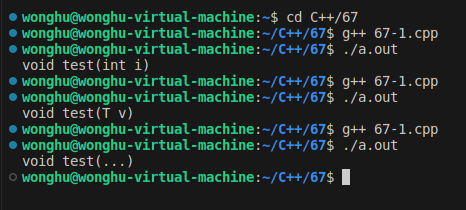

# 关于动态内存分配

| new关键字是C++的一部分                | malloc是由C库函数提供的函数          |
| ------------------------------------- | ------------------------------------ |
| new以具体 **类型** 为单位进行内存分配 | malloc以 **字节** 为单位进行内存分配 |
| new在申请内存空间时可进行初始化       | malloc仅根据需要申请定量的内存空间   |
| new在所有C++编译器都被支持            | malloc在某些系统开发中是不能调用的   |
| new能够触发构造函数的调用             | malloc仅分配需要的内存空间           |
| 对象的创建只能使用new                 | malloc不适合面向对象开发             |

| delete在所有C++编译器中都被支持 | free在某些系统开发中是不能调用的 |
| ------------------------------- | -------------------------------- |
| delete能够触发析构函数的调用    | free仅归还之前分配的内存空间     |
| 对象的销毁只能使用delete        | free不适合面向对象开发           |

------

# 关于虚函数

构造函数`不可能`成为虚函数

- 在构造函数执行结束后，虚函数表指针才会被正确初始化

析构函数`可以`成为虚函数

- 建议在设计类时将析构函数声明为虚函数

 


将析构函数声明为虚函数后：

 


构造函数中`不可能`发生多态行为

- 在构造函数执行时，虚函数表指针未被正确初始化

析构函数中`不可能`发生多态行为

- 在析构函数执行时，虚函数表指针已经被销毁

------

# 关于继承中强制类型转换

- dynamic_cast是与`继承相关`的类型转换关键字

- dynamic_cast要求相关的类中`必须有虚函数`
- 用于直接或者间接`继承关系的指针`（引用）之间
  - 指针：
    - 转换成功：得到目标类型的指针
    - 转换失败：得到一个`空指针`
  - 引用：
    - 转换成功：得到目标类型的引用
    - 转换失败：得到一个`异常操作`信息

> 编译器会检查dynamic_cast的使用是否正确;
>
> 类型转换的结果只可能在**运行阶段**才能得到;

 

 

上述代码中，类的继承顺序是 class D：class C：class B：class A，
当pA是指向A类型的对象时（ pA = new A; ），向下转型失败，pA不能转换为B\*、C\*、D\*类型；

当pD是指向D类型的对象时（ pD = new D; ），向上转型成功，pD可以转换为A\*、B\*、C\*类型。

> 原因：因为每个类都会在内存中保存一份类型信息，编译器会将存在继承关系的类的类型信息使用指针“连接”起来，从而形成一个继承链，如下所示。
>   当使用 dynamic_cast 对指针进行类型转换时，程序会先找到该指针指向的对象，再根据对象找到当前类（指针指向的对象所属的类）的类型信息，并从此节点开始沿着继承链向上遍历，如果找到了要转化的目标类型，那么说明这种转换是安全的，就能够转换成功，如果没有找到要转换的目标类型，那么说明这种转换存在较大的风险，就不能转换。


> 补充：
>
> - dynamic_cast 用于在类的继承层次之间进行类型转换，它既允许向上转型（Upcasting），也允许向下转型（Downcasting）。向上转型是无条件的，不会进行任何检测，所以都能成功；向下转型的前提必须是安全的，要借助 RTTI 进行检测，所有只有一部分能成功。
> - dynamic_cast 与 static_cast 是相对的，dynamic_cast 是“动态转换”的意思，static_cast 是“静态转换”的意思。dynamic_cast 会在程序运行期间借助 RTTI 进行类型转换，这就要求基类必须包含虚函数；static_cast 在编译期间完成类型转换，能够更加及时地发现错误。
>   - 向上转型时，只要待转换的两个类型之间存在继承关系，并且基类包含了虚函数（这些信息在编译期间就能确定），就一定能转换成功。因为向上转型始终是安全的，所以 dynamic_cast 不会进行任何运行期间的检查，这个时候的 dynamic_cast 和 static_cast 就没有什么区别了。
>   - 向下转型是有风险的，dynamic_cast 会借助 RTTI 信息进行检测，确定安全的才能转换成功，否则就转换失败。
> - RTTI代表运行时类型信息，它提供了运行时确定对象类型的方法。

------

# 指针的判别

C++中仍然支持C语言中的可变参数函数；

C++编译器的匹配调用`优先级`：重载函数 > 函数模板 > 变参函数

```c++
void test(int i)
{
    cout << "void test(int i)" << endl;
}

template <typename T>
void test(T v)
{
    cout << "void test(T v)" << endl;
}

void test(...)
{
    cout << "void test(...)" << endl;
}

int main(int argc, char *argv[])
{
    int i = 0;

    test(i);

    return 0;
}
```

 

将变量分为两类：指针 VS 非指针，编写函数：

- 指针变量调用时返回true
- 非指针变量调用时返回false

 

根据参数的匹配，返回true就是指针，变参函数返回false就不是指针。

然而该程序还是存在缺陷的，变参函数无法解析对象参数，可能造成程序崩溃；


**解决方案：**

让编译器精确匹配函数，不进行实际的调用，只去进行匹配而不运行；

```c++
class Test
{
public:
    Test() = default;
    virtual ~Test() = default;
};

template <typename T>
char IsPtr(T *v) // match pointer
{
    return 'd';
}

int IsPtr(...) // match non-pointer
{
    return 0;
}

#define ISPTR(p) (sizeof(IsPtr(p)) == sizeof(char))

int main(int argc, char *argv[])
{
    int i = 0;
    int *p = &i;

    cout << "p is a pointer: " << ISPTR(p) << endl; // true
    cout << "i is a pointer: " << ISPTR(i) << endl; // false

    Test t;
    Test *pt = &t;

    cout << "pt is a pointer: " << ISPTR(pt) << endl; // true
    cout << "t is a pointer: " << ISPTR(t) << endl;   // false

    return 0;
}
```

> 注解： 编译器编译阶段根据参数类型，判断使用哪个函数，sizeof可以根据函数类型给出相应计算结果(没有调用函数)。

------

# 构造函数中抛出异常

- 构造过程立即停止
- 当前对象无法生成
- 析构函数不会被调用
- 对象所占用的空间立即收回

**工程项目中的建议：**

- `不要在构造函数中抛出异常`
- 当构造函数可能产生异常时，`使用二阶构造模式`

 


**析构中的异常**

应避免在析构函数中抛出异常！

析构函数的异常将导致对象所使用的资源无法完全释放；

------

# 令人迷惑的写法

**typename的作用：**

- 在模板定义中声明泛指类型
- 明确告诉编译器其后的标识符为`类型`

 


**捕获异常的写法**

- try catch用于`分隔`正常功能代码与异常处理代码
- try catch可以直接将函数实现`分隔为2部分`
- 函数声明和定义时可以`直接指定可能抛出的异常类型`
- 异常声明成为函数的一部分可以提高代码可读性

**函数异常声明的注意事项**

- 函数异常声明是一种与编译器之间的契约
- 函数声明异常后就只能抛出声明的异常
  - 抛出其它异常将导致程序运行终止
  - 可以直接通过异常声明定义无异常函数


不常用的动态异常例子（c++ 11中不支持动态异常规范）

 